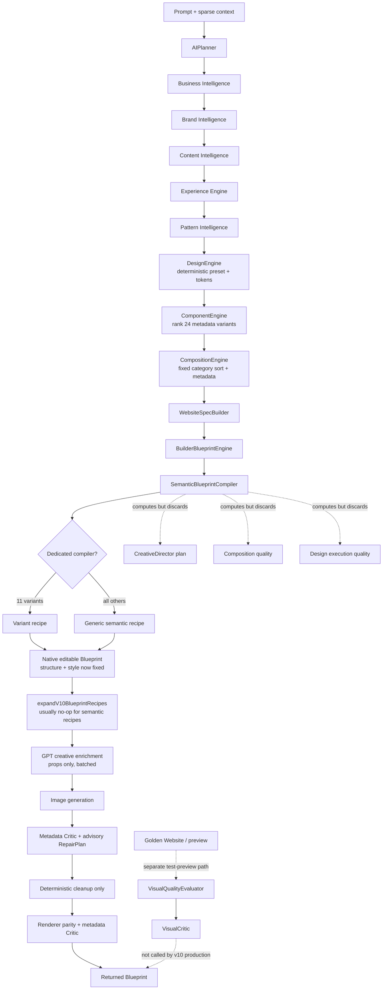

# BuildEZ Builder V2 — AI v10 generation quality audit

Date: 2026-07-16  
Scope: `apps/web-app/modules/builder-v2/ai-v10/` and `apps/web-app/modules/builder-v2/website-engine/`  
Constraint: audit only; no implementation changes

## Executive conclusion

AI v10's visual ceiling is fixed before the only generative creative pass begins.

The production pipeline chooses a small, deterministic component catalog, sorts those choices with a fixed category priority, compiles them through a small set of hard-coded recipes, and only then calls the creative model. That model is explicitly forbidden to change style, structure, layout, responsive behavior, node types, or children. It can only replace `props`—primarily copy and image prompts. Consequently, the model can make a generic page more relevant, but it cannot make its composition less generic.

The exact primary bottleneck is the contract at `ai-v10/creative/runV10CreativeEnrichment.ts:62-67, 192-207, 399-440`: style-bearing patches are rejected, existing styles are copied unchanged, work is split into independent batches, and the system prompt says that the Website Engine already owns layout and responsive design. By this point, visual authorship has ended.

There are four reinforcing bottlenecks:

1. `DesignEngine` selects the first suitable family preset deterministically and produces broad tokens, not an authored art direction.
2. `ComponentEngine` ranks a catalog of only 24 variants with mostly constant visual scores; deterministic ties resolve alphabetically.
3. `CompositionEngine` sorts the selected set using a fixed category priority table. It does not synthesize layouts, coordinate section geometry, or apply its own conflict fallbacks.
4. `SemanticBlueprintCompiler` maps most sections into a handful of repeated shells. Eleven variants have dedicated compilers; the remainder fall back to 15 semantic recipes, most of which collapse to the same intro-plus-grid structure.

The Golden Website, Creative Director, Visual Quality, and Visual Critic systems do not presently close this loop in production. Their scores are metadata heuristics over blueprints—not perceptual judgments over rendered pages—and the v10 orchestrator does not call `VisualQualityEvaluator` or `VisualCriticEngine`. The production critic is explicitly metadata-only, screenshot-free, and its repair plan is advisory.

**Verdict on expressiveness:** native Builder primitives are capable of substantially more than v10 currently emits, but the current semantic Blueprint/recipe contract cannot reliably express premium Figma/Webflow/Framer compositions. It supports editable conventional sections well; it lacks first-class concepts for art-directed geometry, overlap, layering, asymmetry, controlled overflow, decorative systems, coordinated type composition, media choreography, section transitions, and breakpoint-specific recomposition. Expanding only the widget catalog will not solve this. The intermediate representation and compiler contract must become layout- and art-direction-aware.

## Current production pipeline

Important pipeline observations:

- `runV10WebsiteGeneration.ts:103-179` invokes all principal engines, but the section structure is fully compiled before enrichment.
- `recipeExpander.ts:11-13` calls `compileSemanticBlueprint(input).seeds` and discards its composition, design, and creative plans.
- `runV10WebsiteGeneration.ts:212-221` computes a repair plan, describes it as advisory, and applies only `applyV10BlueprintRepair` cleanup.
- The trace labels the enrichment model as an “engine-node-enrichment” step, accurately reflecting that it is not a layout generator.

## Where visual creativity is lost

### FP-1 — Creative generation is reduced to semantic hydration (critical)

Evidence:

- `runV10CreativeEnrichment.ts:62-67` rejects any patch key other than `props`.
- `runV10CreativeEnrichment.ts:192-207` merges props but deliberately retains `style: node.style`.
- `runV10CreativeEnrichment.ts:403` tells the model: “Patch only props” and “The Website Engine already owns layout and responsive design.”
- `runV10CreativeEnrichment.ts:385, 399-440` processes 4–12 nodes per batch, commonly with concurrency. Each batch sees compact global metadata but only its local nodes, so it cannot make coherent page-wide visual decisions even if the patch schema allowed them.
- `buildCompactCreativeContext` includes design/component/composition results but not the `CreativeDirectionPlan`, `DesignExecutionPlan`, reference examples, rendered preview, or critic feedback.

Impact:

- The model can improve text specificity and image subject matter only.
- It cannot change a four-card grid into an asymmetric editorial story, introduce overlap, change media scale, build a signature hero, vary section silhouette, or coordinate a page-wide motif.
- Batching optimizes response reliability at the cost of cross-section authorship. It is appropriate for hydration, not creative direction.

This is the single most important bottleneck.

### FP-2 — Creative Director is observability, not direction (critical)

`CreativeDirectorCompiler.ts` assigns a deterministic personality, detects template warnings, and calculates high creative scores from section-name regexes. Its output declares `metadataOnly: true` and `deterministic: true`.

However:

- It runs inside `compileSemanticBlueprint`, after component and composition choices already exist.
- It does not participate in recipe resolution or alter seeds.
- `expandComponentRecipes` returns only `.seeds`, discarding the plan.
- The plan is absent from the production creative enrichment context.
- Warnings such as card fatigue or uniform shells do not trigger replanning.
- Scores start from generous bases (roughly 78–82) and reward the number of regex-classified patterns. They do not inspect rendered originality.

The Creative Director is therefore a post-hoc classifier. It can say that a page should be cinematic or that grids repeat, but it cannot make the page cinematic or replace the grids.

### FP-3 — DesignEngine chooses categories, not compositions (high)

Evidence:

- `DesignEngine.ts:81-118` is entirely deterministic and derives typography, color, spacing, layout, motion, density, and theme from one selected language.
- `designLanguages.ts:26-49` maps each industry to an ordered list and selects the first suitable profile. For example, real estate predictably begins at Luxury, healthcare at Clinical, and SaaS at Technology.
- The profiles contain broad prose such as “airy,” “modular,” “image-led,” or “editorial.” These values become conventional tokens, not spatial design instructions.
- The engine metadata explicitly states `noGeneration`, `noCssGeneration`, and `noRendering` (`DesignEngine.ts:143-153`).

Impact:

- Different brands in the same family converge on the same design language.
- Typography is a family-level pairing/scale rather than an authored typographic composition.
- Color and spacing alter the skin of the same recipe geometry.
- Premium intent is treated as a preset suffix or palette choice rather than a distinct visual concept.

### FP-4 — Creative decisions have no rendered feedback loop (critical)

Production v10 calls `runCritic`, not `runVisualCritic`.

- `CriticEngine.ts:90-106, 109-166` explicitly reports `metadataOnly`, `rendered: false`, and `screenshotCaptured: false`.
- `runV10WebsiteGeneration.ts:196-225` evaluates metadata before and after deterministic cleanup but never captures or evaluates a rendered page.
- The initial `repairPlan` is advisory; no critic-guided regeneration is performed.
- `VisualCriticEngine` exists, but repository references show it used only by tests and `GoldenWebsitePreview`.
- `VisualCriticEngine.ts:41-49` is itself deterministic and metadata-only. It subtracts fixed penalties from an upstream heuristic score.

Without pixels, the system cannot observe alignment tension, crop quality, font character, perceived hierarchy, awkward empty areas, visual sameness, balance, polish, or whether the page actually resembles a premium reference.

## Where generic layouts are introduced

### FP-5 — The generic semantic recipe factory is the main layout funnel (critical)

`semanticRecipeFactory.ts` supplies the dominant fallback grammar:

- Every section uses the same centered max-width shell with alternating background color (`:33-41`).
- Heading sizes are globally fixed at 64/44 desktop and 38/30 mobile (`:44-50`).
- Hero/about/contact use essentially one two-column editorial split (`:61-75`).
- Gallery, portfolio, services, testimonials, pricing, comparison, feature grids, stats, FAQ, and timeline largely become the same “intro + uniform grid + cards” structure (`:78-100, 121-129`).
- Cards share border, radius, padding, gap, title, description, and optional image/button anatomy (`:86-95`).
- CTA and footer each have one geometry (`:103-119`).

This funnel explains the observed output precisely: correct section semantics and responsive stacks, but repetitive visual silhouettes.

### FP-6 — Dedicated component compilation covers less than half the catalog (high)

- `componentCatalog.ts` defines 24 variants.
- `ComponentVariantRecipeRegistry.ts:11-23` provides native dedicated compilers for only 11.
- The other 13—including trust, proof, project showcase, founder story, process, portfolio, comparison, reviews, forms, final conversion, sticky CTA, and footer—fall through regex matching into generic semantic recipes.

Several nominally distinctive component IDs therefore do not guarantee distinctive rendered anatomy. A rich metadata catalog is being collapsed into a much smaller visual catalog.

### FP-7 — Alternation is cosmetic and index-driven (high)

- The generic shell alternates only background color by section order.
- The legacy `expandV10BlueprintRecipes.ts:20-32` varies padding, gap, and row direction by index/modulo, not by narrative intent.
- That expander is normally a no-op because it returns immediately when semantic recipe sections are present (`:7-10`).

Alternating tint and left/right order creates superficial variation, not authored composition.

## Where component selection becomes repetitive

### FP-8 — Small deterministic catalog plus weak scoring produces stable winners (critical)

`ComponentEngine` has 24 total choices across all industries and roles. Selection is deterministic:

- `componentScoring.ts:13-27` gives every variant the same `designFit` when any design exists, the same `motionFit`, and mostly the same conversion score. Design language does not discriminate between component geometries.
- `patternFit` floors at 0.2 when patterns exist, and family compatibility is binary-ish (1 or 0.35).
- No score represents novelty, sibling compatibility, page-level visual contrast, prior usage frequency, brand distinctiveness, or a target composition motif.
- `componentRanking.ts:3-6` breaks equal overall scores alphabetically by ID.
- `ComponentEngine.ts:34-52` greedily takes one component per category, in ranked order. It does not optimize the selected set jointly.
- The target count is merely pattern count + 2, clamped to 4–10.

Impact:

- Similar businesses repeatedly select the same alphabetically stable top variants.
- A selection may be individually compatible yet collectively monotonous.
- There is no exploration budget or controlled variation between generation runs.
- Component labels imply more diversity than the compiler can render.

### FP-9 — Pattern intelligence does not bind one planned pattern to one section robustly (high)

In `SemanticBlueprintCompiler.orderedSections`, selections are matched by component ID and pattern IDs are also taken by array index. Component selection itself returns a globally ranked unique-category list rather than a section-scoped candidate set. Composition then reconstructs sections from those selections.

This reverses the desired relationship. Premium generation should start with narrative beats and assign a purpose-built layout candidate to each beat while optimizing the page as a whole. Current v10 starts with a globally selected bag of components and then turns that bag into the page.

## Where composition is too mechanical

### FP-10 — Composition is a fixed sort, not composition (critical)

`sectionOrdering.ts:3-41` assigns categories a global priority from navigation (0) to footer (14), adds a few family offsets, and sorts. This makes section order predictable across every page in a family.

`CompositionEngine.buildCompositionPlan` (`:97-118`) then derives labels—weights, cadence, breathing, alternation, journey, stacking, density—from that sorted sequence. These are metadata descriptions, not spatial operations.

No composition step decides:

- grid spans or asymmetric track systems;
- section height, silhouette, overlap, edge treatment, or transition;
- media crop hierarchy or full-bleed moments;
- text measure and alignment per narrative beat;
- shared visual anchors across adjacent sections;
- when to break the container;
- foreground/background layering;
- breakpoint-specific alternative compositions;
- controlled violation of the standard shell.

### FP-11 — Conflict handling does not repair the sequence (high)

`CompositionEngine.ts:48-77` detects three adjacent card-grid sections and other journey conflicts, but `buildCompositionFallbacks` only emits advice. `runCompositionEngine` returns the original plan unchanged. Thus the engine can knowingly pass a generic or conflicting sequence downstream.

### FP-12 — Composition weights do not drive recipe geometry (high)

Section weights, visual breathing, density transitions, media alternation, and scroll narrative are calculated, but the generic recipe factory mostly reads design tokens, section order, type, and component metadata. It does not consume the Creative Director’s density pattern or turn composition weights into materially different section templates.

The pipeline produces extensive composition metadata that has little causal effect on pixels.

## Can the Blueprint/widget system express premium designs?

### Short answer

**The low-level Builder node/style model: probably yes for many premium static pages. The current AI semantic Blueprint and widget recipe system: no, not reliably.**

The existing primitives already support containers, columns, responsive style values, grids, flex, images, typography, positioning, overflow, radius, shadow, and motion metadata. Those are sufficient building blocks for many high-quality layouts.

The limitation is the authored intermediate grammar:

- Sections are treated as isolated recipe instances inside one standard shell.
- Recipe output is a fixed tree; creative enrichment cannot add/remove/reparent nodes.
- No first-class layout archetype describes bento, asymmetric editorial, stacked media, scrollytelling, split-screen, mosaic, art-directed hero, floating proof, full-bleed transition, framed canvas, or intentional overlap.
- No cross-section composition object owns shared geometry or transitions.
- Style bindings are primarily token substitutions rather than semantic constraints.
- Responsive behavior generally means stacking/reducing columns, not redesigning the composition.
- Decorative primitives and layered media roles are not represented in the creative contract.
- Repetition/cardinality is fixed in recipes rather than selected from content and composition needs.
- Component variants lack a compiler-capability guarantee; a variant may silently degrade to a generic fallback.

The current system is optimized for safe editability and serialization. Premium expression requires adding constrained structural variability without losing those properties.

## Golden Website system audit

The Golden Website system is primarily a structural contract suite, not a visual benchmark.

### What it validates well

- expected sections and component IDs;
- native node compatibility;
- editability and inspector bindings;
- responsive metadata presence;
- serialization/runtime parity;
- deterministic results;
- metadata composition/design thresholds.

### Why it can pass generic pages

- `GoldenWebsiteRunner.ts:71-75` gives structure credit for section-name matches, editability credit when all widgets are editable, and responsive credit for bindings/tabs.
- `GoldenWebsiteScore.ts:10-12` averages structure, heuristic composition, heuristic design, editability, and responsiveness equally. There is no rendered aesthetic term.
- `designQualityScore.ts:21-35` can produce near-perfect scores from body size, spacing ranges, the existence of heading weight/contrast/media fields, and basic mobile rules. It does not inspect actual visual output.
- Golden inputs inject idealized handcrafted metadata with confidence 1 (`GoldenWebsiteRunner.ts:20-48`) instead of running the real prompt-to-engine pipeline.
- Preview copy is generic by construction (“thoughtfully presented,” “Designed around what matters most”), and images are synthetic colored SVG placeholders (`GoldenWebsitePreview.ts:9-25`).
- Only one reference metadata entry exists; it contains style/mood/focus text and no required image (`GoldenReferenceMetadata.ts:9-14`).
- Golden preview invokes visual scoring and critic only after the structural golden run; the runner’s pass result does not depend on those returned preview scores.

This creates the exact reported discrepancy: high engineering scores with low perceived quality.

## Visual Critic system audit

### Strengths

- Clear deterministic detection for missing hierarchy, overflow risks, missing CTAs, repeated grid classifications, incomplete media, and basic mobile stacking.
- Recommendations are traceable and safe.
- It diagnoses structural anti-patterns more explicitly than the production Critic.

### Limitations

- It is not called by production v10.
- It operates on Blueprint metadata and simple regex classification, not rendered pixels.
- `VisualQualityEvaluator` starts most dimensions at 100 and subtracts for rule violations. Absence of detectable failure is treated as excellence.
- Its layout score measures overflow and spacing-range compliance (`VisualQualityEvaluator.ts:45-54`), not composition quality.
- Typography measures H1/H2 counts and minimum size (`:56-62`), not font pairing, scale character, line breaks, rhythm, optical balance, or hierarchy perception.
- Imagery measures source/alt completeness (`:76-78`), not crop, relevance, art direction, focal balance, or image quality.
- Responsive measures responsive-object presence and simple width risk (`:80-84`), not actual viewport renders.
- `VisualCriticEngine.ts:43` subtracts fixed penalties from this already optimistic score.
- Node-to-section matching relies heavily on ID suffixes; it is brittle for several generated ID patterns.
- Repair recommendations are advisory and are not followed by render/re-score iterations in v10.

It is better described as a blueprint lint system than a visual critic.

## Recommended recovery architecture

### P0 — Move creative direction before selection and compilation

Introduce one page-level **Art Direction Brief** after business/brand/content/experience intelligence and before component selection. It should define:

- a specific visual thesis, not merely “Luxury” or “Modern”;
- 2–4 signature motifs and explicit anti-motifs;
- typography composition and scale behavior;
- page silhouette and section contrast plan;
- media direction, crop roles, and focal moments;
- section-level layout archetypes;
- intentional deviations from the base container;
- responsive reinterpretation rules;
- a novelty target relative to catalog/golden history.

Creative Director should author or select this brief and become causal. Its warnings must be hard constraints for component set optimization and compiler selection.

### P0 — Replace props-only “creative enrichment” with two distinct passes

Keep the reliable hydration pass, but stop calling it the creative stage.

1. **Structural/art-direction pass, before Blueprint compilation:** returns a validated, constrained composition specification: section roles, layout archetypes, node anatomy options, variant parameters, visual motifs, media roles, and responsive transformations.
2. **Semantic hydration pass, after compilation:** retains the current props-only contract for copy and image prompts.

The structural pass should operate page-wide, not in independent node batches. Safety should come from a typed DSL and validator, not by eliminating structural authorship.

### P0 — Make component selection section-scoped and set-aware

- Generate candidates per narrative beat/section.
- Score actual design-language compatibility instead of a constant 0.78.
- Add geometry, density, media role, silhouette, and motif metadata.
- Optimize the whole sequence for compatibility plus contrast, not greedy one-per-category selection.
- Penalize repeated anatomy and catalog popularity.
- Add controlled exploration/seeded variation while preserving reproducibility when requested.
- Require every production variant to have a dedicated compiler or explicitly fail validation; do not silently collapse premium variants into generic recipes.

### P0 — Make composition produce executable layout decisions

Replace fixed category sorting with a constrained sequence search over narrative, conversion, trust, media, and rhythm objectives. Its output must directly parameterize compilation:

- layout archetype per section;
- container mode (contained, breakout, full bleed, framed);
- columns/tracks/spans and alignment;
- section weight translated into height/spacing/type/media scale;
- transition and adjacency treatment;
- image count, crop family, and focal hierarchy;
- overlap/layering/decorative roles;
- desktop/tablet/mobile transformations;
- cross-section motifs and shared anchors.

Conflicts should trigger replanning before Blueprint compilation, not merely warnings.

### P0 — Add a real rendered visual quality loop

For each candidate page:

1. Compile and render desktop, tablet, and mobile.
2. Capture screenshots.
3. Evaluate perceptual hierarchy, balance, originality, crop quality, brand fit, reference similarity, and responsive integrity.
4. Produce typed repair actions that can modify composition/component/style specifications.
5. Recompile, rerender, and compare deltas for a bounded number of iterations.

The visual gate should block “premium” status when pixel-level thresholds fail, regardless of engineering score.

### P1 — Expand the semantic layout grammar

Add reusable, parameterized layout archetypes rather than dozens of near-identical named components. Initial premium grammar should include:

- editorial offset split;
- full-bleed cinematic hero;
- type-dominant hero with floating proof;
- asymmetric mosaic/masonry;
- bento with variable spans;
- alternating feature narrative;
- layered image/text overlap;
- horizontal editorial rail;
- large quote/proof interlude;
- art-directed statistics band;
- framed conversion canvas;
- section transition/bridge;
- sticky/scrollytelling feature sequence where runtime supports it.

Each must define editable anatomy, allowed variants, content constraints, and breakpoint-specific recomposition.

### P1 — Separate engineering and visual scorecards

Do not average editability/serialization with aesthetics into one score. Report at least:

- engineering integrity;
- semantic/content quality;
- conversion/journey quality;
- rendered visual quality;
- originality/catalog distance;
- reference/brand fit.

Require minimums in every category. A 100 in editability must not compensate for a 60 in visual distinction.

### P1 — Rebuild Golden Websites as perceptual regression benchmarks

- Run real v10 prompt-to-output generation, not idealized handcrafted engine inputs only.
- Store approved desktop/tablet/mobile reference screenshots and source attribution/usage rights.
- Compare rendered output using perceptual metrics plus calibrated human review.
- Include negative examples of structurally valid but generic pages.
- Track catalog/geometry fingerprints and cross-run repetition.
- Make visual and critic scores part of pass/fail.
- Use multiple references per archetype to avoid copying a single design.

### P2 — Add quality telemetry

Track in production/evaluation:

- component/compiler selection frequency;
- fallback recipe rate;
- layout-archetype entropy per family;
- repeated anatomy fingerprint rate;
- section silhouette diversity;
- critic repair effectiveness after rerender;
- human preference score versus current baseline;
- percentage of generations requiring manual layout edits.

## Files requiring modification for recovery

No files were modified as part of this audit other than this document. The following are recommended future change locations.

### Production orchestration and creative contracts (P0)

- `apps/web-app/modules/builder-v2/ai-v10/orchestrator/runV10WebsiteGeneration.ts` — insert pre-compilation art direction and rendered evaluation/repair loop; call the real visual gate.
- `apps/web-app/modules/builder-v2/ai-v10/creative/runV10CreativeEnrichment.ts` — retain as semantic hydration or split it; stop treating it as the page’s creative author.
- `apps/web-app/modules/builder-v2/ai-v10/skills/openAi56WebsiteBuilder.ts` — define separate structural-art-direction and hydration responsibilities.
- `apps/web-app/modules/builder-v2/ai-v10/repair/applyV10BlueprintRepair.ts` — evolve from cleanup into application of validated visual repair actions, or delegate to a new compiler-level repair stage.

### Design, components, and composition (P0)

- `website-engine/design/DesignEngine.ts`
- `website-engine/design/designLanguages.ts`
- `website-engine/design/designIntent.ts`
- `website-engine/components/ComponentEngine.ts`
- `website-engine/components/componentCatalog.ts`
- `website-engine/components/componentScoring.ts`
- `website-engine/components/componentRanking.ts`
- `website-engine/components/componentVariant.ts`
- `website-engine/composition/CompositionEngine.ts`
- `website-engine/composition/sectionOrdering.ts`
- `website-engine/composition/compositionPlan.ts`
- `website-engine/composition/sectionWeight.ts`
- `website-engine/composition/densityTransitions.ts`
- `website-engine/composition/mediaContentAlternation.ts`

### Creative direction and Blueprint compilation (P0/P1)

- `website-engine/creative-director/CreativeDirectorCompiler.ts` — move from post-hoc scorer to pre-selection author/constraint source.
- `website-engine/builder-blueprint/SemanticBlueprintCompiler.ts` — consume executable art/composition decisions and expose all compiled plans downstream.
- `website-engine/builder-blueprint/recipeExpander.ts` — stop discarding all compilation outputs except seeds.
- `website-engine/builder-blueprint/recipes/semanticRecipeFactory.ts` — replace the universal shell/grid funnel with parameterized layout archetypes.
- `website-engine/builder-blueprint/recipes/RecipeRegistry.ts` — resolve against explicit layout intent, not regex alone.
- `website-engine/builder-blueprint/component-recipes/ComponentVariantRecipeRegistry.ts` — enforce compiler coverage/capability.
- all files under `website-engine/builder-blueprint/component-recipes/` — add materially distinct, parameterized geometries.
- `website-engine/builder-blueprint/widgetBlueprint.ts`, `styleBinding.ts`, `responsiveBinding.ts`, and `motionBinding.ts` — extend the typed expression model for layout variants and breakpoint recomposition.
- `apps/web-app/modules/builder-v2/types/blueprint/` and/or `website-engine/builder-blueprint/builderBlueprint.ts` — extend contracts if required for layers, decorations, cross-section relationships, or structural variants.

### Visual evaluation, Golden Websites, and repair (P0/P1)

- `website-engine/visual-quality/VisualQualityEvaluator.ts` — supplement metadata linting with rendered/perceptual inputs.
- `website-engine/visual-critic/VisualCriticEngine.ts`
- `website-engine/visual-critic/VisualCriticRule.ts`
- `website-engine/visual-critic/rules/*`
- `website-engine/visual-critic/VisualRepairPlanner.ts`
- `website-engine/repair/RepairExecutor.ts` and `website-engine/repair/commands/*` — connect typed repair actions to the production loop and verify effectiveness.
- `website-engine/critic/CriticEngine.ts` — keep metadata checks, but do not present them as visual evaluation; combine with the rendered gate explicitly.
- `website-engine/golden-websites/framework/GoldenWebsiteRunner.ts`
- `website-engine/golden-websites/framework/GoldenWebsiteScore.ts`
- `website-engine/golden-websites/framework/GoldenWebsiteValidator.ts`
- `website-engine/golden-websites/preview/GoldenWebsitePreview.ts`
- `website-engine/golden-websites/references/*`
- `apps/web-app/playwright/tests/golden-websites/*` and related screenshot infrastructure.

## Risks and mitigations

| Risk | Consequence | Mitigation |
|---|---|---|
| Structural creativity breaks editability | Premium output becomes difficult to edit in Builder | Use a constrained layout DSL compiled only to native primitives; validate capabilities before accepting a candidate |
| Layout freedom creates invalid responsive pages | Overflow and broken mobile composition | Require explicit breakpoint transformations per archetype and render all three viewports before acceptance |
| Larger search/critic loop increases latency and cost | Slower generation and higher provider spend | Generate a small number of composition candidates, use cheap deterministic prefilters, and reserve perceptual judging for finalists |
| Visual model scores are unstable | Flaky golden tests and unpredictable repairs | Pin models/prompts for evaluation, use score bands, perceptual diffs, deterministic lint, and periodic human calibration |
| Reference-driven generation copies source designs | IP and originality risk | Use licensed/owned references, extract abstract traits rather than structures, and add similarity/plagiarism thresholds |
| Expanded catalog increases maintenance burden | Variant drift, incomplete inspector support | Prefer parameterized archetypes; require compiler coverage, fixtures, editability, and responsive tests per archetype |
| Seeded variation harms reproducibility | Difficult debugging and regression comparison | Persist art-direction seed and complete decision trace; offer deterministic evaluation mode |
| Repair loop oscillates | Repeated changes without quality gain | Limit iterations, score deltas, reject non-improving repairs, and retain the best candidate |
| Pixel optimization degrades content/conversion | Beautiful but ineffective pages | Maintain separate non-compensating gates for truth, conversion, accessibility, engineering, and visuals |
| Existing downstream code assumes fixed trees | Runtime or inspector regressions | Introduce versioned Blueprint capabilities and migrate archetypes incrementally behind feature flags |
| Premium rules overfit a few industries | New sameness at a higher polish level | Measure cross-family/cross-run layout entropy and maintain multiple art directions per archetype |

## Proposed delivery sequence

1. **Measure the baseline:** render a representative real-v10 corpus, fingerprint layout anatomy, and conduct blinded preference scoring.
2. **Make Creative Director causal:** create an executable page-level Art Direction Brief before component selection.
3. **Fix selection and composition:** section-scoped candidates, set-aware optimization, executable geometry, and mandatory compiler coverage.
4. **Add 8–12 parameterized premium layout archetypes:** enough to demonstrate genuine silhouette and rhythm diversity without catalog explosion.
5. **Split structural creation from semantic hydration:** keep props-only batching for its intended reliability role.
6. **Connect screenshot evaluation and typed repair:** desktop/tablet/mobile render, critique, repair, rerender, delta check.
7. **Rebuild Golden Website gating:** real pipeline inputs, visual references, separate scorecards, and non-compensating visual thresholds.
8. **Roll out by business family:** compare human preference, editability, latency, and repair rate before expanding.

## Final diagnosis

AI v10 is not suffering from insufficient prompt polish. It is suffering from a misplaced creative boundary.

The system asks deterministic metadata engines to make all visual decisions, compiles those decisions through a narrow recipe grammar, and then asks its strongest generative model to edit only the words. Golden and critic systems reward correctness and the presence of quality metadata, while neither production system sees the rendered result. The architecture is therefore behaving exactly as encoded: safe, editable, structurally valid, responsive—and visually generic.

Recovery requires moving generative art direction upstream of compilation, making composition executable, expanding the semantic layout grammar, and closing the loop on rendered pixels. Prompt changes or more component names alone will not cross the current visual ceiling.
