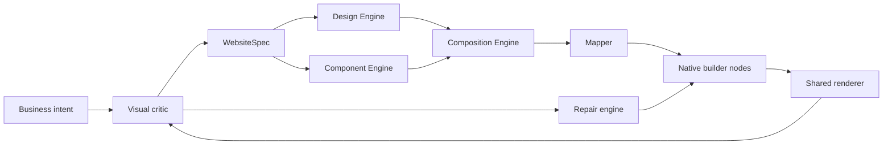

# Vision

BuildEZ is a Website Operating System, not a prompt-to-page toy. The platform should understand any business, resolve it through universal ontology and Website Intelligence, select website archetypes, assemble a typed specification, apply deterministic design language, map to native editable builder nodes, render identically in preview and publish, critique the rendered result, repair structural failures, and learn from outcomes.

The long-term product promise is that a small business owner can describe their business and receive a credible, editable, conversion-aware website without the system inventing facts or hiding brittle placeholders.

## Universal Scope

The engine must support every industry by composition. Real estate, healthcare, restaurant, education, and automotive sites should use the same core pipeline with different ontology records, archetype preferences, section patterns, component patterns, assets, compliance rules, and critic checks. Real estate is a validation fixture, not the foundation of the architecture.

## Implementation Guidance

Future Codex sessions should treat this document as architectural intent, then confirm current code before editing. Any behavior change must update the relevant module doc, specification, phase checklist, and changelog.
