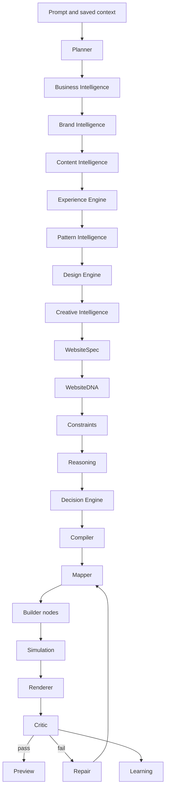

# System Architecture

The Website Engine is a pipeline with feedback loops. The happy path is planner -> business intelligence -> brand intelligence -> content intelligence -> experience engine -> pattern intelligence -> design engine -> creative intelligence -> WebsiteSpec -> WebsiteDNA -> constraints -> reasoning -> Decision Engine -> compiler -> mapper -> simulation -> renderer -> critic -> repair -> preview -> user edits -> publish -> analytics -> learning.

After Phase 20, Mapper is intentionally deferred. The current Compiler is a contract layer and should remain frozen until Business Intelligence, Brand Intelligence, Content Intelligence, Experience, Pattern Intelligence, Design, Creative Intelligence, Component, and Composition engines exist.

The `ai-v10/orchestrator` layer should call these modules rather than containing product logic.

The system must not branch into separate generators for real estate, healthcare, restaurants, education, automotive, or any other family. The planner resolves business concepts and archetypes; the rest of the pipeline composes from typed records.

`ai-v9` remains the production/stable path until the new engine proves parity. `ai-v10` should become orchestration glue only after the Website Engine core contracts exist.

## Implementation Guidance

Future Codex sessions should treat this document as architectural intent, then confirm current code before editing. Any behavior change must update the relevant module doc, specification, phase checklist, and changelog.

## Phase 20 Gate

Do not implement Mapper immediately after Compiler contracts. Implement the upstream intelligence/design/component/composition engines first, revisit Compiler, and only then implement Mapper.

## Creative Intelligence Boundary

Creative Intelligence owns art direction, media requirements, motion language, and provider abstraction. Higgsfield MCP and other providers may execute bounded future creative tasks, but BuildEZ remains the source of truth for strategy, WebsiteSpec, components, structure, and editability.
