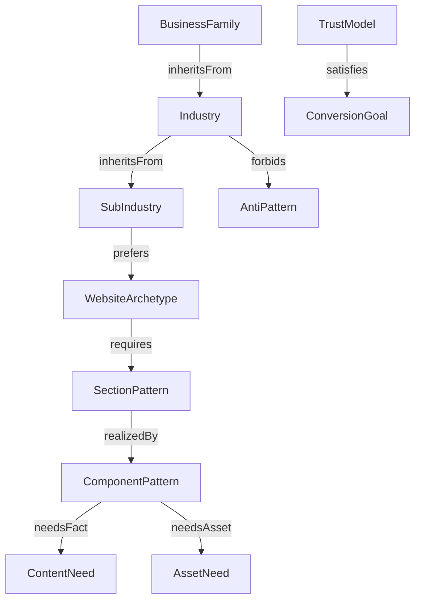

# Knowledge Graph

The Website Knowledge Graph models reusable business and website concepts. It is the bridge between the universal business ontology, website ontology, WebsiteSpec, component metadata, and critic rules.

The graph must model: BusinessFamily, Industry, SubIndustry, BusinessModel, RevenueModel, CustomerJourney, TrustModel, ConversionGoal, LocalityNeed, ComplianceNeed, ContentNeed, AssetNeed, WebsiteArchetype, SectionPattern, ComponentPattern, ComponentVariant, DesignLanguage, CTAType, ConversionPattern, AntiPattern, AccessibilityRule, and SEORequirement.

Relationships include: `inheritsFrom`, `requires`, `supports`, `forbids`, `prefers`, `overrides`, `dependsOn`, `satisfies`, `conflictsWith`, `needsAsset`, `needsFact`, `convertsTo`, and `mapsToNode`.

## Cross-Industry Graph Examples

- Real estate -> residential developer -> apartment project prefers property showcase and lead generation, requires project image/location/configuration facts, and forbids fake availability.
- Healthcare -> clinic -> dental clinic prefers appointment and brochure, requires provider credentials and privacy-safe contact patterns, and forbids cure guarantees.
- Restaurant -> fine dining prefers restaurant menu and booking, requires menu/hours/location/ambience assets, and forbids fake reservation availability.
- Education -> school -> admissions site prefers brochure and lead generation, requires programs/faculty/admissions timeline, and forbids fake accreditation or placement statistics.
- Automotive -> dealer -> EV dealership prefers catalogue and booking, requires inventory/specs/test-drive CTA, and forbids fake discounts, warranty terms, or availability.

## Prompt Bloat Prevention

The graph prevents prompts from carrying the full product brain. The LLM can classify intent and identify ambiguity, while graph traversal supplies inherited rules, preferred archetypes, required facts, forbidden patterns, asset needs, and QA constraints. Prompt text should ask for planning output; graph data should own durable domain knowledge.

## Implementation Guidance

Future Codex sessions should treat this document as architectural intent, then confirm current code before editing. Any behavior change must update the relevant module doc, specification, phase checklist, and changelog. Do not implement graph data as long prompt strings; use versioned structured records.
