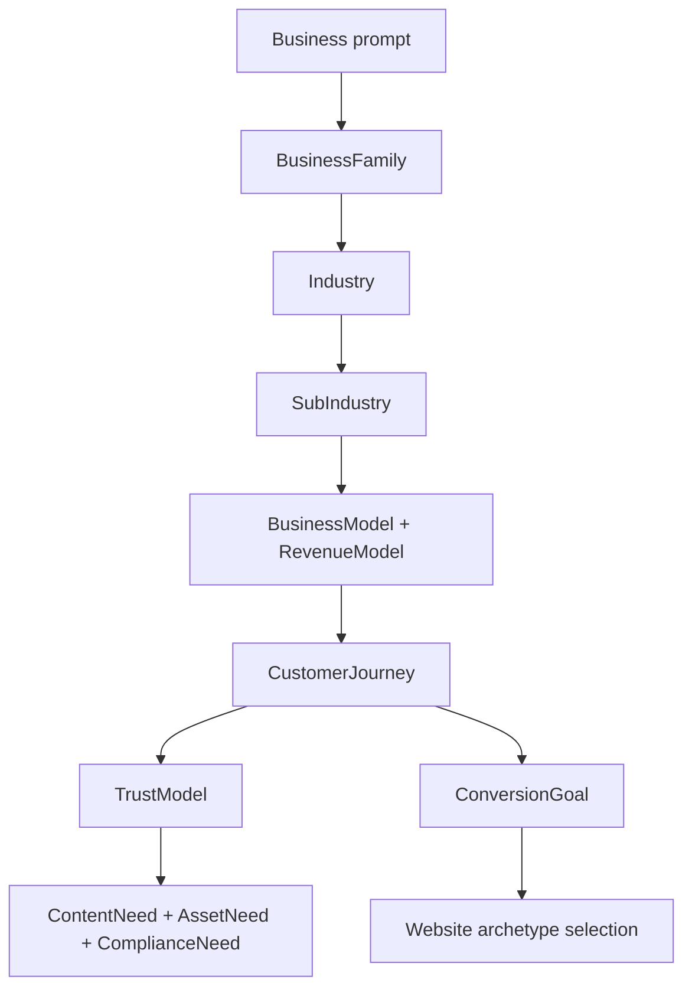

# Universal Business Ontology

BuildEZ must understand businesses before it understands pages. The Universal Business Ontology is the typed model that lets the Website Engine reason across industries without creating a custom generator for each industry.

## Purpose

The ontology captures what a business is, how it makes money, how customers decide, what trust means, what locality or compliance matters, and what content and assets are required. Website generation then becomes composition over this model.

## Core Concepts

- `BusinessFamily`: broad family such as healthcare, real estate, food and beverage, education, or automotive.
- `Industry`: a more specific commercial domain inside a family.
- `SubIndustry`: a narrower specialization with overrides.
- `BusinessModel`: how the organization operates, such as service provider, marketplace, product seller, venue, institution, consultant, or publisher.
- `RevenueModel`: transaction, subscription, booking, lead sale, donation, tuition, retainer, commission, advertising, or quote-based.
- `CustomerJourney`: awareness, comparison, proof, enquiry, booking, purchase, onboarding, retention.
- `TrustModel`: licenses, testimonials, certifications, portfolio, location proof, team credentials, reviews, compliance, guarantees.
- `ConversionGoal`: call, form submit, book, buy, download, visit, apply, donate, subscribe, request quote.
- `LocalityNeed`: none, local service area, single venue, multi-location, destination, project site, delivery zone.
- `ComplianceNeed`: required claims, disclaimers, regulated terminology, prohibited promises, privacy requirements.
- `ContentNeed`: services, products, menu, curriculum, inventory, team, pricing, proof, FAQs, policies.
- `AssetNeed`: logo, location imagery, product images, professional photos, diagrams, maps, documents, certificates.

## Universal Flow

## Cross-Industry Examples

| Industry | Business ontology interpretation |
| --- | --- |
| Real estate | `BusinessFamily: real_estate`, `BusinessModel: project developer or brokerage`, `RevenueModel: lead/enquiry`, `TrustModel: developer credibility, location, approvals`, `LocalityNeed: project site`. |
| Healthcare | `BusinessFamily: healthcare`, `BusinessModel: clinic`, `RevenueModel: appointment`, `TrustModel: doctors, credentials, reviews`, `ComplianceNeed: medical caution and privacy`. |
| Restaurant | `BusinessFamily: food_and_beverage`, `BusinessModel: venue`, `RevenueModel: reservation/order`, `TrustModel: menu, ambience, reviews`, `LocalityNeed: single or multi-location`. |
| Education | `BusinessFamily: education`, `BusinessModel: school/course provider`, `RevenueModel: tuition/application`, `TrustModel: outcomes, faculty, accreditation`, `ContentNeed: programs and admissions`. |
| Automotive | `BusinessFamily: automotive`, `BusinessModel: dealer/service center`, `RevenueModel: enquiry, booking, sale`, `TrustModel: inventory, service quality, warranties`, `AssetNeed: vehicle imagery`. |

## Composition Rule

No website module should ask "is this real estate?" first. It should ask:

1. What business family and subindustry are present?
2. What business and revenue model drive the site?
3. What customer journey and conversion goal are required?
4. What trust, locality, compliance, content, and asset needs constrain the page?
5. Which archetype and patterns satisfy those needs?

## Implementation Guidance

The ontology should eventually live as structured repository data under `website-engine/repository/industries/` and be versioned independently from the LLM prompts. Prompt wording may help classify ambiguous input, but typed ontology records must own durable business knowledge.
