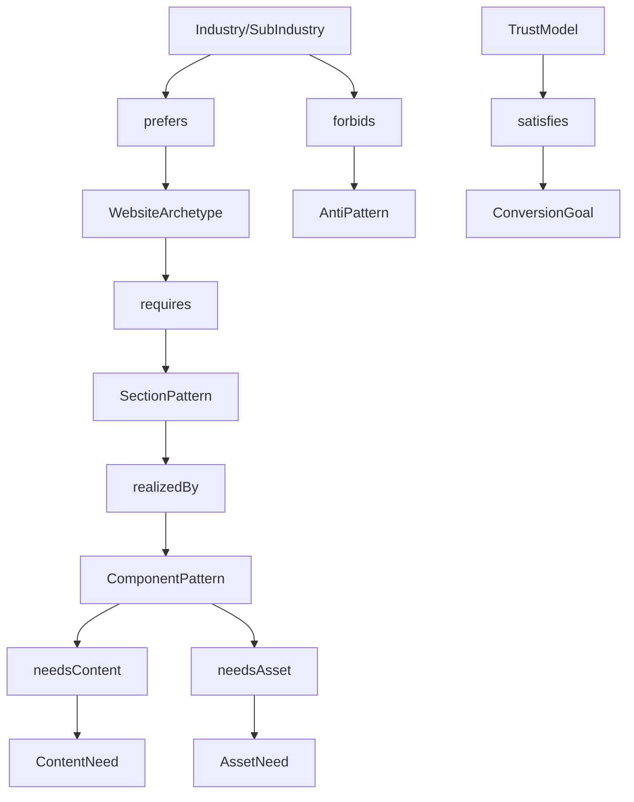

# Universal Website Ontology

The Universal Website Ontology models what websites are made of. It separates business facts from website strategy so BuildEZ can compose many site types from common primitives.

## Core Concepts

- `WebsiteArchetype`: the primary strategy of the site, such as lead generation, ecommerce, booking, portfolio, directory, or knowledge base.
- `SectionPattern`: reusable section intent such as hero, proof band, service list, menu, inventory grid, location block, FAQ, final CTA.
- `ComponentPattern`: editable production pattern that realizes a section, such as image-led hero, card grid, menu list, appointment form, map band, or comparison table.
- `ConversionGoal`: desired visitor action.
- `TrustModel`: proof required before a visitor acts.
- `ContentNeed`: specific text/data requirements.
- `AssetNeed`: visual or document requirements.
- `AntiPattern`: forbidden pattern for the current ontology context.

## Relationship Model

## Cross-Industry Examples

| Industry | Archetype | Section patterns | Component patterns |
| --- | --- | --- | --- |
| Real estate | Property showcase, lead generation | Project hero, gallery, amenities, location, enquiry CTA | Immersive project hero, amenity mosaic, map band, enquiry form. |
| Healthcare | Appointment, brochure | Clinic hero, doctor trust, services, insurance, appointment CTA | Credentials strip, service explainer, appointment form, FAQ accordion. |
| Restaurant | Restaurant menu, booking | Ambience hero, menu, reservation, reviews, location | Menu sections, gallery rail, booking widget, hours/location band. |
| Education | Brochure, application | Program hero, curriculum, outcomes, faculty, admissions CTA | Course cards, timeline, faculty grid, application form. |
| Automotive | Catalogue, booking, lead generation | Inventory hero, vehicle grid, finance/trade-in, service booking | Vehicle card grid, comparison table, service scheduler, dealer map. |

## Why This Prevents Hardcoding

An automotive inventory page and a real estate project page both need catalogue-like browsing, trust proof, locality, and enquiry. Their content fields and assets differ, but the engine can reuse archetypes and patterns with industry-specific constraints. A healthcare appointment site and a restaurant booking site both need availability and booking CTAs, but compliance and trust rules differ.

## Implementation Guidance

The ontology should be queried by the planner and reasoning modules before design or mapping. Components should declare which section patterns they realize, not which one-off prompt they were created for.
