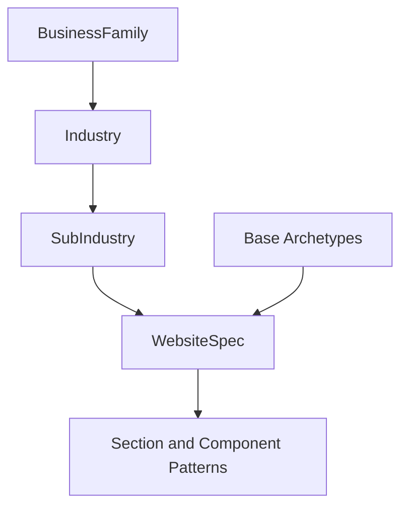

# Industry Inheritance Model

Industry inheritance lets BuildEZ scale without hardcoding every use case. A broad family defines defaults, an industry refines them, and a subindustry overrides only the differences.

## Inheritance Layers

## Required Industry Families

healthcare, real estate, hospitality, food and beverage, education, beauty/wellness, fitness, automotive, construction, architecture/interiors, professional services, legal/finance, ecommerce/D2C, manufacturing/industrial, logistics, travel, creative/portfolio, NGO/community, entertainment/events, technology/SaaS, personal brand.

## Override Rules

- Families define common journeys, trust models, content needs, compliance needs, and anti-patterns.
- Industries refine the family with more specific revenue models, locality needs, assets, and section preferences.
- Subindustries override fields only when the base defaults are wrong.
- Conflicts must be explicit. For example, a healthcare family may forbid cure guarantees, while a dental clinic subindustry may add insurance and appointment patterns.
- Inherited data must be traceable so engineers can see why a section was selected.

## Cross-Industry Examples

| Family path | Inherited defaults | Overrides |
| --- | --- | --- |
| Real estate -> Residential developer -> Apartment project | Locality, project proof, enquiry, visual assets. | Configuration, amenities, floor plans, compliance caution. |
| Healthcare -> Clinic -> Dental clinic | Appointment, credentials, privacy, service pages. | Insurance, before/after caution, procedure pages. |
| Food and beverage -> Restaurant -> Fine dining | Menu, hours, location, reviews. | Reservation-first journey, ambience imagery, private dining. |
| Education -> School -> Admissions site | Programs, outcomes, faculty, trust. | Admissions timeline, fees caution, campus visit. |
| Automotive -> Dealer -> EV dealership | Inventory, test drive, finance, location. | Charging range content, incentives caution, EV comparison. |

## Anti-Hardcoding Rule

Do not create `generateDentalWebsite`, `generateRestaurantWebsite`, or `generateRealEstateWebsite` as the foundation. Create ontology records, archetype preferences, section patterns, component metadata, and QA rules that the universal pipeline composes.

## Implementation Guidance

Inheritance should be data-driven and testable with fixtures. Each fixture should state which inherited rules were applied and which overrides changed the output.
