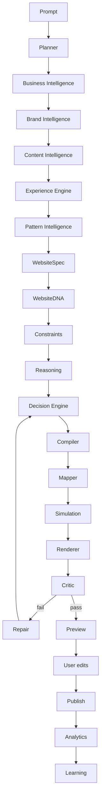

# Website Engine Core

## Purpose

The Website Engine Core is the durable product capability planned for `modules/builder-v2/website-engine/`. It is built beside `ai-v9`, not by rewriting it. The core turns classified business intent into a resolved, constrained, simulated, editable website plan.

## Problem Solved

`ai-v9` can remain production/stable while BuildEZ develops a deterministic engine. The core gives future `ai-v10` something safe to orchestrate: SDK contracts, repository records, constraints, reasoning candidates, Decision Plans, compiler output, mapper integration, simulation, critic, repair, learning, and analytics.

## Responsibilities

- Own the full pipeline after AI planning.
- Keep `WebsiteSpec` as the central contract.
- Resolve repository records and constraints before mapping.
- Compile a complete generation plan before builder nodes are produced.
- Simulate common failures before preview.
- Preserve native builder editability and renderer parity.
- Produce traces for debugging, migration, rollback, and learning.

## Inputs

Prompt-derived intent, `BusinessContext`, `WebsiteIntentClassification`, repository records, `WebsiteSpec`, `WebsiteDNA`, brand context, available assets, constraints, feature flags, and tenant-safe generation history.

## Outputs

`DecisionPlan`, `CompiledWebsitePlan`, `BuilderNodeMapping`, `SimulationResult`, `WebsiteEvaluation`, `RepairPlan`, `GenerationHistory`, and analytics-ready lifecycle traces.

## Data Flow

## Failure Modes

- Repository records are missing or incompatible.
- The Decision Engine selects conflicting patterns or components.
- Constraints block output because facts or assets are missing.
- The compiler creates a plan that cannot map to editable nodes.
- Simulation detects mobile, accessibility, SEO, performance, asset, or parity risk.
- Critic finds rendered quality failures after simulation passed.

## Multi-Industry Examples

- Real estate: apartment project resolves property showcase plus lead generation, blocks fake prices and unavailable RERA claims, requires project imagery and location facts.
- Healthcare: clinic appointment site resolves appointment archetype, blocks fabricated doctors and medical outcomes, requires provider credentials and privacy-safe CTA.
- Restaurant: reservation site resolves restaurant menu plus booking, blocks invented menu prices, requires hours, location, menu categories, and ambience assets.
- Automotive: dealer catalogue resolves inventory plus test-drive CTA, blocks unauthorized brand claims, requires vehicle images, specs, and availability truth.
- Education: admissions site resolves brochure plus lead generation, blocks fabricated placements and exam results, requires programs, faculty, admissions timeline, and outcomes proof.

## Implementation Guidance

Create the engine beside `ai-v9`. Start with empty module folders, SDK types, fixture repository records, and feature flags. Do not route production traffic until parity and quality gates are proven.

## Testing Guidance

Use fixture-driven tests for the five industries above. Each fixture should include prompt, classification, repository records, spec, Decision Plan, compiled plan, mapped nodes, simulation result, critic expectations, and fallback behavior.

## Future Extensions

Multi-page site planning, localization, multi-brand organizations, regulated-industry packs, analytics-ranked patterns, and repository-backed variant experimentation.
