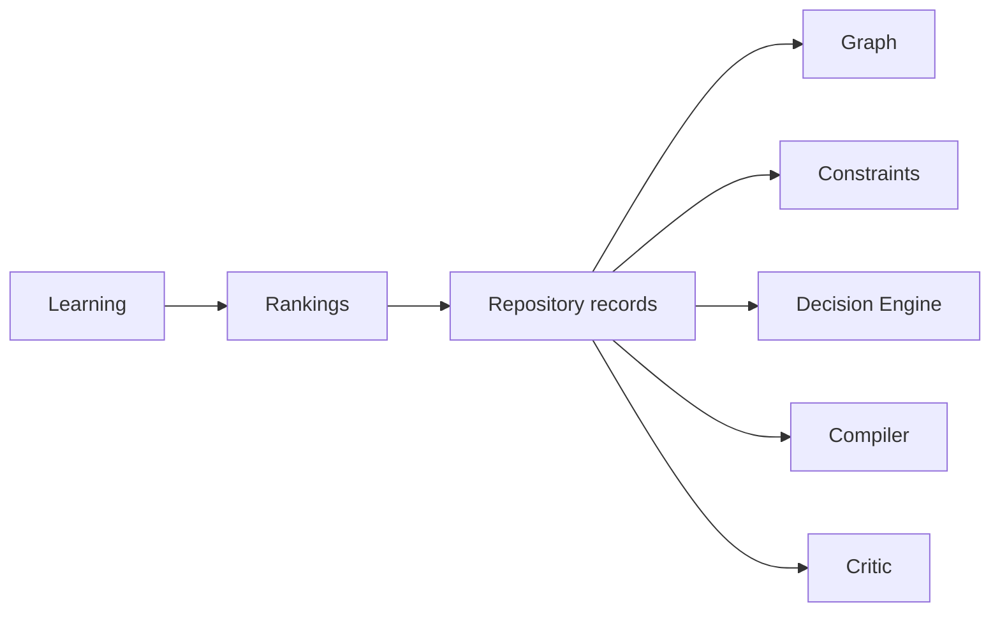

# Website Repository

## Purpose

The Website Repository stores BuildEZ's reusable structured intelligence. It is the long-term moat: not HTML dumps, but versioned records that describe business families, industries, archetypes, patterns, components, design languages, tokens, constraints, QA rules, repair rules, fixtures, examples, and anti-patterns.

## Problem Solved

Prompt-only knowledge is hard to test, rank, migrate, or reuse. A repository lets industry-specific behavior emerge from composable records.

## Responsibilities

- Store versioned records for `business-families`, `industries`, `subindustries`, `archetypes`, `patterns`, `components`, `design-languages`, `tokens`, `composition-rules`, `constraints`, `asset-rules`, `qa-rules`, `repair-rules`, `fixtures`, `examples`, and `anti-patterns`.
- Provide deterministic queries by industry, archetype, goal, pattern, component, asset, and constraint.
- Provide intelligence records for business models, brand postures, content strategies, experience patterns, and semantic website patterns.
- Preserve provenance, status, compatibility, and deprecation metadata.
- Support later ranking by critic scores, user edits, publish rates, and analytics.

## Inputs

SDK schemas, ontology records, fixtures, component metadata, constraints, QA criteria, repair rules, and learning signals.

## Outputs

Repository record sets for graph lookup, Decision Engine compatibility checks, compiler decisions, critic expectations, and repair strategies.

## Data Flow

## Failure Modes

- Records are too generic and cannot guide implementation.
- Records encode one-off industry hacks instead of reusable patterns.
- Version metadata is missing.
- Deprecated records remain selectable.
- Ranking data leaks tenant-specific facts.

## Multi-Industry Examples

Real estate, clinic, restaurant, automotive, and education can reuse lead generation, catalogue, booking, trust proof, location, FAQ, gallery, and final CTA patterns while applying different content, assets, compliance, and anti-patterns.

## Implementation Guidance

Start with file-backed fixtures in Phase 13. Add record IDs, semantic versions, compatibility fields, provenance, and status. Do not store generated HTML as repository knowledge.

## Testing Guidance

Validate repository records against SDK schemas. Run Decision Engine fixture tests to prove the same archetype/pattern/component system works for property showcase, clinic appointment, restaurant menu, vehicle catalogue, and admissions brochure.

## Future Extensions

Repository search UI, ranking service, record review workflow, tenant-safe learning signals, regional packs, and marketplace-like pattern packs.
