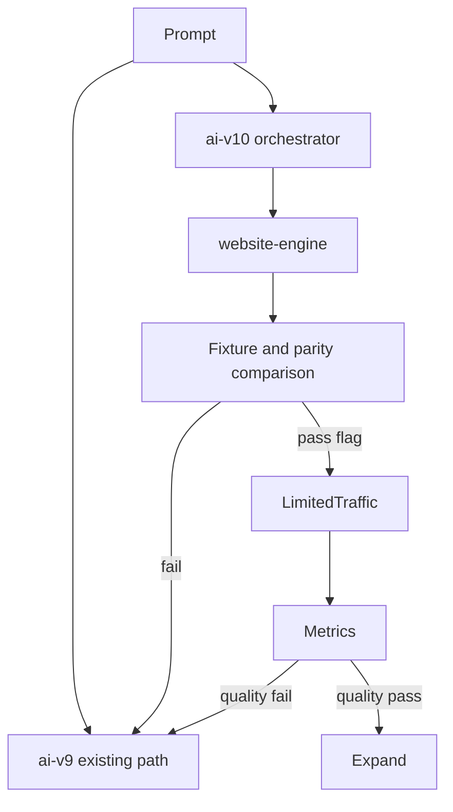

# AI v9 To AI v10 Migration

## Purpose

This document defines the safe migration from current `ai-v9` generation to future `ai-v10` orchestration of the Website Engine.

## Problem Solved

Replacing production generation too early would risk regressions. `ai-v9` must remain isolated and stable until the Website Engine proves parity, quality, and fallback safety.

## Responsibilities

- Keep `ai-v9` unchanged during core engine construction.
- Build `website-engine` beside `ai-v9`.
- Create `ai-v10/orchestrator` as glue, not product logic.
- Use feature flags, fixtures, parity comparisons, and fallback to `ai-v9`.
- Retire `ai-v9` only after quality metrics pass.

## Inputs

Current `ai-v9` behavior, Website Engine fixtures, compiled plans, mapped nodes, simulation/critic scores, user acceptance, publish outcomes, and feature flag configuration.

## Outputs

Migration reports, parity comparisons, gated rollout decisions, fallback behavior, and retirement criteria.

## Data Flow

## Failure Modes

- `ai-v10` starts duplicating engine logic.
- Feature flag fallback is incomplete.
- Parity compares only JSON, not rendered/editable output.
- Migration removes `ai-v9` before fixtures and quality metrics are strong.

## Multi-Industry Examples

Start with real estate, then add healthcare, restaurant, automotive, and education fixtures before broad rollout. Each fixture should compare `ai-v9` output, engine output, editability, simulation, critic scores, and preview/publish parity.

## Implementation Guidance

Do not delete or rewrite `ai-v9`. Add isolated engine modules, then route limited flagged requests through `ai-v10` only after skeleton, SDK, repository, constraints, reasoning, Decision Engine, compiler, mapper, simulation, and critic reach fixture readiness.

## Testing Guidance

Migration tests should cover fallback, feature flags, fixture parity, output editability, and rendered quality. A failed `ai-v10` path must return safely to `ai-v9`.

## Future Extensions

Shadow generation, side-by-side human review, automated quality dashboards, and per-industry rollout gates.
