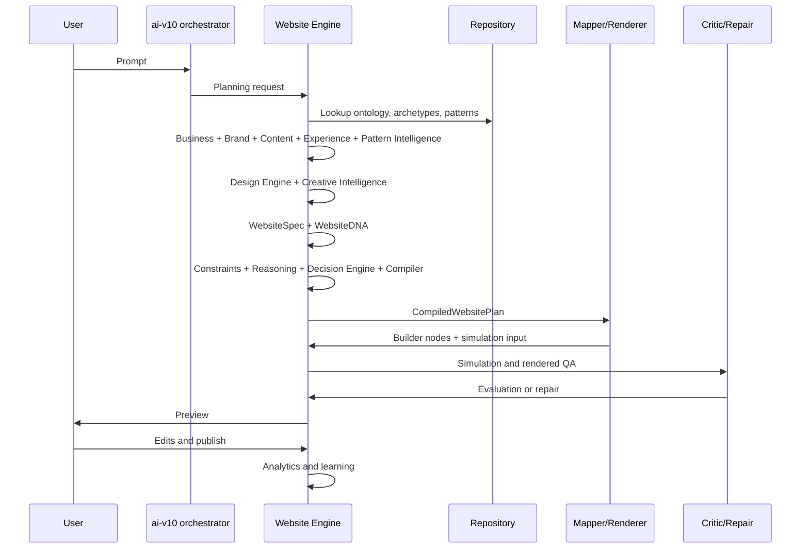

# Engine Lifecycle

## Purpose

The Engine Lifecycle describes every stage from prompt to learning so future modules share the same mental model and trace format.

## Problem Solved

Without a lifecycle, modules optimize locally and gaps appear between planning, constraints, compilation, mapping, simulation, rendering, critique, repair, user edits, publishing, analytics, and learning.

## Responsibilities

- Define stage order and handoff contracts.
- Identify where constraints, reasoning, Decision Engine, compiler, simulation, critic, and repair run.
- Preserve trace metadata for debugging and rollback.
- Separate `ai-v10` orchestration from Website Engine product logic.

## Inputs

User prompt, saved context, repository records, available assets, brand context, tenant state, feature flags, and prior generation history.

## Outputs

Lifecycle trace, `WebsiteSpec`, `WebsiteDNA`, Decision Plan, compiled plan, mapped nodes, simulation result, rendered output, critic score, repair plan, preview, published site, analytics events, and learning updates.

## Data Flow

Phase 20 review note: the lifecycle below remains the long-term target, but Mapper must not be implemented immediately after Compiler contracts. The intelligence/design/creative/component/composition engines must be implemented first, then Compiler revisited.

## Failure Modes

- Missing trace stage makes debugging impossible.
- Repair loops indefinitely.
- User edits are not recorded for learning.
- Analytics affects shared learning without tenant safety.
- Preview and publish diverge.

## Multi-Industry Examples

The same lifecycle applies to a real estate project, healthcare clinic, restaurant reservation site, automotive inventory site, and education admissions site. Only repository records, constraints, assets, and archetype selections differ.

## Implementation Guidance

Every stage should emit `EngineLifecycleTrace` metadata with engine versions, inputs, outputs, warnings, errors, and fallback decisions.

After Phase 20, treat Compiler as frozen contract-only until upstream intelligence, design, creative, component, and composition engines exist.

## Testing Guidance

Lifecycle fixture tests should assert stage order, trace completeness, failure behavior, fallback behavior, and repair loop limits.

## Future Extensions

Trace visualization, replay tools, partial regeneration after edits, and learning analysis by lifecycle stage.
