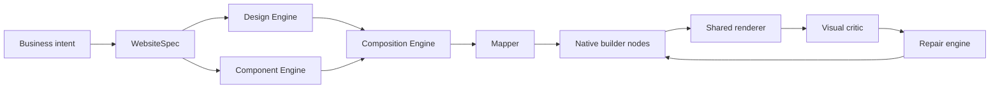
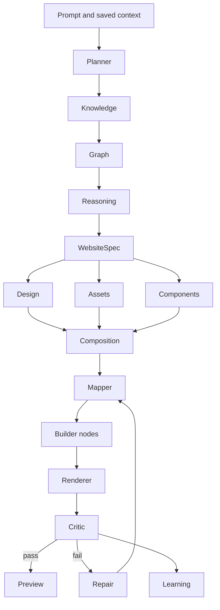
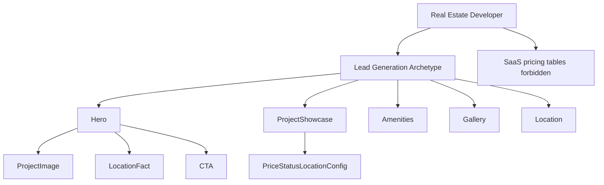

# BUILD EZ WEBSITE ENGINE ARCHITECTURE BIBLE

Generated: Sun Jul  5 22:37:47 IST 2026

---


=======================================================================
# FILE: docs/adr/0001-website-engine-as-platform.md
=======================================================================

# ADR: Website Engine As Platform

## Status

Accepted

## Context

BuildEZ needs durable website capability beyond a single AI route.

## Decision

Create a Website Engine platform with typed modules for planning, knowledge, spec, design, mapping, rendering, QA, repair, learning, and analytics.

## Consequences

The platform can scale by adding graph data and variants instead of larger prompts.

## Real Estate Impact

Real estate developer example: a premium residential project lead-generation site uses Hero, Project Showcase, Amenities, Gallery, Location, FAQ, and CTA sections; requires real project/location/configuration facts; forbids SaaS pricing tables, generic feature cards, placeholder claims, and fake availability.

## Review Trigger

Revisit this ADR if implementation proves the decision blocks editable output, renderer parity, tenant safety, or measurable quality improvements.


=======================================================================
# FILE: docs/adr/0002-ai-as-orchestrator-not-designer.md
=======================================================================

# ADR: AI As Orchestrator Not Designer

## Status

Accepted

## Context

Direct model-created layouts produce generic, inconsistent, and hard-to-repair output.

## Decision

Use AI for classification, planning, missing-fact detection, and structured content assistance. Engine modules own design and rendering decisions.

## Consequences

Prompts get simpler and output becomes more deterministic.

## Real Estate Impact

Real estate developer example: a premium residential project lead-generation site uses Hero, Project Showcase, Amenities, Gallery, Location, FAQ, and CTA sections; requires real project/location/configuration facts; forbids SaaS pricing tables, generic feature cards, placeholder claims, and fake availability.

## Review Trigger

Revisit this ADR if implementation proves the decision blocks editable output, renderer parity, tenant safety, or measurable quality improvements.


=======================================================================
# FILE: docs/adr/0003-website-spec-as-contract.md
=======================================================================

# ADR: WebsiteSpec As Contract

## Status

Accepted

## Context

Golden blueprint thinking is too loose for multi-module generation.

## Decision

Adopt WebsiteSpec as the versioned contract between planning and rendering.

## Consequences

All modules can validate and explain decisions against the same source of truth.

## Real Estate Impact

Real estate developer example: a premium residential project lead-generation site uses Hero, Project Showcase, Amenities, Gallery, Location, FAQ, and CTA sections; requires real project/location/configuration facts; forbids SaaS pricing tables, generic feature cards, placeholder claims, and fake availability.

## Review Trigger

Revisit this ADR if implementation proves the decision blocks editable output, renderer parity, tenant safety, or measurable quality improvements.


=======================================================================
# FILE: docs/adr/0004-knowledge-graph.md
=======================================================================

# ADR: Knowledge Graph

## Status

Accepted

## Context

Industry knowledge embedded in prompts is hard to test and reuse.

## Decision

Represent industry, archetype, section, component, conversion, SEO, accessibility, and anti-pattern relationships as machine-readable graph data.

## Consequences

Real estate rules become enforceable and inspectable.

## Real Estate Impact

Real estate developer example: a premium residential project lead-generation site uses Hero, Project Showcase, Amenities, Gallery, Location, FAQ, and CTA sections; requires real project/location/configuration facts; forbids SaaS pricing tables, generic feature cards, placeholder claims, and fake availability.

## Review Trigger

Revisit this ADR if implementation proves the decision blocks editable output, renderer parity, tenant safety, or measurable quality improvements.


=======================================================================
# FILE: docs/adr/0005-deterministic-design-engine.md
=======================================================================

# ADR: Deterministic Design Engine

## Status

Accepted

## Context

LLM-designed visual systems drift and often look generic.

## Decision

Create a deterministic Design Engine that owns tokens, rhythm, and visual constraints.

## Consequences

Visual quality becomes testable and less dependent on model phrasing.

## Real Estate Impact

Real estate developer example: a premium residential project lead-generation site uses Hero, Project Showcase, Amenities, Gallery, Location, FAQ, and CTA sections; requires real project/location/configuration facts; forbids SaaS pricing tables, generic feature cards, placeholder claims, and fake availability.

## Review Trigger

Revisit this ADR if implementation proves the decision blocks editable output, renderer parity, tenant safety, or measurable quality improvements.


=======================================================================
# FILE: docs/adr/0006-native-editable-builder-nodes.md
=======================================================================

# ADR: Native Editable Builder Nodes

## Status

Accepted

## Context

Generated pages must be editable in the builder.

## Decision

The mapper emits native builder nodes rather than opaque HTML blobs or images.

## Consequences

Users retain control and existing builder workflows continue to matter.

## Real Estate Impact

Real estate developer example: a premium residential project lead-generation site uses Hero, Project Showcase, Amenities, Gallery, Location, FAQ, and CTA sections; requires real project/location/configuration facts; forbids SaaS pricing tables, generic feature cards, placeholder claims, and fake availability.

## Review Trigger

Revisit this ADR if implementation proves the decision blocks editable output, renderer parity, tenant safety, or measurable quality improvements.


=======================================================================
# FILE: docs/adr/0007-preview-published-renderer-parity.md
=======================================================================

# ADR: Preview Published Renderer Parity

## Status

Accepted

## Context

QA is meaningless if preview differs from published output.

## Decision

Preview and published pages must share renderer semantics and parity tests.

## Consequences

Visual QA can be trusted only after parity is enforced.

## Real Estate Impact

Real estate developer example: a premium residential project lead-generation site uses Hero, Project Showcase, Amenities, Gallery, Location, FAQ, and CTA sections; requires real project/location/configuration facts; forbids SaaS pricing tables, generic feature cards, placeholder claims, and fake availability.

## Review Trigger

Revisit this ADR if implementation proves the decision blocks editable output, renderer parity, tenant safety, or measurable quality improvements.


=======================================================================
# FILE: docs/adr/0008-visual-qa-before-preview.md
=======================================================================

# ADR: Visual QA Before Preview

## Status

Accepted

## Context

JSON validation cannot catch weak visual output or industry mismatch.

## Decision

Run visual/DOM/accessibility/industry critic checks before presenting generated output as ready.

## Consequences

The system can repair structural failures before users see them.

## Real Estate Impact

Real estate developer example: a premium residential project lead-generation site uses Hero, Project Showcase, Amenities, Gallery, Location, FAQ, and CTA sections; requires real project/location/configuration facts; forbids SaaS pricing tables, generic feature cards, placeholder claims, and fake availability.

## Review Trigger

Revisit this ADR if implementation proves the decision blocks editable output, renderer parity, tenant safety, or measurable quality improvements.


=======================================================================
# FILE: docs/adr/0009-documentation-as-deliverable.md
=======================================================================

# ADR: Documentation As Deliverable

## Status

Accepted

## Context

Future sessions need durable context independent of chat history.

## Decision

Every meaningful Website Engine feature updates docs, specs, ADRs, logs, or changelog.

## Consequences

Architecture remains navigable as implementation grows.

## Real Estate Impact

Real estate developer example: a premium residential project lead-generation site uses Hero, Project Showcase, Amenities, Gallery, Location, FAQ, and CTA sections; requires real project/location/configuration facts; forbids SaaS pricing tables, generic feature cards, placeholder claims, and fake availability.

## Review Trigger

Revisit this ADR if implementation proves the decision blocks editable output, renderer parity, tenant safety, or measurable quality improvements.


=======================================================================
# FILE: docs/AI_SYSTEM.md
=======================================================================

# BuildEZ AI Builder Strategy

Last updated: 2026-06-27

This document is the canonical strategy for BuildEZ AI website generation. Any AI-builder module, prompt, agent, recipe, validator, or UI workflow should revisit this file before implementation.

## North Star

BuildEZ is a node-native AI website builder.

The product promise is:

> AI speed with Elementor-like editability and production validation.

BuildEZ should not generate static pages, arbitrary React, locked templates, or screenshot-only output. Every generated website must become a valid editable `BuilderBlueprint` made from registered builder nodes and widgets.

## Competitor Research Notes

Reviewed competitor positioning on June 28, 2026:

- Framer AI focuses on prompt-to-site generation inside a mature visual website canvas, plus AI-assisted review and refinement.
- Lovable and Emergent emphasize chat-first generation of working web apps and prototypes from natural language.
- Cursor's strongest pattern is agentic code execution with visible iteration, review, and developer control rather than a pure website canvas.

Implication for BuildEZ:

BuildEZ should not try to win only on "prompt goes in, page comes out." That lane becomes generic quickly. The differentiated path is professional website intelligence plus builder-native editability: brief extraction, industry recipes, brand memory, proof/CTA strategy, generated asset direction, validation, repair, and editable nodes.

The first active implementation slice is in:

- `apps/web-app/modules/builder/ai-v8/agents/`
- `apps/web-app/modules/builder/ai-v8/orchestrator/runWebsiteGenerationOrchestrator.ts`
- `apps/web-app/modules/builder/ai-v8/lib/experienceIntelligence.ts`
- `apps/web-app/app/api/ai-v8/generate-react/route.ts`

This slice adds deterministic task agents, an orchestrator layer, a professional brief, conversion strategy, competitor-gap instructions, quality scoring, repair feedback, agent run logs, and saved generation metadata before the system moves to fully node-native generation.

## Core Positioning

The crowded AI website-builder market mostly competes on prompt-to-site speed. BuildEZ should stand out through:

- Industry-specific intelligence.
- Design-style variety.
- Unique generation per request.
- Builder-node editability.
- Visual preview before build.
- Validation and repair before publishing.
- Brand and business memory across pages.

The frozen product lane:

> BuildEZ is an AI-orchestrated, node-native website builder where every generated website is visually impressive, validated, and editable like Elementor.

## Non-Negotiable Rules

1. AI must not freely generate production React for builder pages.
2. AI must not bypass the builder node schema.
3. AI-generated UI images are visual targets, not the source of truth.
4. The editable blueprint is always the canonical output.
5. Only registered widgets and approved section recipes can reach the canvas.
6. Validation must run before writing AI output into builder state.
7. Repair must modify blueprint data, not patch rendered DOM.
8. Every generated section must remain editable through normal builder controls.
9. Industry kits and design style kits should guide generation, but not create duplicate-looking sites.
10. The orchestrator owns workflow control; agents propose bounded outputs.

## Target Generation Flow

```text
User Prompt
  -> AI Orchestrator
  -> Intent Detection
  -> Industry Kit Selection
  -> Design Style Selection
  -> Site/Page Plan
  -> Optional UI Image Preview
  -> Section Recipe Selection
  -> Content + Asset Direction
  -> BuilderBlueprint Generation
  -> Blueprint Validation
  -> Render Preview
  -> QA + Repair Loop
  -> Editable Builder Canvas
```

## Source Of Truth

The canonical final output is a valid builder blueprint:

```text
Page
  Section
    Container
      Heading
      Text
      Button
      Image
```

Relevant active contracts:

- `apps/web-app/modules/builder-v2/types/blueprint.ts`
- `apps/web-app/modules/builder-v2/core/registry/WidgetRegistry.ts`
- `apps/web-app/modules/builder-v2/core/registry/registerWidgets.ts`
- `apps/web-app/modules/builder-v2/core/commands/CommandBus.ts`

AI modules must treat these contracts as hard boundaries.

## Widget Marketplace Strategy

BuildEZ should call this layer the Widget Marketplace from the beginning.

The marketplace is not only a future storefront. It is the premium builder-native component source that AI uses to assemble high-quality editable websites.

There should be two widget tiers:

```text
Default Widgets
  -> available to all plans
  -> core builder foundation

Premium Marketplace Widgets
  -> available to paid plans later
  -> richer conversion, media, content, commerce, and industry-specific widgets
```

Initial default widgets:

- Page
- Section
- Container
- Column
- Heading
- Text
- Button
- Image
- Video
- Icon
- Divider
- Spacer

Initial premium marketplace widget categories:

- Header and navigation.
- Footer.
- Hero.
- Forms.
- Cards.
- Content grids.
- Carousel.
- Slider.
- Gallery.
- Lightbox.
- Expanding cards.
- Flipbox.
- Content tabs.
- Accordion.
- FAQ.
- Testimonials.
- Pricing.
- Blog list and blog cards.
- Instagram feed.
- WhatsApp button.
- Floating contact button.
- Modal and popup.
- Announcement bar.
- Map.
- Reviews.
- Product or offer grid.

Each marketplace widget must define:

- Widget definition.
- Default node.
- Renderer.
- Property schema.
- Responsive behavior.
- Valid parent/child rules.
- AI usage description.
- Industry relevance.
- Design style compatibility.
- Validation rules.
- Free or premium tier.
- Required plan or feature flag.

AI must use marketplace metadata when selecting widgets.

Example:

```text
Need a visual property showcase for a luxury real-estate page
  -> choose premium gallery/lightbox/carousel widget
  -> fill props, assets, and copy
  -> apply luxury/editorial tokens
  -> validate
  -> insert as editable builder nodes
```

Plan gating should be implemented later through feature flags or plan entitlements, but the widget metadata should be designed for it now.

Suggested metadata fields:

```text
tier: "default" | "premium"
requiredFeature: "premium_widgets" | "ai_builder" | "commerce_widgets"
allowedPlans: string[]
marketplaceCategory: string
industryTags: string[]
styleTags: string[]
aiUseCases: string[]
```

Frozen decision:

> BuildEZ will have default widgets and a premium Widget Marketplace. AI generation should use the marketplace as its trusted source of editable builder-native widgets, with premium widgets gated by paid plans later.

## AI Images

AI UI images may be used for:

- Design direction previews.
- Section thumbnails.
- Client approval.
- Hero or section asset inspiration.
- Screenshot comparison during QA.

AI UI images must not be used as the primary editable format.

Preferred image-assisted workflow:

```text
Prompt
  -> AI design image / section mockup
  -> User approves direction
  -> AI maps design to section recipes
  -> Blueprint nodes are generated
  -> Rendered screenshot is compared to target
  -> Repair loop improves blueprint
```

This gives creative range without sacrificing editability.

## Agent Architecture

Use a controlled multi-agent pipeline. Agents are specialist modules, not autonomous code writers.

Recommended agents:

- `OrchestratorAgent`: owns workflow, state, retries, and final approval.
- `IntentAgent`: detects industry, business subtype, audience, goal, and constraints.
- `SitePlannerAgent`: creates sitemap, page list, section list, and conversion flow.
- `DesignDirectionAgent`: chooses design style, visual tone, typography direction, color logic, spacing rhythm, and motion level.
- `ContentAgent`: writes headings, body text, CTAs, FAQs, testimonials, and SEO-oriented copy.
- `SectionRecipeAgent`: maps plan sections to approved section recipes.
- `AssetAgent`: selects or generates image/icon direction and connects to the media system.
- `BlueprintAgent`: creates valid builder-node trees from recipes.
- `ValidatorAgent`: checks schema, allowed nodes, parent/child rules, props, responsive defaults, and unsafe styles.
- `QAAgent`: renders, screenshots, checks layout/contrast/mobile issues, and requests repairs.
- `RepairAgent`: makes bounded blueprint repairs after validation or visual QA failures.

The key rule:

```text
AI agents can propose.
Builder contracts decide.
Validator must approve.
Only approved blueprints reach the canvas.
```

## Industry Repository

BuildEZ should build a large internal repository of industry-specific kits. This creates quality, speed, and defensible lock-in.

Suggested structure:

```text
modules/builder-ai/repository/
  industries/
    real-estate/
    restaurant/
    healthcare/
    dentist/
    gym/
    construction/
    salon/
    ecommerce/
    saas/
    agency/
    education/
    legal/
    travel/
    finance/
    events/
```

Each industry kit should contain:

```text
industry.json
theme-presets.json
section-recipes.json
copy-patterns.json
image-prompts.json
conversion-flows.json
seo-patterns.json
element-variants.json
```

Industry gives relevance. Design style gives taste. The uniqueness engine gives variation. Builder nodes give editability.

## Design Style Library

Design style is a separate axis from industry.

Generation should combine:

```text
Industry + Use Case + Design Style + Brand Personality + Conversion Goal
```

Initial design styles:

- `modern`
- `classic`
- `minimal`
- `luxury`
- `editorial`
- `bold`
- `playful`
- `corporate`
- `premium`
- `organic`
- `futuristic`
- `brutalist`
- `warm`
- `clinical`
- `creative-agency`
- `startup`
- `heritage`

Each design style should define:

- Color behavior.
- Typography behavior.
- Spacing density.
- Border radius.
- Shadow depth.
- Image treatment.
- Section rhythm.
- Button style.
- Icon style.
- Motion level.
- Copy tone.
- Layout density.

Example matrix:

```text
Restaurant + Fine Dining + Classic + Elegant + Reservations
Dentist + Family Clinic + Modern + Friendly + Appointments
Real Estate + Luxury Villa + Editorial + Premium + Lead Capture
SaaS + Analytics Tool + Minimal + Technical + Demo Booking
```

## Uniqueness Engine

Each generation must feel custom. The system should avoid producing the same-looking website repeatedly for the same industry.

The uniqueness engine should:

- Select industry kit.
- Select design style kit.
- Select theme preset.
- Mutate theme tokens within safe ranges.
- Select section recipes.
- Vary section order.
- Vary component variants.
- Vary copy angle.
- Assign image direction.
- Score similarity against previous generations.
- Retry composition if similarity is too high.

Suggested target:

```text
similarityScore < 0.72
```

Similarity can consider:

- Section order.
- Recipe IDs.
- Color token distance.
- Typography pairing.
- Layout density.
- CTA pattern.
- Asset direction.
- Copy tone.

## Recommended Module Layout

```text
apps/web-app/modules/builder-ai/
  orchestrator/
    runAiBuilder.ts
    workflowTypes.ts
    workflowState.ts

  agents/
    intentAgent.ts
    sitePlannerAgent.ts
    designDirectionAgent.ts
    contentAgent.ts
    sectionRecipeAgent.ts
    assetAgent.ts
    blueprintAgent.ts
    validatorAgent.ts
    qaAgent.ts
    repairAgent.ts

  repository/
    industries/
    design-styles/
    use-cases/

  recipes/
    hero/
    features/
    pricing/
    gallery/
    faq/
    contact/
    footer/

  uniqueness/
    uniquenessEngine.ts
    similarityScore.ts

  validation/
    blueprintSchema.ts
    validateBlueprint.ts
    repairBlueprint.ts
    validateSection.ts

  prompts/
    intent.prompt.ts
    planner.prompt.ts
    design.prompt.ts
    content.prompt.ts
    blueprint.prompt.ts
    qa.prompt.ts
```

## MVP Build Order

Do not start with a fully autonomous AI website builder.

Start with this MVP:

```text
Prompt
  -> Intent
  -> Section Plan
  -> Recipe Selection
  -> Editable Blueprint
  -> Validation
  -> Render In Builder
```

Then add:

1. Industry kits.
2. Design style kits.
3. Uniqueness engine.
4. AI image previews.
5. Asset generation/selection.
6. Screenshot QA.
7. Repair loop.
8. Multi-page generation.
9. Brand memory.
10. Node-level AI inspector actions.

## Builder Prerequisites

Before deep AI integration, the builder foundation must support reliable AI output:

1. Stable blueprint load/save/autosave.
2. Canonical widget registry rendering path.
3. Property-registry-driven inspector.
4. Real blueprint validator and schema migration boundary.
5. Section recipe library.
6. Media pipeline for AI/generated assets.
7. Preview/publish validation.
8. Active-code typecheck boundary that excludes broken legacy/experimental AI files.

If these are not stable, AI will produce broken output faster.

## AI Inspector Direction

After MVP generation, BuildEZ should support AI actions on selected nodes:

```text
Make this section more premium.
Rewrite this for dentists.
Turn this into pricing.
Make mobile layout cleaner.
Generate three hero variants.
Replace this image style.
Improve CTA conversion.
Make this match the brand voice.
```

These actions must operate on selected builder nodes and return validated blueprint patches.

## Final Frozen Strategy

BuildEZ AI generation will use:

- A multi-agent orchestrator.
- Industry-specific kits.
- Design-style kits.
- A uniqueness engine.
- Optional AI visual previews.
- Section recipes.
- Validated editable builder nodes.
- Render QA and repair loops.

The goal is not just prompt-to-site.

The goal is prompt-to-unique, industry-aware, visually strong, editable, validated builder websites.


=======================================================================
# FILE: docs/API_REFERENCE.md
=======================================================================


=======================================================================
# FILE: docs/architecture/00_VISION.md
=======================================================================

# Vision

BuildEZ is a Website Operating System, not a prompt-to-page toy. The platform should understand a business, select a website archetype, assemble a typed specification, apply deterministic design language, map to native editable builder nodes, render identically in preview and publish, critique the rendered result, repair structural failures, and learn from outcomes.

The long-term product promise is that a small business owner can describe their business and receive a credible, editable, conversion-aware website without the system inventing facts or hiding brittle placeholders.



## Implementation Guidance

Future Codex sessions should treat this document as architectural intent, then confirm current code before editing. Any behavior change must update the relevant module doc, specification, phase checklist, and changelog.


=======================================================================
# FILE: docs/architecture/01_CONSTITUTION.md
=======================================================================

# Constitution

The BuildEZ Website Engine exists to produce truthful, editable, industry-aware websites. Its constitution is stricter than any single implementation shortcut.

- The LLM plans; BuildEZ designs.
- WebsiteSpec is the source of truth.
- The renderer is deterministic.
- Preview and published output must share the same rendering contract.
- Visual QA evaluates pixels and DOM, not just JSON shape.
- Repair can replace a section structurally; it is not limited to copy tweaks.
- Missing facts are marked as missing facts, not converted into confident claims.
- Every generated section must remain editable in the builder.

For real estate, this means no fake launch dates, fake RERA/compliance numbers, fake prices, fake inventory, fake awards, or generic SaaS feature/pricing blocks.

## Implementation Guidance

Future Codex sessions should treat this document as architectural intent, then confirm current code before editing. Any behavior change must update the relevant module doc, specification, phase checklist, and changelog.


=======================================================================
# FILE: docs/architecture/02_PRINCIPLES.md
=======================================================================

# Principles

BuildEZ should prefer typed knowledge, deterministic composition, inspectable decisions, and native editability over opaque one-shot generation.

Design pressure belongs in engines: tokens, layout rhythm, component variants, and asset requirements. AI pressure belongs in planning: classify, summarize, infer cautiously, ask for missing facts, and produce structured options.

Engineering principle: every module should accept typed inputs, return typed outputs, explain important decisions, and be testable without a live LLM.

## Implementation Guidance

Future Codex sessions should treat this document as architectural intent, then confirm current code before editing. Any behavior change must update the relevant module doc, specification, phase checklist, and changelog.


=======================================================================
# FILE: docs/architecture/03_SYSTEM_ARCHITECTURE.md
=======================================================================

# System Architecture

The Website Engine is a pipeline with feedback loops. The happy path is planner -> knowledge graph -> reasoning -> WebsiteSpec -> design/assets/components/composition -> mapper -> renderer -> critic -> repair -> learning.



The `ai-v10/orchestrator` layer should call these modules rather than containing product logic.

## Implementation Guidance

Future Codex sessions should treat this document as architectural intent, then confirm current code before editing. Any behavior change must update the relevant module doc, specification, phase checklist, and changelog.


=======================================================================
# FILE: docs/architecture/04_WEBSITE_ENGINE.md
=======================================================================

# Website Engine

The Website Engine is the durable platform namespace planned for `modules/builder-v2/website-engine/`. It owns typed domain knowledge, deterministic decisions, and the conversion from website intent into editable builder output.

Target folders: planner, knowledge, graph, reasoning, specification, design, assets, components, composition, mapper, renderer, critic, repair, learning, analytics.

Each folder should expose a small public API and keep domain data versioned so future generated pages can be explained and reproduced.

## Implementation Guidance

Future Codex sessions should treat this document as architectural intent, then confirm current code before editing. Any behavior change must update the relevant module doc, specification, phase checklist, and changelog.


=======================================================================
# FILE: docs/architecture/05_AI_ORCHESTRATION.md
=======================================================================

# AI Orchestration

AI orchestration is thin. It should not directly create arbitrary builder nodes, CSS, or unreviewed layouts. It asks the model to classify intent, identify missing facts, draft structured content candidates, and explain uncertainty.

The orchestrator must pass model output through schema validation and engine-owned constraints. On validation failure, it should request correction or fall back to a conservative deterministic path.

Prompt content should shrink as typed knowledge grows. Industry knowledge belongs in machine-readable graph data, not long prompt paragraphs.

## Implementation Guidance

Future Codex sessions should treat this document as architectural intent, then confirm current code before editing. Any behavior change must update the relevant module doc, specification, phase checklist, and changelog.


=======================================================================
# FILE: docs/architecture/06_KNOWLEDGE_GRAPH.md
=======================================================================

# Knowledge Graph

The Website Knowledge Graph models reusable website concepts and relationships: Industry, SubIndustry, BusinessType, WebsiteArchetype, Goal, Audience, BuyerJourney, TrustSignal, SectionType, SectionPurpose, ComponentVariant, DesignStyle, ImageNeed, CTAType, ConversionPattern, ContentRequirement, AntiPattern, AccessibilityRule, and SEORequirement.



Real estate developer example: a premium residential project lead-generation site uses Hero, Project Showcase, Amenities, Gallery, Location, FAQ, and CTA sections; requires real project/location/configuration facts; forbids SaaS pricing tables, generic feature cards, placeholder claims, and fake availability.

## Implementation Guidance

Future Codex sessions should treat this document as architectural intent, then confirm current code before editing. Any behavior change must update the relevant module doc, specification, phase checklist, and changelog.


=======================================================================
# FILE: docs/architecture/07_WEBSITE_SPECIFICATION.md
=======================================================================

# Website Specification

WebsiteSpec replaces loose golden-blueprint thinking. It is the contract between planning and rendering. The spec captures business context, goals, audience, industry, archetype, section plan, content requirements, component preferences, forbidden components, design rules, asset requirements, SEO, accessibility, conversion, responsive rules, facts used, missing facts, confidence, and fallback strategy.

A WebsiteSpec should be serializable, versioned, explainable, and testable. It should never require reading the original chat to understand why a page was generated.

See `docs/specifications/WebsiteSpec.md` for the TypeScript shape.

## Implementation Guidance

Future Codex sessions should treat this document as architectural intent, then confirm current code before editing. Any behavior change must update the relevant module doc, specification, phase checklist, and changelog.


=======================================================================
# FILE: docs/architecture/08_DESIGN_ENGINE.md
=======================================================================

# Design Engine

The Design Engine owns visual language. It turns WebsiteSpec and brand context into deterministic tokens for color, typography, spacing, radius, shadows, section density, and interaction tone.

It must prevent weak one-note palettes, enforce legible contrast, and produce vertical-appropriate visual systems. For real estate, supported styles include Luxury, Premium, Editorial, and Minimal; generic SaaS-blue dashboards are anti-patterns.

Design output should be consumed by composition, components, mapper, and renderer.

## Implementation Guidance

Future Codex sessions should treat this document as architectural intent, then confirm current code before editing. Any behavior change must update the relevant module doc, specification, phase checklist, and changelog.


=======================================================================
# FILE: docs/architecture/09_COMPONENT_ENGINE.md
=======================================================================

# Component Engine

The Component Engine owns production-ready variants. It should choose from typed component variants rather than asking an LLM to invent UI shapes.

A component variant describes allowed props, required facts, asset needs, responsive behavior, accessibility expectations, compatible archetypes, compatible industries, and anti-patterns.

Real estate examples include editorial project hero, property spotlight grid, amenity mosaic, location map band, gallery rail, floor-plan teaser, FAQ accordion, and lead form CTA.

## Implementation Guidance

Future Codex sessions should treat this document as architectural intent, then confirm current code before editing. Any behavior change must update the relevant module doc, specification, phase checklist, and changelog.


=======================================================================
# FILE: docs/architecture/10_COMPOSITION_ENGINE.md
=======================================================================

# Composition Engine

The Composition Engine arranges section intent into page rhythm. It decides order, density, transitions, media cadence, CTA recurrence, and responsive stacking.

Composition should account for buyer journey. A real estate lead-generation page typically moves from project promise to proof, inventory/configuration, lifestyle amenities, location, gallery, FAQs, and lead capture.

The output is a composition plan consumed by the mapper.

## Implementation Guidance

Future Codex sessions should treat this document as architectural intent, then confirm current code before editing. Any behavior change must update the relevant module doc, specification, phase checklist, and changelog.


=======================================================================
# FILE: docs/architecture/11_MAPPING_ENGINE.md
=======================================================================

# Mapping Engine

The Mapping Engine converts WebsiteSpec plus composition decisions into native editable builder nodes. It must not emit opaque screenshots or non-editable blobs.

Mapping preserves semantic structure: sections, headings, text, CTAs, media, forms, cards, and lists should remain inspectable in the builder. Mapper output should be deterministic for a given spec and engine version.

A mapping failure should return a typed error and a repairable cause, not partial placeholder UI.

## Implementation Guidance

Future Codex sessions should treat this document as architectural intent, then confirm current code before editing. Any behavior change must update the relevant module doc, specification, phase checklist, and changelog.


=======================================================================
# FILE: docs/architecture/12_RENDERING_ENGINE.md
=======================================================================

# Rendering Engine

The Rendering Engine renders native builder nodes for canvas, preview, and published output with parity. It should use the same interpretation of node schema, style tokens, responsive rules, and assets across environments.

Preview-published parity is a platform invariant. If a generated page passes QA in preview but publishes differently, the QA result is invalid.

Renderer contracts should be covered by snapshot, DOM, visual, and accessibility tests.

## Implementation Guidance

Future Codex sessions should treat this document as architectural intent, then confirm current code before editing. Any behavior change must update the relevant module doc, specification, phase checklist, and changelog.


=======================================================================
# FILE: docs/architecture/13_QA_AND_CRITIC.md
=======================================================================

# QA And Critic

The Critic evaluates rendered output, not only JSON. It should inspect DOM, screenshots, accessibility tree, responsive breakpoints, content truthfulness, component fit, conversion clarity, and industry anti-patterns.

Scoring dimensions include visual quality, layout coherence, industry fit, asset completeness, content specificity, accessibility, SEO, performance risk, and editability.

For real estate, the critic should reject SaaS pricing tables, generic feature cards, placeholder labels, and project claims unsupported by facts.

## Implementation Guidance

Future Codex sessions should treat this document as architectural intent, then confirm current code before editing. Any behavior change must update the relevant module doc, specification, phase checklist, and changelog.


=======================================================================
# FILE: docs/architecture/14_REPAIR_ENGINE.md
=======================================================================

# Repair Engine

The Repair Engine converts critic failures into structural changes. It can replace a weak section variant, request a missing asset, adjust tokens, reorder sections, or reduce unsupported claims.

Repair plans must be typed, auditable, and bounded. They should include the cause, target section, proposed operation, expected score lift, and rollback path.

Cosmetic-only repair is insufficient when the section model is wrong.

## Implementation Guidance

Future Codex sessions should treat this document as architectural intent, then confirm current code before editing. Any behavior change must update the relevant module doc, specification, phase checklist, and changelog.


=======================================================================
# FILE: docs/architecture/15_LEARNING_ENGINE.md
=======================================================================

# Learning Engine

The Learning Engine records generation traces, critic scores, repair outcomes, user edits, acceptance signals, and future analytics. It should improve ranking and defaults without hiding why decisions changed.

Learning must be privacy-aware and tenant-safe. It should aggregate patterns where possible and avoid leaking tenant-specific facts into shared knowledge.

Early learning can be offline: persist generation history and compare variant outcomes before deploying automated ranking.

## Implementation Guidance

Future Codex sessions should treat this document as architectural intent, then confirm current code before editing. Any behavior change must update the relevant module doc, specification, phase checklist, and changelog.


=======================================================================
# FILE: docs/architecture/16_ASSET_INTELLIGENCE.md
=======================================================================

# Asset Intelligence

Asset Intelligence identifies what visual assets are required, available, missing, risky, or replaceable. It should know when a project image is mandatory and when a neutral fallback is acceptable.

It should classify image needs such as hero project image, gallery, amenity image, location map, team portrait, logo, trust badge, and floor-plan visual.

No generated output should silently use irrelevant stock-like imagery when the user needs to inspect a real product, property, or service.

## Implementation Guidance

Future Codex sessions should treat this document as architectural intent, then confirm current code before editing. Any behavior change must update the relevant module doc, specification, phase checklist, and changelog.


=======================================================================
# FILE: docs/architecture/17_ANALYTICS_ENGINE.md
=======================================================================

# Analytics Engine

The Analytics Engine will connect generation decisions to outcomes: preview acceptance, publish rate, user edits, lead submissions, engagement, performance, and repair frequency.

Analytics must not be required for the initial deterministic engine to work. It is a later feedback system that ranks variants and identifies weak archetypes.

Tenant boundaries, consent, and event minimization are required before analytics informs shared defaults.

## Implementation Guidance

Future Codex sessions should treat this document as architectural intent, then confirm current code before editing. Any behavior change must update the relevant module doc, specification, phase checklist, and changelog.


=======================================================================
# FILE: docs/architecture/18_SECURITY_AND_TENANCY.md
=======================================================================

# Security And Tenancy

The Website Engine must preserve tenant isolation across prompts, specs, assets, generation history, analytics, and learned patterns.

Security rules: validate all model outputs, sanitize content before rendering, restrict asset access to the owning tenant, avoid prompt leakage, rate-limit expensive AI and visual QA flows, and log high-risk operations.

Shared knowledge can include generic industry structure but must not include private tenant data unless explicitly anonymized and permitted.

## Implementation Guidance

Future Codex sessions should treat this document as architectural intent, then confirm current code before editing. Any behavior change must update the relevant module doc, specification, phase checklist, and changelog.


=======================================================================
# FILE: docs/architecture/19_TESTING_STRATEGY.md
=======================================================================

# Testing Strategy

Testing should cover schemas, module contracts, deterministic mapping, renderer parity, critic scoring, repair behavior, and end-to-end generation traces.

Test layers: unit tests for pure engines, contract tests for WebsiteSpec and graph data, fixture tests for real estate examples, visual regression tests across breakpoints, accessibility checks, and publish-preview parity tests.

A release should not expand generation scope unless failures can be reproduced from saved specs and fixtures.

## Implementation Guidance

Future Codex sessions should treat this document as architectural intent, then confirm current code before editing. Any behavior change must update the relevant module doc, specification, phase checklist, and changelog.


=======================================================================
# FILE: docs/architecture/20_MIGRATION_STRATEGY.md
=======================================================================

# Migration Strategy

Migration should be incremental. Stabilize current AI output first, then introduce WebsiteSpec as a sidecar, then map selected vertical flows through the new engine, then retire direct AI node generation.

Compatibility matters: existing saved pages and builder nodes must continue rendering. Migration should add adapters and shims before replacing behavior.

Every migration phase needs rollback: disable new orchestration, fall back to existing generator, or render from previously saved builder nodes.

## Implementation Guidance

Future Codex sessions should treat this document as architectural intent, then confirm current code before editing. Any behavior change must update the relevant module doc, specification, phase checklist, and changelog.


=======================================================================
# FILE: docs/architecture/21_SCALABILITY.md
=======================================================================

# Scalability

Scale is about repeatable quality as much as traffic. The engine should scale across industries by adding typed graph data, component variants, design styles, and fixtures, not by growing prompts indefinitely.

Runtime scalability requires caching model calls, graph lookups, generated specs, asset analysis, rendered snapshots, and critic results where safe.

Organizational scalability requires docs, ADRs, changelog entries, and developer logs so parallel work does not fragment the architecture.

## Implementation Guidance

Future Codex sessions should treat this document as architectural intent, then confirm current code before editing. Any behavior change must update the relevant module doc, specification, phase checklist, and changelog.


=======================================================================
# FILE: docs/architecture/22_FUTURE_ROADMAP.md
=======================================================================

# Future Roadmap

Roadmap: stabilize current AI, build WebsiteSpec skeleton, ship real estate vertical, implement deterministic design and component selection, enforce renderer parity, add visual QA and structural repair, expand knowledge graph, then introduce learning and analytics.

Future verticals should be admitted only when they have graph coverage, component variants, fixture specs, anti-patterns, visual QA criteria, and rollback plans.

The product should eventually support multi-page sites, personalization, localization, richer asset sourcing, compliance-aware industries, and outcome-informed variant ranking.

## Implementation Guidance

Future Codex sessions should treat this document as architectural intent, then confirm current code before editing. Any behavior change must update the relevant module doc, specification, phase checklist, and changelog.


=======================================================================
# FILE: docs/architecture/99_GLOSSARY.md
=======================================================================

# Glossary

- Website Operating System: the platform layer that understands, composes, renders, critiques, repairs, and learns websites.
- WebsiteSpec: typed contract between planning and rendering.
- Archetype: reusable website strategy such as lead generation, portfolio, brochure, ecommerce, or booking.
- ComponentVariant: production-ready section or component implementation with metadata.
- Mapper: engine that converts spec and composition into native builder nodes.
- Critic: rendered-output evaluator.
- RepairPlan: typed set of changes intended to fix critic failures.
- AntiPattern: forbidden or discouraged choice for an industry, archetype, or section.

Real estate developer example: a premium residential project lead-generation site uses Hero, Project Showcase, Amenities, Gallery, Location, FAQ, and CTA sections; requires real project/location/configuration facts; forbids SaaS pricing tables, generic feature cards, placeholder claims, and fake availability.

This glossary should grow whenever new engine terms enter implementation.

## Implementation Guidance

Future Codex sessions should treat this document as architectural intent, then confirm current code before editing. Any behavior change must update the relevant module doc, specification, phase checklist, and changelog.


=======================================================================
# FILE: docs/BLUEPRINT_SCHEMA.md
=======================================================================


=======================================================================
# FILE: docs/BUILDER_V2_ARCHITECTURE.md
=======================================================================


=======================================================================
# FILE: docs/BUILDER_V2_DECISIONS.md
=======================================================================


=======================================================================
# FILE: docs/BUILDER_V2_ROADMAP.md
=======================================================================


=======================================================================
# FILE: docs/changelog/CHANGELOG.md
=======================================================================

# BuildEZ Website Engine Changelog

This changelog tracks durable architecture and implementation changes for the BuildEZ Website Engine. It is intentionally higher-level than developer logs: use it to understand what changed across phases, not every command that was run.

## 2026-07-05

### Added

- Added the Website Engine Architecture Bible documentation structure.
- Documented BuildEZ as a Website Operating System.
- Established WebsiteSpec as the planning-to-rendering contract.
- Added module contracts for planner, knowledge, graph, reasoning, specification, design, assets, components, composition, mapper, renderer, critic, repair, learning, and analytics.
- Added TypeScript-oriented specification docs for WebsiteSpec, knowledge graph, design tokens, component variants, QA scores, repair plans, and generation history.
- Added ADRs for platform architecture, AI orchestration, WebsiteSpec, knowledge graph, deterministic design, native editable nodes, renderer parity, visual QA, and documentation as a deliverable.
- Added implementation phase plans from architecture foundation through learning engine.

### Constraints

- This entry is documentation-only.
- No builder behavior, AI generation behavior, runtime rendering behavior, or ai-v9 behavior was intentionally changed.

### Next

- Begin Phase 01 by stabilizing current AI output and removing misleading fallback behavior without changing the broader architecture yet.


=======================================================================
# FILE: docs/CODING_STANDARDS.md
=======================================================================


=======================================================================
# FILE: docs/COMMANDS.md
=======================================================================


=======================================================================
# FILE: docs/developer-logs/README.md
=======================================================================

# Developer Logs

Developer logs preserve implementation context that should not live only in chat. Add one log entry per meaningful Website Engine implementation session so future Codex sessions and human engineers can recover the why, not only the diff.

## Naming

Use `YYYY-MM-DD-short-topic.md`. Keep the topic concrete, for example `2026-07-05-real-estate-fixtures.md` or `2026-07-12-renderer-parity-checks.md`.

## Required Content

- Objective: the specific engineering or documentation goal.
- Files changed: the important files and why they changed.
- Decisions made: tradeoffs, boundaries, feature flags, and rejected paths.
- Verification performed: commands, tests, screenshots, fixtures, or manual QA.
- Follow-ups: concrete next steps that remain after the session.
- Risks and rollback notes: how to disable, revert, or contain the change.

## What Belongs Here

Use logs for implementation breadcrumbs: why a module API was shaped a certain way, why a real estate anti-pattern was added, why a repair operation was scoped down, or why a phase is incomplete. Link to ADRs when a decision has durable architectural weight.

## What Does Not Belong Here

Do not store secrets, private customer data, prompt transcripts containing tenant-sensitive facts, access tokens, raw analytics events, or generated content that should remain tenant-scoped. Summarize sensitive facts as categories, not values.

## Maintenance Rule

When a Website Engine PR changes behavior, the developer log should be updated before the changelog. The log can be detailed and session-oriented; the changelog should remain release-oriented and readable.


=======================================================================
# FILE: docs/developer-logs/TEMPLATE.md
=======================================================================

# YYYY-MM-DD Topic

## Objective

Describe the implementation objective in one or two sentences. Include the phase name when the work maps to `docs/implementation`.

## Files Changed

List the important files and why they changed. Group related files when useful, but keep enough detail that a future engineer can jump directly into the relevant area.

## Decisions Made

Record architectural or product decisions that future sessions should know. If the decision is durable, create or update an ADR and link it here.

## Verification

List commands, tests, screenshots, fixture checks, visual QA, accessibility checks, or manual review performed. If verification was skipped, explain why and what should be run next.

## Follow-Ups

List concrete next steps. Prefer actionable bullets such as `Add real estate gallery fixture` over broad statements such as `Improve quality`.

## Risks And Rollback

Describe known risks and how to revert, feature-flag, or disable the change. Include tenant, rendering, data, or generation-quality risks if relevant.

## Notes For Next Session

Add any context that would otherwise live only in conversation: assumptions, partial work, open questions, and areas that looked suspicious but were not touched.


=======================================================================
# FILE: docs/implementation/PHASE_00_ARCHITECTURE.md
=======================================================================

# Architecture Foundation

## Scope

Create the documentation foundation only.

## Implementation Guidance

- Confirm current code before editing.
- Keep changes behind clear boundaries or feature flags when behavior changes.
- Update specs, module docs, changelog, and developer logs with each material change.
- Use real estate fixtures as the first proof point.

## Acceptance Criteria

- All requested docs exist; no application code changes; project state is clear; ADRs explain core decisions.
- Documentation reflects the final implemented behavior.
- Tests or verification notes show the phase is safe to continue from.

## Rollback Plan

Revert documentation additions only; no runtime rollback required.

## Risks

- Accidentally changing existing builder behavior before parity and QA are ready.
- Letting prompt text substitute for typed knowledge.
- Accepting visually weak output because schema validation passed.


=======================================================================
# FILE: docs/implementation/PHASE_01_STABILIZE_CURRENT_AI.md
=======================================================================

# Stabilize Current AI

## Scope

Reduce misleading output while preserving existing behavior and routes.

## Implementation Guidance

- Confirm current code before editing.
- Keep changes behind clear boundaries or feature flags when behavior changes.
- Update specs, module docs, changelog, and developer logs with each material change.
- Use real estate fixtures as the first proof point.

## Acceptance Criteria

- No fake fallback copy; placeholder paths are identified; existing user flows still work; tests cover changed behavior.
- Documentation reflects the final implemented behavior.
- Tests or verification notes show the phase is safe to continue from.

## Rollback Plan

Disable stabilization flags or restore previous generator path.

## Risks

- Accidentally changing existing builder behavior before parity and QA are ready.
- Letting prompt text substitute for typed knowledge.
- Accepting visually weak output because schema validation passed.


=======================================================================
# FILE: docs/implementation/PHASE_02_WEBSITE_ENGINE_SKELETON.md
=======================================================================

# Website Engine Skeleton

## Scope

Create module folders, types, validation shells, fixtures, and feature flags.

## Implementation Guidance

- Confirm current code before editing.
- Keep changes behind clear boundaries or feature flags when behavior changes.
- Update specs, module docs, changelog, and developer logs with each material change.
- Use real estate fixtures as the first proof point.

## Acceptance Criteria

- No production traffic depends on incomplete modules; real estate fixture spec validates; logs capture engine version.
- Documentation reflects the final implemented behavior.
- Tests or verification notes show the phase is safe to continue from.

## Rollback Plan

Turn off feature flag and keep existing generator.

## Risks

- Accidentally changing existing builder behavior before parity and QA are ready.
- Letting prompt text substitute for typed knowledge.
- Accepting visually weak output because schema validation passed.


=======================================================================
# FILE: docs/implementation/PHASE_03_REAL_ESTATE_VERTICAL.md
=======================================================================

# Real Estate Vertical

## Scope

Implement typed knowledge, archetype, section patterns, anti-patterns, and fixture specs for real estate.

## Implementation Guidance

- Confirm current code before editing.
- Keep changes behind clear boundaries or feature flags when behavior changes.
- Update specs, module docs, changelog, and developer logs with each material change.
- Use real estate fixtures as the first proof point.

## Acceptance Criteria

- Real estate output requires project facts; SaaS pricing/generic cards are rejected; missing facts remain explicit.
- Documentation reflects the final implemented behavior.
- Tests or verification notes show the phase is safe to continue from.

## Rollback Plan

Fallback to old generator for real estate while retaining graph data.

## Risks

- Accidentally changing existing builder behavior before parity and QA are ready.
- Letting prompt text substitute for typed knowledge.
- Accepting visually weak output because schema validation passed.


=======================================================================
# FILE: docs/implementation/PHASE_04_DESIGN_AND_COMPONENT_ENGINE.md
=======================================================================

# Design And Component Engine

## Scope

Build deterministic tokens and variant selection.

## Implementation Guidance

- Confirm current code before editing.
- Keep changes behind clear boundaries or feature flags when behavior changes.
- Update specs, module docs, changelog, and developer logs with each material change.
- Use real estate fixtures as the first proof point.

## Acceptance Criteria

- Tokens pass contrast checks; variants declare required props/assets; fixtures render premium real estate sections.
- Documentation reflects the final implemented behavior.
- Tests or verification notes show the phase is safe to continue from.

## Rollback Plan

Fallback to default tokens and approved legacy components.

## Risks

- Accidentally changing existing builder behavior before parity and QA are ready.
- Letting prompt text substitute for typed knowledge.
- Accepting visually weak output because schema validation passed.


=======================================================================
# FILE: docs/implementation/PHASE_05_RENDERER_PARITY.md
=======================================================================

# Renderer Parity

## Scope

Unify preview and published rendering contracts.

## Implementation Guidance

- Confirm current code before editing.
- Keep changes behind clear boundaries or feature flags when behavior changes.
- Update specs, module docs, changelog, and developer logs with each material change.
- Use real estate fixtures as the first proof point.

## Acceptance Criteria

- Same nodes and tokens produce equivalent DOM/visual output across preview and publish.
- Documentation reflects the final implemented behavior.
- Tests or verification notes show the phase is safe to continue from.

## Rollback Plan

Route preview or publish back to known stable renderer.

## Risks

- Accidentally changing existing builder behavior before parity and QA are ready.
- Letting prompt text substitute for typed knowledge.
- Accepting visually weak output because schema validation passed.


=======================================================================
# FILE: docs/implementation/PHASE_06_VISUAL_QA_AND_REPAIR.md
=======================================================================

# Visual QA And Repair

## Scope

Evaluate rendered output and apply structural repair plans.

## Implementation Guidance

- Confirm current code before editing.
- Keep changes behind clear boundaries or feature flags when behavior changes.
- Update specs, module docs, changelog, and developer logs with each material change.
- Use real estate fixtures as the first proof point.

## Acceptance Criteria

- Critic catches layout, content, accessibility, and industry failures; repair can replace bad sections.
- Documentation reflects the final implemented behavior.
- Tests or verification notes show the phase is safe to continue from.

## Rollback Plan

Disable automatic repair and surface QA warnings only.

## Risks

- Accidentally changing existing builder behavior before parity and QA are ready.
- Letting prompt text substitute for typed knowledge.
- Accepting visually weak output because schema validation passed.


=======================================================================
# FILE: docs/implementation/PHASE_07_KNOWLEDGE_GRAPH_EXPANSION.md
=======================================================================

# Knowledge Graph Expansion

## Scope

Add more industries and archetypes using real fixtures.

## Implementation Guidance

- Confirm current code before editing.
- Keep changes behind clear boundaries or feature flags when behavior changes.
- Update specs, module docs, changelog, and developer logs with each material change.
- Use real estate fixtures as the first proof point.

## Acceptance Criteria

- Each new vertical has graph nodes, anti-patterns, variants, fixtures, and QA criteria.
- Documentation reflects the final implemented behavior.
- Tests or verification notes show the phase is safe to continue from.

## Rollback Plan

Disable newly added verticals by feature flag.

## Risks

- Accidentally changing existing builder behavior before parity and QA are ready.
- Letting prompt text substitute for typed knowledge.
- Accepting visually weak output because schema validation passed.


=======================================================================
# FILE: docs/implementation/PHASE_08_LEARNING_ENGINE.md
=======================================================================

# Learning Engine

## Scope

Persist generation traces and use outcomes to rank variants safely.

## Implementation Guidance

- Confirm current code before editing.
- Keep changes behind clear boundaries or feature flags when behavior changes.
- Update specs, module docs, changelog, and developer logs with each material change.
- Use real estate fixtures as the first proof point.

## Acceptance Criteria

- History captures spec, mapper report, QA, repairs, and user edits; no tenant data leaks into shared learning.
- Documentation reflects the final implemented behavior.
- Tests or verification notes show the phase is safe to continue from.

## Rollback Plan

Stop applying learned ranking and use deterministic defaults.

## Risks

- Accidentally changing existing builder behavior before parity and QA are ready.
- Letting prompt text substitute for typed knowledge.
- Accepting visually weak output because schema validation passed.


=======================================================================
# FILE: docs/modules/analytics.md
=======================================================================

# Analytics Module

## Purpose

The analytics module connects generated choices to real outcomes. It is part of the future `modules/builder-v2/website-engine/analytics/` platform capability.

## Responsibilities

- Accept typed inputs and reject ambiguous unvalidated data.
- Keep domain decisions outside long prompts whenever deterministic code or graph data can own them.
- Emit explainable decisions that can be logged in `GenerationHistory`.
- Preserve builder editability and preview/published parity downstream.

## Inputs

events, conversions, performance, publish state.

## Outputs

aggregated metrics and variant effectiveness signals.

## Public Interfaces

`runAnalytics(input): AnalyticsResult` is the expected public shape. The exact TypeScript contract should live beside implementation and mirror the corresponding files under `docs/specifications`.

## Dependencies

This module may depend on validated spec types, graph data, engine configuration, logging, and feature flags. It should not depend directly on UI components unless it is the renderer, and it should not call an LLM unless the AI orchestrator explicitly delegates a planning task.

## Lifecycle

1. Receive typed input from the previous engine step.
2. Validate schema version and required facts.
3. Produce deterministic decisions where possible.
4. Return result, warnings, confidence, and trace metadata.
5. Feed outputs to the next module and to generation history.

## Example Flow

Real estate developer example: a premium residential project lead-generation site uses Hero, Project Showcase, Amenities, Gallery, Location, FAQ, and CTA sections; requires real project/location/configuration facts; forbids SaaS pricing tables, generic feature cards, placeholder claims, and fake availability. In this module, the flow should preserve those constraints and record any missing facts instead of inventing them.

## Known Limitations

The module does not exist as production code yet. During Phase 00 it is documented only; implementation begins in later phase files. Early versions should favor narrow real estate fixtures over broad but shallow coverage.


=======================================================================
# FILE: docs/modules/assets.md
=======================================================================

# Assets Module

## Purpose

The assets module detects required, available, and missing assets. It is part of the future `modules/builder-v2/website-engine/assets/` platform capability.

## Responsibilities

- Accept typed inputs and reject ambiguous unvalidated data.
- Keep domain decisions outside long prompts whenever deterministic code or graph data can own them.
- Emit explainable decisions that can be logged in `GenerationHistory`.
- Preserve builder editability and preview/published parity downstream.

## Inputs

WebsiteSpec, uploaded assets, business facts.

## Outputs

AssetRequirement list and asset readiness score.

## Public Interfaces

`runAssets(input): AssetsResult` is the expected public shape. The exact TypeScript contract should live beside implementation and mirror the corresponding files under `docs/specifications`.

## Dependencies

This module may depend on validated spec types, graph data, engine configuration, logging, and feature flags. It should not depend directly on UI components unless it is the renderer, and it should not call an LLM unless the AI orchestrator explicitly delegates a planning task.

## Lifecycle

1. Receive typed input from the previous engine step.
2. Validate schema version and required facts.
3. Produce deterministic decisions where possible.
4. Return result, warnings, confidence, and trace metadata.
5. Feed outputs to the next module and to generation history.

## Example Flow

Real estate developer example: a premium residential project lead-generation site uses Hero, Project Showcase, Amenities, Gallery, Location, FAQ, and CTA sections; requires real project/location/configuration facts; forbids SaaS pricing tables, generic feature cards, placeholder claims, and fake availability. In this module, the flow should preserve those constraints and record any missing facts instead of inventing them.

## Known Limitations

The module does not exist as production code yet. During Phase 00 it is documented only; implementation begins in later phase files. Early versions should favor narrow real estate fixtures over broad but shallow coverage.


=======================================================================
# FILE: docs/modules/components.md
=======================================================================

# Components Module

## Purpose

The components module selects production-ready variants. It is part of the future `modules/builder-v2/website-engine/components/` platform capability.

## Responsibilities

- Accept typed inputs and reject ambiguous unvalidated data.
- Keep domain decisions outside long prompts whenever deterministic code or graph data can own them.
- Emit explainable decisions that can be logged in `GenerationHistory`.
- Preserve builder editability and preview/published parity downstream.

## Inputs

WebsiteSpec, design tokens, graph constraints.

## Outputs

ComponentVariant selections with required props.

## Public Interfaces

`runComponents(input): ComponentsResult` is the expected public shape. The exact TypeScript contract should live beside implementation and mirror the corresponding files under `docs/specifications`.

## Dependencies

This module may depend on validated spec types, graph data, engine configuration, logging, and feature flags. It should not depend directly on UI components unless it is the renderer, and it should not call an LLM unless the AI orchestrator explicitly delegates a planning task.

## Lifecycle

1. Receive typed input from the previous engine step.
2. Validate schema version and required facts.
3. Produce deterministic decisions where possible.
4. Return result, warnings, confidence, and trace metadata.
5. Feed outputs to the next module and to generation history.

## Example Flow

Real estate developer example: a premium residential project lead-generation site uses Hero, Project Showcase, Amenities, Gallery, Location, FAQ, and CTA sections; requires real project/location/configuration facts; forbids SaaS pricing tables, generic feature cards, placeholder claims, and fake availability. In this module, the flow should preserve those constraints and record any missing facts instead of inventing them.

## Known Limitations

The module does not exist as production code yet. During Phase 00 it is documented only; implementation begins in later phase files. Early versions should favor narrow real estate fixtures over broad but shallow coverage.


=======================================================================
# FILE: docs/modules/composition.md
=======================================================================

# Composition Module

## Purpose

The composition module orders and balances sections. It is part of the future `modules/builder-v2/website-engine/composition/` platform capability.

## Responsibilities

- Accept typed inputs and reject ambiguous unvalidated data.
- Keep domain decisions outside long prompts whenever deterministic code or graph data can own them.
- Emit explainable decisions that can be logged in `GenerationHistory`.
- Preserve builder editability and preview/published parity downstream.

## Inputs

WebsiteSpec, component variants, design rhythm.

## Outputs

composition plan with responsive rules.

## Public Interfaces

`runComposition(input): CompositionResult` is the expected public shape. The exact TypeScript contract should live beside implementation and mirror the corresponding files under `docs/specifications`.

## Dependencies

This module may depend on validated spec types, graph data, engine configuration, logging, and feature flags. It should not depend directly on UI components unless it is the renderer, and it should not call an LLM unless the AI orchestrator explicitly delegates a planning task.

## Lifecycle

1. Receive typed input from the previous engine step.
2. Validate schema version and required facts.
3. Produce deterministic decisions where possible.
4. Return result, warnings, confidence, and trace metadata.
5. Feed outputs to the next module and to generation history.

## Example Flow

Real estate developer example: a premium residential project lead-generation site uses Hero, Project Showcase, Amenities, Gallery, Location, FAQ, and CTA sections; requires real project/location/configuration facts; forbids SaaS pricing tables, generic feature cards, placeholder claims, and fake availability. In this module, the flow should preserve those constraints and record any missing facts instead of inventing them.

## Known Limitations

The module does not exist as production code yet. During Phase 00 it is documented only; implementation begins in later phase files. Early versions should favor narrow real estate fixtures over broad but shallow coverage.


=======================================================================
# FILE: docs/modules/critic.md
=======================================================================

# Critic Module

## Purpose

The critic module scores rendered output. It is part of the future `modules/builder-v2/website-engine/critic/` platform capability.

## Responsibilities

- Accept typed inputs and reject ambiguous unvalidated data.
- Keep domain decisions outside long prompts whenever deterministic code or graph data can own them.
- Emit explainable decisions that can be logged in `GenerationHistory`.
- Preserve builder editability and preview/published parity downstream.

## Inputs

rendered DOM, screenshots, WebsiteSpec, graph anti-patterns.

## Outputs

VisualQAScore and issue list.

## Public Interfaces

`runCritic(input): CriticResult` is the expected public shape. The exact TypeScript contract should live beside implementation and mirror the corresponding files under `docs/specifications`.

## Dependencies

This module may depend on validated spec types, graph data, engine configuration, logging, and feature flags. It should not depend directly on UI components unless it is the renderer, and it should not call an LLM unless the AI orchestrator explicitly delegates a planning task.

## Lifecycle

1. Receive typed input from the previous engine step.
2. Validate schema version and required facts.
3. Produce deterministic decisions where possible.
4. Return result, warnings, confidence, and trace metadata.
5. Feed outputs to the next module and to generation history.

## Example Flow

Real estate developer example: a premium residential project lead-generation site uses Hero, Project Showcase, Amenities, Gallery, Location, FAQ, and CTA sections; requires real project/location/configuration facts; forbids SaaS pricing tables, generic feature cards, placeholder claims, and fake availability. In this module, the flow should preserve those constraints and record any missing facts instead of inventing them.

## Known Limitations

The module does not exist as production code yet. During Phase 00 it is documented only; implementation begins in later phase files. Early versions should favor narrow real estate fixtures over broad but shallow coverage.


=======================================================================
# FILE: docs/modules/design.md
=======================================================================

# Design Module

## Purpose

The design module creates deterministic visual language. It is part of the future `modules/builder-v2/website-engine/design/` platform capability.

## Responsibilities

- Accept typed inputs and reject ambiguous unvalidated data.
- Keep domain decisions outside long prompts whenever deterministic code or graph data can own them.
- Emit explainable decisions that can be logged in `GenerationHistory`.
- Preserve builder editability and preview/published parity downstream.

## Inputs

WebsiteSpec, brand assets, style preference.

## Outputs

DesignTokens and composition design rules.

## Public Interfaces

`runDesign(input): DesignResult` is the expected public shape. The exact TypeScript contract should live beside implementation and mirror the corresponding files under `docs/specifications`.

## Dependencies

This module may depend on validated spec types, graph data, engine configuration, logging, and feature flags. It should not depend directly on UI components unless it is the renderer, and it should not call an LLM unless the AI orchestrator explicitly delegates a planning task.

## Lifecycle

1. Receive typed input from the previous engine step.
2. Validate schema version and required facts.
3. Produce deterministic decisions where possible.
4. Return result, warnings, confidence, and trace metadata.
5. Feed outputs to the next module and to generation history.

## Example Flow

Real estate developer example: a premium residential project lead-generation site uses Hero, Project Showcase, Amenities, Gallery, Location, FAQ, and CTA sections; requires real project/location/configuration facts; forbids SaaS pricing tables, generic feature cards, placeholder claims, and fake availability. In this module, the flow should preserve those constraints and record any missing facts instead of inventing them.

## Known Limitations

The module does not exist as production code yet. During Phase 00 it is documented only; implementation begins in later phase files. Early versions should favor narrow real estate fixtures over broad but shallow coverage.


=======================================================================
# FILE: docs/modules/graph.md
=======================================================================

# Graph Module

## Purpose

The graph module resolves relationships between industries, goals, audiences, sections, variants, and constraints. It is part of the future `modules/builder-v2/website-engine/graph/` platform capability.

## Responsibilities

- Accept typed inputs and reject ambiguous unvalidated data.
- Keep domain decisions outside long prompts whenever deterministic code or graph data can own them.
- Emit explainable decisions that can be logged in `GenerationHistory`.
- Preserve builder editability and preview/published parity downstream.

## Inputs

knowledge records and query context.

## Outputs

graph traversal results and recommendations.

## Public Interfaces

`runGraph(input): GraphResult` is the expected public shape. The exact TypeScript contract should live beside implementation and mirror the corresponding files under `docs/specifications`.

## Dependencies

This module may depend on validated spec types, graph data, engine configuration, logging, and feature flags. It should not depend directly on UI components unless it is the renderer, and it should not call an LLM unless the AI orchestrator explicitly delegates a planning task.

## Lifecycle

1. Receive typed input from the previous engine step.
2. Validate schema version and required facts.
3. Produce deterministic decisions where possible.
4. Return result, warnings, confidence, and trace metadata.
5. Feed outputs to the next module and to generation history.

## Example Flow

Real estate developer example: a premium residential project lead-generation site uses Hero, Project Showcase, Amenities, Gallery, Location, FAQ, and CTA sections; requires real project/location/configuration facts; forbids SaaS pricing tables, generic feature cards, placeholder claims, and fake availability. In this module, the flow should preserve those constraints and record any missing facts instead of inventing them.

## Known Limitations

The module does not exist as production code yet. During Phase 00 it is documented only; implementation begins in later phase files. Early versions should favor narrow real estate fixtures over broad but shallow coverage.


=======================================================================
# FILE: docs/modules/knowledge.md
=======================================================================

# Knowledge Module

## Purpose

The knowledge module stores typed industry and website knowledge. It is part of the future `modules/builder-v2/website-engine/knowledge/` platform capability.

## Responsibilities

- Accept typed inputs and reject ambiguous unvalidated data.
- Keep domain decisions outside long prompts whenever deterministic code or graph data can own them.
- Emit explainable decisions that can be logged in `GenerationHistory`.
- Preserve builder editability and preview/published parity downstream.

## Inputs

industry graph data, archetype catalog, anti-patterns.

## Outputs

versioned machine-readable knowledge records.

## Public Interfaces

`runKnowledge(input): KnowledgeResult` is the expected public shape. The exact TypeScript contract should live beside implementation and mirror the corresponding files under `docs/specifications`.

## Dependencies

This module may depend on validated spec types, graph data, engine configuration, logging, and feature flags. It should not depend directly on UI components unless it is the renderer, and it should not call an LLM unless the AI orchestrator explicitly delegates a planning task.

## Lifecycle

1. Receive typed input from the previous engine step.
2. Validate schema version and required facts.
3. Produce deterministic decisions where possible.
4. Return result, warnings, confidence, and trace metadata.
5. Feed outputs to the next module and to generation history.

## Example Flow

Real estate developer example: a premium residential project lead-generation site uses Hero, Project Showcase, Amenities, Gallery, Location, FAQ, and CTA sections; requires real project/location/configuration facts; forbids SaaS pricing tables, generic feature cards, placeholder claims, and fake availability. In this module, the flow should preserve those constraints and record any missing facts instead of inventing them.

## Known Limitations

The module does not exist as production code yet. During Phase 00 it is documented only; implementation begins in later phase files. Early versions should favor narrow real estate fixtures over broad but shallow coverage.


=======================================================================
# FILE: docs/modules/learning.md
=======================================================================

# Learning Module

## Purpose

The learning module records traces and improves future decisions. It is part of the future `modules/builder-v2/website-engine/learning/` platform capability.

## Responsibilities

- Accept typed inputs and reject ambiguous unvalidated data.
- Keep domain decisions outside long prompts whenever deterministic code or graph data can own them.
- Emit explainable decisions that can be logged in `GenerationHistory`.
- Preserve builder editability and preview/published parity downstream.

## Inputs

generation history, critic scores, user edits.

## Outputs

rankings, insights, safe training/evaluation datasets.

## Public Interfaces

`runLearning(input): LearningResult` is the expected public shape. The exact TypeScript contract should live beside implementation and mirror the corresponding files under `docs/specifications`.

## Dependencies

This module may depend on validated spec types, graph data, engine configuration, logging, and feature flags. It should not depend directly on UI components unless it is the renderer, and it should not call an LLM unless the AI orchestrator explicitly delegates a planning task.

## Lifecycle

1. Receive typed input from the previous engine step.
2. Validate schema version and required facts.
3. Produce deterministic decisions where possible.
4. Return result, warnings, confidence, and trace metadata.
5. Feed outputs to the next module and to generation history.

## Example Flow

Real estate developer example: a premium residential project lead-generation site uses Hero, Project Showcase, Amenities, Gallery, Location, FAQ, and CTA sections; requires real project/location/configuration facts; forbids SaaS pricing tables, generic feature cards, placeholder claims, and fake availability. In this module, the flow should preserve those constraints and record any missing facts instead of inventing them.

## Known Limitations

The module does not exist as production code yet. During Phase 00 it is documented only; implementation begins in later phase files. Early versions should favor narrow real estate fixtures over broad but shallow coverage.


=======================================================================
# FILE: docs/modules/mapper.md
=======================================================================

# Mapper Module

## Purpose

The mapper module converts plans into editable native builder nodes. It is part of the future `modules/builder-v2/website-engine/mapper/` platform capability.

## Responsibilities

- Accept typed inputs and reject ambiguous unvalidated data.
- Keep domain decisions outside long prompts whenever deterministic code or graph data can own them.
- Emit explainable decisions that can be logged in `GenerationHistory`.
- Preserve builder editability and preview/published parity downstream.

## Inputs

WebsiteSpec, composition plan, variant props.

## Outputs

builder node tree and mapping report.

## Public Interfaces

`runMapper(input): MapperResult` is the expected public shape. The exact TypeScript contract should live beside implementation and mirror the corresponding files under `docs/specifications`.

## Dependencies

This module may depend on validated spec types, graph data, engine configuration, logging, and feature flags. It should not depend directly on UI components unless it is the renderer, and it should not call an LLM unless the AI orchestrator explicitly delegates a planning task.

## Lifecycle

1. Receive typed input from the previous engine step.
2. Validate schema version and required facts.
3. Produce deterministic decisions where possible.
4. Return result, warnings, confidence, and trace metadata.
5. Feed outputs to the next module and to generation history.

## Example Flow

Real estate developer example: a premium residential project lead-generation site uses Hero, Project Showcase, Amenities, Gallery, Location, FAQ, and CTA sections; requires real project/location/configuration facts; forbids SaaS pricing tables, generic feature cards, placeholder claims, and fake availability. In this module, the flow should preserve those constraints and record any missing facts instead of inventing them.

## Known Limitations

The module does not exist as production code yet. During Phase 00 it is documented only; implementation begins in later phase files. Early versions should favor narrow real estate fixtures over broad but shallow coverage.


=======================================================================
# FILE: docs/modules/planner.md
=======================================================================

# Planner Module

## Purpose

The planner module classifies raw intent into structured business and website intent. It is part of the future `modules/builder-v2/website-engine/planner/` platform capability.

## Responsibilities

- Accept typed inputs and reject ambiguous unvalidated data.
- Keep domain decisions outside long prompts whenever deterministic code or graph data can own them.
- Emit explainable decisions that can be logged in `GenerationHistory`.
- Preserve builder editability and preview/published parity downstream.

## Inputs

prompt, tenant context, saved business profile.

## Outputs

WebsiteIntentClassification, missing facts, confidence.

## Public Interfaces

`runPlanner(input): PlannerResult` is the expected public shape. The exact TypeScript contract should live beside implementation and mirror the corresponding files under `docs/specifications`.

## Dependencies

This module may depend on validated spec types, graph data, engine configuration, logging, and feature flags. It should not depend directly on UI components unless it is the renderer, and it should not call an LLM unless the AI orchestrator explicitly delegates a planning task.

## Lifecycle

1. Receive typed input from the previous engine step.
2. Validate schema version and required facts.
3. Produce deterministic decisions where possible.
4. Return result, warnings, confidence, and trace metadata.
5. Feed outputs to the next module and to generation history.

## Example Flow

Real estate developer example: a premium residential project lead-generation site uses Hero, Project Showcase, Amenities, Gallery, Location, FAQ, and CTA sections; requires real project/location/configuration facts; forbids SaaS pricing tables, generic feature cards, placeholder claims, and fake availability. In this module, the flow should preserve those constraints and record any missing facts instead of inventing them.

## Known Limitations

The module does not exist as production code yet. During Phase 00 it is documented only; implementation begins in later phase files. Early versions should favor narrow real estate fixtures over broad but shallow coverage.


=======================================================================
# FILE: docs/modules/reasoning.md
=======================================================================

# Reasoning Module

## Purpose

The reasoning module turns intent plus graph evidence into a website strategy. It is part of the future `modules/builder-v2/website-engine/reasoning/` platform capability.

## Responsibilities

- Accept typed inputs and reject ambiguous unvalidated data.
- Keep domain decisions outside long prompts whenever deterministic code or graph data can own them.
- Emit explainable decisions that can be logged in `GenerationHistory`.
- Preserve builder editability and preview/published parity downstream.

## Inputs

classification, graph matches, business context.

## Outputs

section strategy, conversion strategy, risk notes.

## Public Interfaces

`runReasoning(input): ReasoningResult` is the expected public shape. The exact TypeScript contract should live beside implementation and mirror the corresponding files under `docs/specifications`.

## Dependencies

This module may depend on validated spec types, graph data, engine configuration, logging, and feature flags. It should not depend directly on UI components unless it is the renderer, and it should not call an LLM unless the AI orchestrator explicitly delegates a planning task.

## Lifecycle

1. Receive typed input from the previous engine step.
2. Validate schema version and required facts.
3. Produce deterministic decisions where possible.
4. Return result, warnings, confidence, and trace metadata.
5. Feed outputs to the next module and to generation history.

## Example Flow

Real estate developer example: a premium residential project lead-generation site uses Hero, Project Showcase, Amenities, Gallery, Location, FAQ, and CTA sections; requires real project/location/configuration facts; forbids SaaS pricing tables, generic feature cards, placeholder claims, and fake availability. In this module, the flow should preserve those constraints and record any missing facts instead of inventing them.

## Known Limitations

The module does not exist as production code yet. During Phase 00 it is documented only; implementation begins in later phase files. Early versions should favor narrow real estate fixtures over broad but shallow coverage.


=======================================================================
# FILE: docs/modules/renderer.md
=======================================================================

# Renderer Module

## Purpose

The renderer module renders nodes consistently across canvas, preview, and publish. It is part of the future `modules/builder-v2/website-engine/renderer/` platform capability.

## Responsibilities

- Accept typed inputs and reject ambiguous unvalidated data.
- Keep domain decisions outside long prompts whenever deterministic code or graph data can own them.
- Emit explainable decisions that can be logged in `GenerationHistory`.
- Preserve builder editability and preview/published parity downstream.

## Inputs

builder nodes, tokens, runtime context.

## Outputs

HTML/React output, DOM, screenshots for QA.

## Public Interfaces

`runRenderer(input): RendererResult` is the expected public shape. The exact TypeScript contract should live beside implementation and mirror the corresponding files under `docs/specifications`.

## Dependencies

This module may depend on validated spec types, graph data, engine configuration, logging, and feature flags. It should not depend directly on UI components unless it is the renderer, and it should not call an LLM unless the AI orchestrator explicitly delegates a planning task.

## Lifecycle

1. Receive typed input from the previous engine step.
2. Validate schema version and required facts.
3. Produce deterministic decisions where possible.
4. Return result, warnings, confidence, and trace metadata.
5. Feed outputs to the next module and to generation history.

## Example Flow

Real estate developer example: a premium residential project lead-generation site uses Hero, Project Showcase, Amenities, Gallery, Location, FAQ, and CTA sections; requires real project/location/configuration facts; forbids SaaS pricing tables, generic feature cards, placeholder claims, and fake availability. In this module, the flow should preserve those constraints and record any missing facts instead of inventing them.

## Known Limitations

The module does not exist as production code yet. During Phase 00 it is documented only; implementation begins in later phase files. Early versions should favor narrow real estate fixtures over broad but shallow coverage.


=======================================================================
# FILE: docs/modules/repair.md
=======================================================================

# Repair Module

## Purpose

The repair module creates structural fixes for critic failures. It is part of the future `modules/builder-v2/website-engine/repair/` platform capability.

## Responsibilities

- Accept typed inputs and reject ambiguous unvalidated data.
- Keep domain decisions outside long prompts whenever deterministic code or graph data can own them.
- Emit explainable decisions that can be logged in `GenerationHistory`.
- Preserve builder editability and preview/published parity downstream.

## Inputs

critic issues, WebsiteSpec, mapper report.

## Outputs

RepairPlan and patched generation input.

## Public Interfaces

`runRepair(input): RepairResult` is the expected public shape. The exact TypeScript contract should live beside implementation and mirror the corresponding files under `docs/specifications`.

## Dependencies

This module may depend on validated spec types, graph data, engine configuration, logging, and feature flags. It should not depend directly on UI components unless it is the renderer, and it should not call an LLM unless the AI orchestrator explicitly delegates a planning task.

## Lifecycle

1. Receive typed input from the previous engine step.
2. Validate schema version and required facts.
3. Produce deterministic decisions where possible.
4. Return result, warnings, confidence, and trace metadata.
5. Feed outputs to the next module and to generation history.

## Example Flow

Real estate developer example: a premium residential project lead-generation site uses Hero, Project Showcase, Amenities, Gallery, Location, FAQ, and CTA sections; requires real project/location/configuration facts; forbids SaaS pricing tables, generic feature cards, placeholder claims, and fake availability. In this module, the flow should preserve those constraints and record any missing facts instead of inventing them.

## Known Limitations

The module does not exist as production code yet. During Phase 00 it is documented only; implementation begins in later phase files. Early versions should favor narrow real estate fixtures over broad but shallow coverage.


=======================================================================
# FILE: docs/modules/specification.md
=======================================================================

# Specification Module

## Purpose

The specification module builds and validates WebsiteSpec. It is part of the future `modules/builder-v2/website-engine/specification/` platform capability.

## Responsibilities

- Accept typed inputs and reject ambiguous unvalidated data.
- Keep domain decisions outside long prompts whenever deterministic code or graph data can own them.
- Emit explainable decisions that can be logged in `GenerationHistory`.
- Preserve builder editability and preview/published parity downstream.

## Inputs

business context, reasoning output, design constraints.

## Outputs

versioned WebsiteSpec and validation report.

## Public Interfaces

`runSpecification(input): SpecificationResult` is the expected public shape. The exact TypeScript contract should live beside implementation and mirror the corresponding files under `docs/specifications`.

## Dependencies

This module may depend on validated spec types, graph data, engine configuration, logging, and feature flags. It should not depend directly on UI components unless it is the renderer, and it should not call an LLM unless the AI orchestrator explicitly delegates a planning task.

## Lifecycle

1. Receive typed input from the previous engine step.
2. Validate schema version and required facts.
3. Produce deterministic decisions where possible.
4. Return result, warnings, confidence, and trace metadata.
5. Feed outputs to the next module and to generation history.

## Example Flow

Real estate developer example: a premium residential project lead-generation site uses Hero, Project Showcase, Amenities, Gallery, Location, FAQ, and CTA sections; requires real project/location/configuration facts; forbids SaaS pricing tables, generic feature cards, placeholder claims, and fake availability. In this module, the flow should preserve those constraints and record any missing facts instead of inventing them.

## Known Limitations

The module does not exist as production code yet. During Phase 00 it is documented only; implementation begins in later phase files. Early versions should favor narrow real estate fixtures over broad but shallow coverage.


=======================================================================
# FILE: docs/PROJECT_STATE.md
=======================================================================

# BuildEZ Project State

Last updated: 2026-07-05

## Current Objective

Create the architecture documentation foundation for the BuildEZ Website Engine. This phase is documentation-only: no application behavior, builder generation behavior, AI route behavior, renderer behavior, or schema behavior should change as part of this work.

## Known Repository Context

The current builder stack includes `modules/builder-v2` concepts such as AI generation, widgets, runtime, canvas, core, theme, types, store, and workspace. Existing generated-output concerns include weak premium preview rendering, fake fallback copy, overly direct AI node generation, prompt-only industry knowledge, JSON-only QA, cosmetic repair, SaaS-shaped real estate output, weak design-token enforcement, and component mapping that is not yet premium or industry-aware.

## Target Platform Shape

`apps/web-app/modules/builder-v2/website-engine/` becomes the durable platform capability. `apps/web-app/modules/builder-v2/ai-v10/orchestrator/` becomes a thin orchestration layer that asks for planning, classification, and ambiguity resolution without letting the LLM directly invent arbitrary layouts.

## Active Constraints

- Do not refactor `ai-v9` yet.
- Do not change existing builder behavior yet.
- Do not add runtime code during Phase 00.
- Do not rely on chat history for architecture decisions.
- Treat docs in this directory as the implementation contract for future work.

## First Implementation After This Phase

Begin with [implementation/PHASE_01_STABILIZE_CURRENT_AI.md](./implementation/PHASE_01_STABILIZE_CURRENT_AI.md). The first engineering step should reduce misleading generated output while preserving current routes and user flows.

## Risks To Track

- Existing generated pages can look premium in intent but render as placeholders.
- Visual QA cannot be trusted until it evaluates rendered output.
- Real estate can regress into generic SaaS composition if industry constraints are not typed.
- Preview/published parity must be enforced before large-scale generation is trusted.

## Documentation Maintenance Rule

Every implementation PR that touches Website Engine behavior must update at least one of: module doc, specification doc, phase file, ADR, developer log, or changelog.


=======================================================================
# FILE: docs/README.md
=======================================================================

# BuildEZ Engineering Documentation

This directory is the source of truth for the BuildEZ Website Engine architecture. It exists so future Codex sessions and human engineers can continue the work without relying on prior chat history.

## Start Here

1. Read [PROJECT_STATE.md](./PROJECT_STATE.md) for the current state, constraints, and next implementation step.
2. Read [architecture/00_VISION.md](./architecture/00_VISION.md) and [architecture/01_CONSTITUTION.md](./architecture/01_CONSTITUTION.md) before changing builder generation behavior.
3. Read [architecture/07_WEBSITE_SPECIFICATION.md](./architecture/07_WEBSITE_SPECIFICATION.md) before touching any AI, mapping, rendering, QA, or repair workflow.
4. Read the relevant module document under [modules](./modules/) before implementing a module.
5. Update the matching phase file under [implementation](./implementation/) and add a developer log entry for material changes.

## Documentation Map

- `architecture/`: Long-term system architecture, principles, boundaries, and roadmap.
- `modules/`: Operational contracts for each future `modules/builder-v2/website-engine/*` module.
- `specifications/`: Typed domain contracts, with TypeScript interface examples.
- `adr/`: Architecture decision records that explain why the platform is shaped this way.
- `implementation/`: Phase plans with acceptance criteria and rollback plans.
- `developer-logs/`: Daily/feature logs for implementation sessions.
- `changelog/`: Human-readable architecture and implementation change history.

## Non-Negotiables

- Do not modify builder behavior when only updating architecture docs.
- The LLM plans; BuildEZ designs, composes, maps, renders, critiques, repairs, and learns.
- `WebsiteSpec` is the contract between planning and rendering.
- Generated pages must remain editable as native builder nodes.
- Preview output must equal published output.
- No fake stats, fake testimonials, placeholder content, or generic SaaS layouts for vertical websites.
- Documentation is part of every feature.

## Current Target

The first target vertical is real estate lead generation. Real estate developer example: a premium residential project lead-generation site uses Hero, Project Showcase, Amenities, Gallery, Location, FAQ, and CTA sections; requires real project/location/configuration facts; forbids SaaS pricing tables, generic feature cards, placeholder claims, and fake availability.


=======================================================================
# FILE: docs/specifications/AssetRequirement.md
=======================================================================

# AssetRequirement

## Purpose

`AssetRequirement` is a typed contract used by the BuildEZ Website Engine. It should be serializable, validated at module boundaries, and logged when it affects generated output.

## TypeScript Example

```ts
interface AssetRequirement {
  id: string;
  sectionId: string;
  kind: 'hero_image' | 'gallery_image' | 'logo' | 'map' | 'floor_plan' | 'trust_badge';
  required: boolean;
  acceptableFallback: 'none' | 'neutral_pattern' | 'map_placeholder' | 'user_upload_needed';
  reason: string;
}
```

## Validation Rules

- Required fields must be present before downstream modules execute.
- Confidence must be numeric and bounded from 0 to 1 where applicable.
- Missing facts must remain explicit and must not be converted into fake claims.
- Industry anti-patterns should be enforced by schema-aware validation or critic checks.

## Real Estate Example

Real estate developer example: a premium residential project lead-generation site uses Hero, Project Showcase, Amenities, Gallery, Location, FAQ, and CTA sections; requires real project/location/configuration facts; forbids SaaS pricing tables, generic feature cards, placeholder claims, and fake availability.

## Implementation Notes

Interfaces in this document are illustrative contracts. Production code should place versioned types near the owning engine module and keep migrations explicit.


=======================================================================
# FILE: docs/specifications/BusinessContext.md
=======================================================================

# BusinessContext

## Purpose

`BusinessContext` is a typed contract used by the BuildEZ Website Engine. It should be serializable, validated at module boundaries, and logged when it affects generated output.

## TypeScript Example

```ts
interface BusinessContext {
  businessName: string;
  industry: string;
  location?: string;
  offerings: string[];
  differentiators: string[];
  proofPoints: string[];
  knownFacts: Record<string, string | number | boolean>;
  missingFacts: string[];
  sourceNotes: string[];
}
```

## Validation Rules

- Required fields must be present before downstream modules execute.
- Confidence must be numeric and bounded from 0 to 1 where applicable.
- Missing facts must remain explicit and must not be converted into fake claims.
- Industry anti-patterns should be enforced by schema-aware validation or critic checks.

## Real Estate Example

Real estate developer example: a premium residential project lead-generation site uses Hero, Project Showcase, Amenities, Gallery, Location, FAQ, and CTA sections; requires real project/location/configuration facts; forbids SaaS pricing tables, generic feature cards, placeholder claims, and fake availability.

## Implementation Notes

Interfaces in this document are illustrative contracts. Production code should place versioned types near the owning engine module and keep migrations explicit.


=======================================================================
# FILE: docs/specifications/ComponentVariant.md
=======================================================================

# ComponentVariant

## Purpose

`ComponentVariant` is a typed contract used by the BuildEZ Website Engine. It should be serializable, validated at module boundaries, and logged when it affects generated output.

## TypeScript Example

```ts
interface ComponentVariant {
  id: string;
  componentType: string;
  compatibleIndustries: string[];
  compatibleArchetypes: string[];
  requiredProps: string[];
  assetNeeds: string[];
  accessibilityRules: string[];
  antiPatterns: string[];
}
```

## Validation Rules

- Required fields must be present before downstream modules execute.
- Confidence must be numeric and bounded from 0 to 1 where applicable.
- Missing facts must remain explicit and must not be converted into fake claims.
- Industry anti-patterns should be enforced by schema-aware validation or critic checks.

## Real Estate Example

Real estate developer example: a premium residential project lead-generation site uses Hero, Project Showcase, Amenities, Gallery, Location, FAQ, and CTA sections; requires real project/location/configuration facts; forbids SaaS pricing tables, generic feature cards, placeholder claims, and fake availability.

## Implementation Notes

Interfaces in this document are illustrative contracts. Production code should place versioned types near the owning engine module and keep migrations explicit.


=======================================================================
# FILE: docs/specifications/DesignTokens.md
=======================================================================

# DesignTokens

## Purpose

`DesignTokens` is a typed contract used by the BuildEZ Website Engine. It should be serializable, validated at module boundaries, and logged when it affects generated output.

## TypeScript Example

```ts
interface DesignTokens {
  version: '1.0';
  color: { background: string; foreground: string; accent: string; muted: string; };
  typography: { headingFamily: string; bodyFamily: string; scale: string; };
  spacing: { sectionY: number; gutter: number; gridGap: number; };
  radius: { small: number; medium: number; large: number; };
  shadow: { card: string; elevated: string; };
}
```

## Validation Rules

- Required fields must be present before downstream modules execute.
- Confidence must be numeric and bounded from 0 to 1 where applicable.
- Missing facts must remain explicit and must not be converted into fake claims.
- Industry anti-patterns should be enforced by schema-aware validation or critic checks.

## Real Estate Example

Real estate developer example: a premium residential project lead-generation site uses Hero, Project Showcase, Amenities, Gallery, Location, FAQ, and CTA sections; requires real project/location/configuration facts; forbids SaaS pricing tables, generic feature cards, placeholder claims, and fake availability.

## Implementation Notes

Interfaces in this document are illustrative contracts. Production code should place versioned types near the owning engine module and keep migrations explicit.


=======================================================================
# FILE: docs/specifications/GenerationHistory.md
=======================================================================

# GenerationHistory

## Purpose

`GenerationHistory` is a typed contract used by the BuildEZ Website Engine. It should be serializable, validated at module boundaries, and logged when it affects generated output.

## TypeScript Example

```ts
interface GenerationHistory {
  id: string;
  createdAt: string;
  engineVersion: string;
  inputSummary: string;
  websiteSpec: WebsiteSpec;
  mappingReport: Record<string, unknown>;
  qaScores: VisualQAScore[];
  repairPlans: RepairPlan[];
  userEdits?: Record<string, unknown>[];
}
```

## Validation Rules

- Required fields must be present before downstream modules execute.
- Confidence must be numeric and bounded from 0 to 1 where applicable.
- Missing facts must remain explicit and must not be converted into fake claims.
- Industry anti-patterns should be enforced by schema-aware validation or critic checks.

## Real Estate Example

Real estate developer example: a premium residential project lead-generation site uses Hero, Project Showcase, Amenities, Gallery, Location, FAQ, and CTA sections; requires real project/location/configuration facts; forbids SaaS pricing tables, generic feature cards, placeholder claims, and fake availability.

## Implementation Notes

Interfaces in this document are illustrative contracts. Production code should place versioned types near the owning engine module and keep migrations explicit.


=======================================================================
# FILE: docs/specifications/IndustryKnowledge.md
=======================================================================

# IndustryKnowledge

## Purpose

`IndustryKnowledge` is a typed contract used by the BuildEZ Website Engine. It should be serializable, validated at module boundaries, and logged when it affects generated output.

## TypeScript Example

```ts
interface IndustryKnowledge {
  industryId: string;
  subIndustries: string[];
  commonGoals: string[];
  requiredTrustSignals: string[];
  requiredFacts: string[];
  antiPatterns: string[];
  supportedArchetypes: string[];
}
```

## Validation Rules

- Required fields must be present before downstream modules execute.
- Confidence must be numeric and bounded from 0 to 1 where applicable.
- Missing facts must remain explicit and must not be converted into fake claims.
- Industry anti-patterns should be enforced by schema-aware validation or critic checks.

## Real Estate Example

Real estate developer example: a premium residential project lead-generation site uses Hero, Project Showcase, Amenities, Gallery, Location, FAQ, and CTA sections; requires real project/location/configuration facts; forbids SaaS pricing tables, generic feature cards, placeholder claims, and fake availability.

## Implementation Notes

Interfaces in this document are illustrative contracts. Production code should place versioned types near the owning engine module and keep migrations explicit.


=======================================================================
# FILE: docs/specifications/RepairPlan.md
=======================================================================

# RepairPlan

## Purpose

`RepairPlan` is a typed contract used by the BuildEZ Website Engine. It should be serializable, validated at module boundaries, and logged when it affects generated output.

## TypeScript Example

```ts
interface RepairPlan {
  id: string;
  sourceScore: VisualQAScore;
  operations: RepairOperation[];
  expectedImpact: string;
  rollback: string;
}
interface RepairOperation { type: 'replace_section' | 'change_variant' | 'adjust_tokens' | 'request_fact' | 'remove_claim'; targetId: string; reason: string; }
```

## Validation Rules

- Required fields must be present before downstream modules execute.
- Confidence must be numeric and bounded from 0 to 1 where applicable.
- Missing facts must remain explicit and must not be converted into fake claims.
- Industry anti-patterns should be enforced by schema-aware validation or critic checks.

## Real Estate Example

Real estate developer example: a premium residential project lead-generation site uses Hero, Project Showcase, Amenities, Gallery, Location, FAQ, and CTA sections; requires real project/location/configuration facts; forbids SaaS pricing tables, generic feature cards, placeholder claims, and fake availability.

## Implementation Notes

Interfaces in this document are illustrative contracts. Production code should place versioned types near the owning engine module and keep migrations explicit.


=======================================================================
# FILE: docs/specifications/SectionPattern.md
=======================================================================

# SectionPattern

## Purpose

`SectionPattern` is a typed contract used by the BuildEZ Website Engine. It should be serializable, validated at module boundaries, and logged when it affects generated output.

## TypeScript Example

```ts
interface SectionPattern {
  id: string;
  sectionType: string;
  purpose: string;
  requiredContent: string[];
  requiredAssets: string[];
  allowedVariants: string[];
  forbiddenComponents: string[];
}
```

## Validation Rules

- Required fields must be present before downstream modules execute.
- Confidence must be numeric and bounded from 0 to 1 where applicable.
- Missing facts must remain explicit and must not be converted into fake claims.
- Industry anti-patterns should be enforced by schema-aware validation or critic checks.

## Real Estate Example

Real estate developer example: a premium residential project lead-generation site uses Hero, Project Showcase, Amenities, Gallery, Location, FAQ, and CTA sections; requires real project/location/configuration facts; forbids SaaS pricing tables, generic feature cards, placeholder claims, and fake availability.

## Implementation Notes

Interfaces in this document are illustrative contracts. Production code should place versioned types near the owning engine module and keep migrations explicit.


=======================================================================
# FILE: docs/specifications/VisualQAScore.md
=======================================================================

# VisualQAScore

## Purpose

`VisualQAScore` is a typed contract used by the BuildEZ Website Engine. It should be serializable, validated at module boundaries, and logged when it affects generated output.

## TypeScript Example

```ts
interface VisualQAScore {
  overall: number;
  dimensions: { visual: number; industryFit: number; accessibility: number; contentTruth: number; conversion: number; parity: number; };
  issues: VisualQAIssue[];
  passed: boolean;
}
interface VisualQAIssue { severity: 'blocker' | 'major' | 'minor'; sectionId?: string; message: string; repairHint?: string; }
```

## Validation Rules

- Required fields must be present before downstream modules execute.
- Confidence must be numeric and bounded from 0 to 1 where applicable.
- Missing facts must remain explicit and must not be converted into fake claims.
- Industry anti-patterns should be enforced by schema-aware validation or critic checks.

## Real Estate Example

Real estate developer example: a premium residential project lead-generation site uses Hero, Project Showcase, Amenities, Gallery, Location, FAQ, and CTA sections; requires real project/location/configuration facts; forbids SaaS pricing tables, generic feature cards, placeholder claims, and fake availability.

## Implementation Notes

Interfaces in this document are illustrative contracts. Production code should place versioned types near the owning engine module and keep migrations explicit.


=======================================================================
# FILE: docs/specifications/WebsiteArchetype.md
=======================================================================

# WebsiteArchetype

## Purpose

`WebsiteArchetype` is a typed contract used by the BuildEZ Website Engine. It should be serializable, validated at module boundaries, and logged when it affects generated output.

## TypeScript Example

```ts
interface WebsiteArchetype {
  id: string;
  name: string;
  primaryGoal: string;
  requiredSections: string[];
  optionalSections: string[];
  conversionPattern: string;
  incompatibleIndustries?: string[];
}
```

## Validation Rules

- Required fields must be present before downstream modules execute.
- Confidence must be numeric and bounded from 0 to 1 where applicable.
- Missing facts must remain explicit and must not be converted into fake claims.
- Industry anti-patterns should be enforced by schema-aware validation or critic checks.

## Real Estate Example

Real estate developer example: a premium residential project lead-generation site uses Hero, Project Showcase, Amenities, Gallery, Location, FAQ, and CTA sections; requires real project/location/configuration facts; forbids SaaS pricing tables, generic feature cards, placeholder claims, and fake availability.

## Implementation Notes

Interfaces in this document are illustrative contracts. Production code should place versioned types near the owning engine module and keep migrations explicit.


=======================================================================
# FILE: docs/specifications/WebsiteIntentClassification.md
=======================================================================

# WebsiteIntentClassification

## Purpose

`WebsiteIntentClassification` is a typed contract used by the BuildEZ Website Engine. It should be serializable, validated at module boundaries, and logged when it affects generated output.

## TypeScript Example

```ts
interface WebsiteIntentClassification {
  version: '1.0';
  industry: 'real_estate' | string;
  subIndustry?: string;
  businessType: string;
  primaryGoal: 'lead_generation' | 'booking' | 'portfolio' | 'commerce' | 'brochure';
  audience: string[];
  requestedDeliverable: 'single_page' | 'multi_page' | 'section' | 'unknown';
  confidence: number;
  missingFacts: string[];
}
```

## Validation Rules

- Required fields must be present before downstream modules execute.
- Confidence must be numeric and bounded from 0 to 1 where applicable.
- Missing facts must remain explicit and must not be converted into fake claims.
- Industry anti-patterns should be enforced by schema-aware validation or critic checks.

## Real Estate Example

Real estate developer example: a premium residential project lead-generation site uses Hero, Project Showcase, Amenities, Gallery, Location, FAQ, and CTA sections; requires real project/location/configuration facts; forbids SaaS pricing tables, generic feature cards, placeholder claims, and fake availability.

## Implementation Notes

Interfaces in this document are illustrative contracts. Production code should place versioned types near the owning engine module and keep migrations explicit.


=======================================================================
# FILE: docs/specifications/WebsiteKnowledgeGraph.md
=======================================================================

# WebsiteKnowledgeGraph

## Purpose

`WebsiteKnowledgeGraph` is a typed contract used by the BuildEZ Website Engine. It should be serializable, validated at module boundaries, and logged when it affects generated output.

## TypeScript Example

```ts
interface WebsiteKnowledgeGraph {
  version: '1.0';
  nodes: KnowledgeNode[];
  edges: KnowledgeEdge[];
}
interface KnowledgeNode { id: string; kind: string; label: string; metadata?: Record<string, unknown>; }
interface KnowledgeEdge { from: string; to: string; relation: string; weight?: number; constraints?: string[]; }
```

## Validation Rules

- Required fields must be present before downstream modules execute.
- Confidence must be numeric and bounded from 0 to 1 where applicable.
- Missing facts must remain explicit and must not be converted into fake claims.
- Industry anti-patterns should be enforced by schema-aware validation or critic checks.

## Real Estate Example

Real estate developer example: a premium residential project lead-generation site uses Hero, Project Showcase, Amenities, Gallery, Location, FAQ, and CTA sections; requires real project/location/configuration facts; forbids SaaS pricing tables, generic feature cards, placeholder claims, and fake availability.

## Implementation Notes

Interfaces in this document are illustrative contracts. Production code should place versioned types near the owning engine module and keep migrations explicit.


=======================================================================
# FILE: docs/specifications/WebsiteSpec.md
=======================================================================

# WebsiteSpec

## Purpose

`WebsiteSpec` is a typed contract used by the BuildEZ Website Engine. It should be serializable, validated at module boundaries, and logged when it affects generated output.

## TypeScript Example

```ts
interface WebsiteSpec {
  version: '1.0';
  business: BusinessContext;
  goals: string[];
  audience: string[];
  industry: string;
  archetype: string;
  sectionPlan: SectionPlanItem[];
  contentRequirements: string[];
  componentPreferences: string[];
  forbiddenComponents: string[];
  designRules: string[];
  assetRequirements: AssetRequirement[];
  seoRequirements: string[];
  accessibilityRequirements: string[];
  conversionRules: string[];
  responsiveRules: string[];
  factsUsed: string[];
  missingFacts: string[];
  confidence: number;
  fallbackStrategy: string;
}
interface SectionPlanItem { id: string; type: string; purpose: string; requiredFacts: string[]; }
```

## Validation Rules

- Required fields must be present before downstream modules execute.
- Confidence must be numeric and bounded from 0 to 1 where applicable.
- Missing facts must remain explicit and must not be converted into fake claims.
- Industry anti-patterns should be enforced by schema-aware validation or critic checks.

## Real Estate Example

Real estate developer example: a premium residential project lead-generation site uses Hero, Project Showcase, Amenities, Gallery, Location, FAQ, and CTA sections; requires real project/location/configuration facts; forbids SaaS pricing tables, generic feature cards, placeholder claims, and fake availability.

## Implementation Notes

Interfaces in this document are illustrative contracts. Production code should place versioned types near the owning engine module and keep migrations explicit.


=======================================================================
# FILE: docs/THEME_ENGINE.md
=======================================================================


=======================================================================
# FILE: docs/website-engine/ARCHITECTURE.md
=======================================================================

# BuildEZ Website Engine Architecture

BuildEZ is a Website Operating System. AI is one subsystem inside the Website Engine, not the product architecture.

## Core Flow

```txt
Prompt + saved context
-> planner
-> graph + reasoning
-> specification
-> design tokens + composition
-> asset intelligence
-> component variant selection
-> native builder node mapper
-> renderer
-> critic
-> repair
-> learning + analytics
```

The LLM plans and fills ambiguity. BuildEZ owns structure, components, design systems, mapping, rendering, QA, repair, and learning.

## Modules

- `planner/`: classifies business, industry, goals, audience, and deliverable.
- `knowledge/`: structured industry, section, component, conversion, and design metadata.
- `graph/`: reusable website concept graph.
- `reasoning/`: converts intent + graph into section strategy.
- `specification/`: creates the `WebsiteSpec` contract.
- `design/tokens/`: deterministic color, typography, spacing, radius, shadows.
- `design/composition/`: section rhythm, density, asymmetry, media placement.
- `assets/`: required images/media/facts per section.
- `components/`: metadata-driven production variants.
- `mapper/`: converts `WebsiteSpec` to editable native builder nodes.
- `renderer/`: shared preview/published rendering target.
- `critic/`: visual, UX, accessibility, SEO, performance, conversion, brand, industry checks.
- `repair/`: structural and visual repair plans.
- `learning/`: generation traces, feedback, pattern ranking.
- `analytics/`: future real-world conversion/performance signals.
- `model-gateway/`: OpenAI calls with budget controls and cache.

## Phase 1 Rules

- Do not use `PremiumWidgetPreview` for generated customer pages.
- Do not inject placeholder content.
- Real estate lead-generation is the first vertical.
- OpenAI is used only for classification/planning where useful.
- Claude and other providers are intentionally deferred.


=======================================================================
# FILE: docs/website-engine/PROGRESS.md
=======================================================================

# Website Engine Progress

## Status

- [x] Created `website-engine/` platform namespace.
- [x] Added OpenAI-only `model-gateway` with budget checks and prompt cache.
- [x] Added planner intent classifier with deterministic fallback.
- [x] Added architecture documentation.
- [x] Added structured debug trace logger.
- [x] Added initial knowledge graph and real-estate lead-gen graph.
- [x] Added `WebsiteSpec` contract and deterministic builder.
- [x] Added deterministic design token and composition engines.
- [x] Added asset intelligence requirements.
- [x] Added component metadata registry.
- [x] Added native builder node mapper.
- [x] Added multi-axis critic scaffold.
- [x] Added repair plan scaffold.
- [x] Added learning/analytics trace types.
- [x] Added `ai-v10` orchestrator entrypoint.
- [x] Added protected `generate-v10` API route for explicit testing.
- [ ] Wire builder UI to call v10 after real-estate QA fixtures pass.
- [ ] Add rendered screenshot QA.
- [ ] Replace/deprecate `PremiumWidgetPreview` for production rendering.
- [ ] Add tests for Sanjeevini real-estate output.

## Debugging

Generator traces are emitted through `website-engine/debug/GeneratorLogger.ts`.

Set `WEBSITE_ENGINE_DEBUG=true` to enable console debug logs.

Each run gets a trace with:

- run id
- stage events
- warnings
- errors
- model usage when available
- generated spec summary
- generated blueprint summary

## Verification

- `npx tsc --noEmit --pretty false --strict --skipLibCheck --target ES2022 --module ESNext --moduleResolution Bundler --lib ES2022,DOM --jsx react-jsx apps/web-app/modules/builder-v2/website-engine/index.ts apps/web-app/modules/builder-v2/ai-v10/index.ts`
- `npx eslint apps/web-app/modules/builder-v2/website-engine apps/web-app/modules/builder-v2/ai-v10 apps/web-app/app/api/builder-v2/ai/generate-v10/route.ts`

Repo-wide `tsc` is still blocked by pre-existing legacy syntax errors under `_legacy/modules.old` and `modules/builder/ai-v8`.

## Cost Guardrails

- Classification uses the OpenAI light model by default.
- Classification has a 1-cent estimated budget cap.
- The Website Engine builds spec/design/assets/components/mapping deterministically after classification.
- No OpenAI calls are made by the deterministic graph/spec/mapper layers.


=======================================================================
# FILE: docs/WIDGET_GUIDELINES.md
=======================================================================


