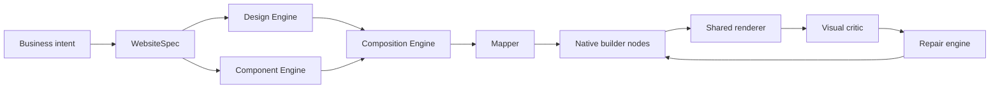
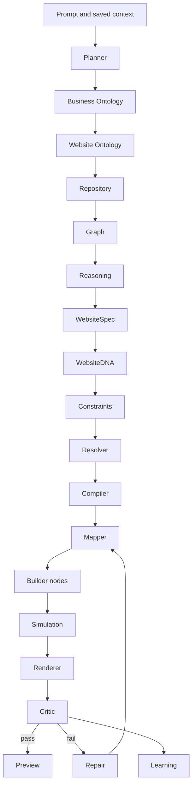
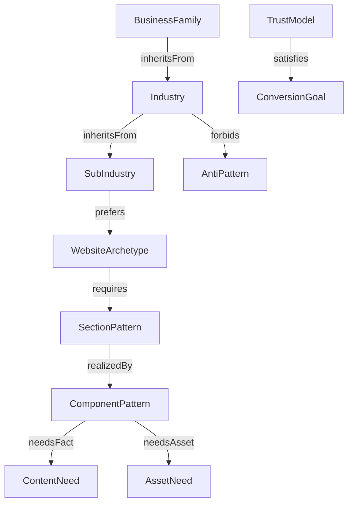
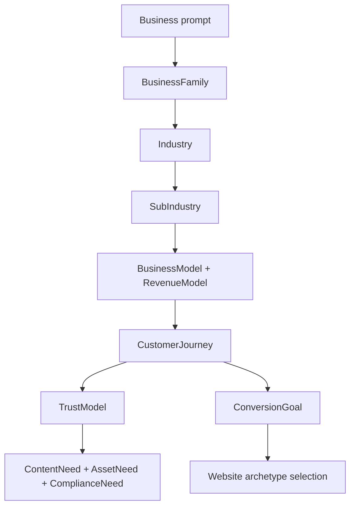
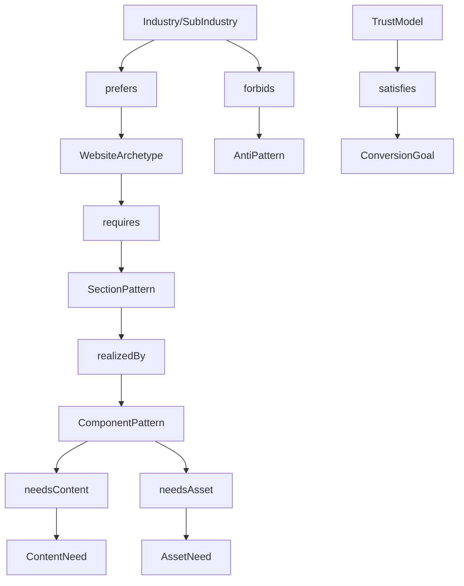
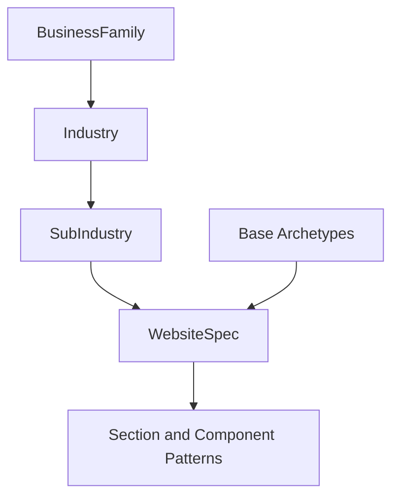
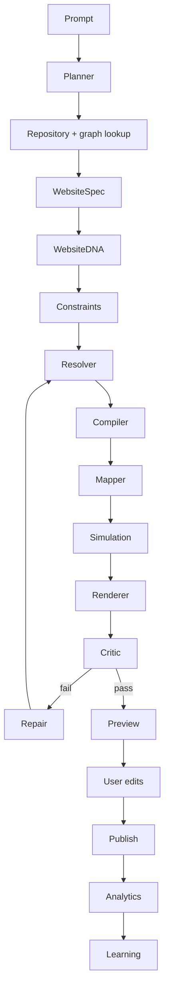
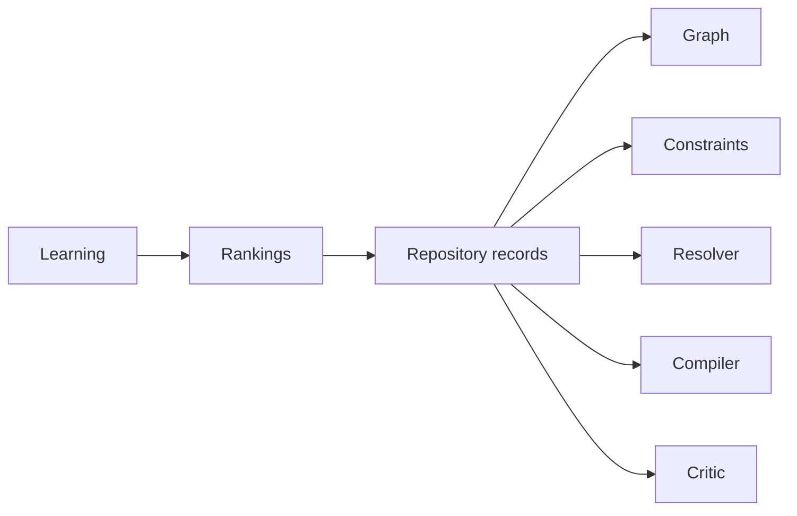
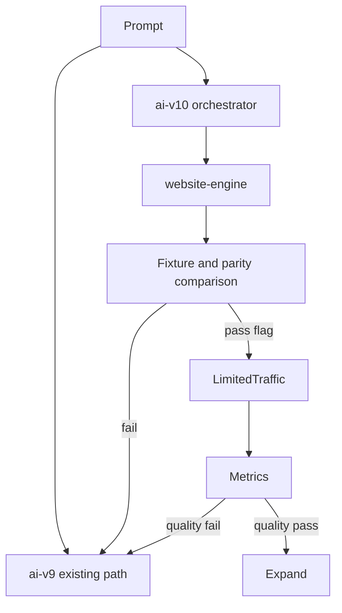
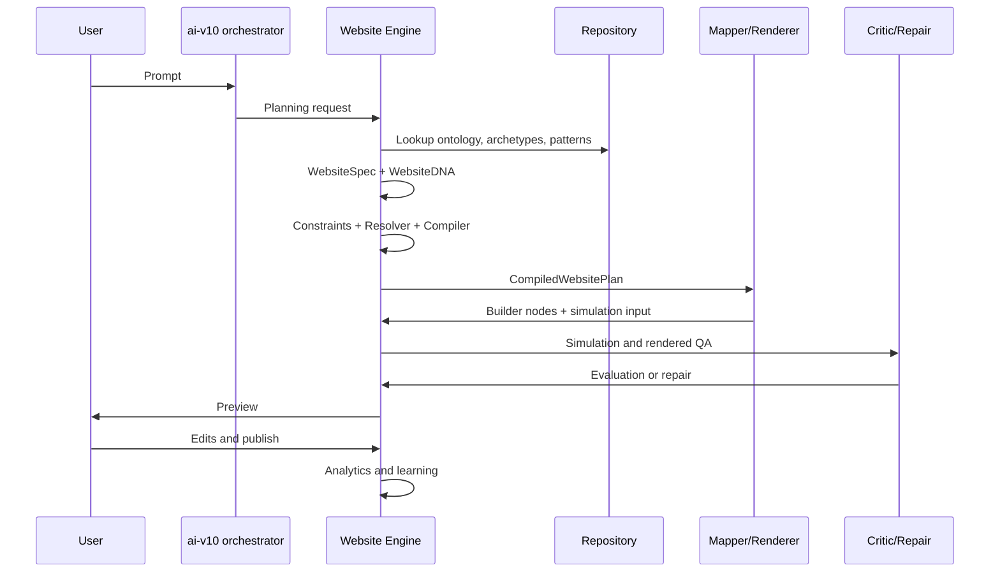

# BUILD EZ ARCHITECTURE REVIEW
Generated: Sun Jul  5 23:12:32 IST 2026


====================================================================
FILE: docs/adr/0001-website-engine-as-platform.md
====================================================================

# ADR: Website Engine As Platform

## Status

Accepted

## Context

BuildEZ needs durable website capability beyond a single AI route.

## Decision

Create a Website Engine platform with typed modules for planning, knowledge, spec, design, mapping, rendering, QA, repair, learning, and analytics.

## Consequences

The platform can scale by adding graph data and variants instead of larger prompts.

## Real Estate Impact

Real estate developer example: a premium residential project lead-generation site uses Hero, Project Showcase, Amenities, Gallery, Location, FAQ, and CTA sections; requires real project/location/configuration facts; forbids SaaS pricing tables, generic feature cards, placeholder claims, and fake availability.

## Review Trigger

Revisit this ADR if implementation proves the decision blocks editable output, renderer parity, tenant safety, or measurable quality improvements.


====================================================================
FILE: docs/adr/0002-ai-as-orchestrator-not-designer.md
====================================================================

# ADR: AI As Orchestrator Not Designer

## Status

Accepted

## Context

Direct model-created layouts produce generic, inconsistent, and hard-to-repair output.

## Decision

Use AI for classification, planning, missing-fact detection, and structured content assistance. Engine modules own design and rendering decisions.

## Consequences

Prompts get simpler and output becomes more deterministic.

## Real Estate Impact

Real estate developer example: a premium residential project lead-generation site uses Hero, Project Showcase, Amenities, Gallery, Location, FAQ, and CTA sections; requires real project/location/configuration facts; forbids SaaS pricing tables, generic feature cards, placeholder claims, and fake availability.

## Review Trigger

Revisit this ADR if implementation proves the decision blocks editable output, renderer parity, tenant safety, or measurable quality improvements.


====================================================================
FILE: docs/adr/0003-website-spec-as-contract.md
====================================================================

# ADR: WebsiteSpec As Contract

## Status

Accepted

## Context

Golden blueprint thinking is too loose for multi-module generation.

## Decision

Adopt WebsiteSpec as the versioned contract between planning and rendering.

## Consequences

All modules can validate and explain decisions against the same source of truth.

## Real Estate Impact

Real estate developer example: a premium residential project lead-generation site uses Hero, Project Showcase, Amenities, Gallery, Location, FAQ, and CTA sections; requires real project/location/configuration facts; forbids SaaS pricing tables, generic feature cards, placeholder claims, and fake availability.

## Review Trigger

Revisit this ADR if implementation proves the decision blocks editable output, renderer parity, tenant safety, or measurable quality improvements.


====================================================================
FILE: docs/adr/0004-knowledge-graph.md
====================================================================

# ADR: Knowledge Graph

## Status

Accepted

## Context

Industry knowledge embedded in prompts is hard to test and reuse.

## Decision

Represent industry, archetype, section, component, conversion, SEO, accessibility, and anti-pattern relationships as machine-readable graph data.

## Consequences

Real estate rules become enforceable and inspectable.

## Real Estate Impact

Real estate developer example: a premium residential project lead-generation site uses Hero, Project Showcase, Amenities, Gallery, Location, FAQ, and CTA sections; requires real project/location/configuration facts; forbids SaaS pricing tables, generic feature cards, placeholder claims, and fake availability.

## Review Trigger

Revisit this ADR if implementation proves the decision blocks editable output, renderer parity, tenant safety, or measurable quality improvements.


====================================================================
FILE: docs/adr/0005-deterministic-design-engine.md
====================================================================

# ADR: Deterministic Design Engine

## Status

Accepted

## Context

LLM-designed visual systems drift and often look generic.

## Decision

Create a deterministic Design Engine that owns tokens, rhythm, and visual constraints.

## Consequences

Visual quality becomes testable and less dependent on model phrasing.

## Real Estate Impact

Real estate developer example: a premium residential project lead-generation site uses Hero, Project Showcase, Amenities, Gallery, Location, FAQ, and CTA sections; requires real project/location/configuration facts; forbids SaaS pricing tables, generic feature cards, placeholder claims, and fake availability.

## Review Trigger

Revisit this ADR if implementation proves the decision blocks editable output, renderer parity, tenant safety, or measurable quality improvements.


====================================================================
FILE: docs/adr/0006-native-editable-builder-nodes.md
====================================================================

# ADR: Native Editable Builder Nodes

## Status

Accepted

## Context

Generated pages must be editable in the builder.

## Decision

The mapper emits native builder nodes rather than opaque HTML blobs or images.

## Consequences

Users retain control and existing builder workflows continue to matter.

## Real Estate Impact

Real estate developer example: a premium residential project lead-generation site uses Hero, Project Showcase, Amenities, Gallery, Location, FAQ, and CTA sections; requires real project/location/configuration facts; forbids SaaS pricing tables, generic feature cards, placeholder claims, and fake availability.

## Review Trigger

Revisit this ADR if implementation proves the decision blocks editable output, renderer parity, tenant safety, or measurable quality improvements.


====================================================================
FILE: docs/adr/0007-preview-published-renderer-parity.md
====================================================================

# ADR: Preview Published Renderer Parity

## Status

Accepted

## Context

QA is meaningless if preview differs from published output.

## Decision

Preview and published pages must share renderer semantics and parity tests.

## Consequences

Visual QA can be trusted only after parity is enforced.

## Real Estate Impact

Real estate developer example: a premium residential project lead-generation site uses Hero, Project Showcase, Amenities, Gallery, Location, FAQ, and CTA sections; requires real project/location/configuration facts; forbids SaaS pricing tables, generic feature cards, placeholder claims, and fake availability.

## Review Trigger

Revisit this ADR if implementation proves the decision blocks editable output, renderer parity, tenant safety, or measurable quality improvements.


====================================================================
FILE: docs/adr/0008-visual-qa-before-preview.md
====================================================================

# ADR: Visual QA Before Preview

## Status

Accepted

## Context

JSON validation cannot catch weak visual output or industry mismatch.

## Decision

Run visual/DOM/accessibility/industry critic checks before presenting generated output as ready.

## Consequences

The system can repair structural failures before users see them.

## Real Estate Impact

Real estate developer example: a premium residential project lead-generation site uses Hero, Project Showcase, Amenities, Gallery, Location, FAQ, and CTA sections; requires real project/location/configuration facts; forbids SaaS pricing tables, generic feature cards, placeholder claims, and fake availability.

## Review Trigger

Revisit this ADR if implementation proves the decision blocks editable output, renderer parity, tenant safety, or measurable quality improvements.


====================================================================
FILE: docs/adr/0009-documentation-as-deliverable.md
====================================================================

# ADR: Documentation As Deliverable

## Status

Accepted

## Context

Future sessions need durable context independent of chat history.

## Decision

Every meaningful Website Engine feature updates docs, specs, ADRs, logs, or changelog.

## Consequences

Architecture remains navigable as implementation grows.

## Real Estate Impact

Real estate developer example: a premium residential project lead-generation site uses Hero, Project Showcase, Amenities, Gallery, Location, FAQ, and CTA sections; requires real project/location/configuration facts; forbids SaaS pricing tables, generic feature cards, placeholder claims, and fake availability.

## Review Trigger

Revisit this ADR if implementation proves the decision blocks editable output, renderer parity, tenant safety, or measurable quality improvements.


====================================================================
FILE: docs/adr/0010-universal-business-ontology.md
====================================================================

# ADR: Universal Business Ontology

## Status

Accepted

## Context

BuildEZ must become a Website Operating System that supports many industries and use cases. The earlier architecture used real estate heavily as the first proof point, but that framing risks overfitting the engine to one vertical.

## Problem

If business knowledge is embedded in prompts or hardcoded generators, the system will grow as a set of brittle vertical-specific paths. That would make healthcare, restaurants, education, automotive, real estate, and future industries inconsistent and hard to test.

## Decision

Adopt a universal business ontology with `BusinessFamily`, `Industry`, `SubIndustry`, `BusinessModel`, `RevenueModel`, `CustomerJourney`, `TrustModel`, `ConversionGoal`, `LocalityNeed`, `ComplianceNeed`, `ContentNeed`, and `AssetNeed`. Website generation must compose from these concepts into archetypes, section patterns, and component patterns.

## Alternatives Considered

- Build one generator per industry. Rejected because it duplicates logic and makes quality uneven.
- Keep industry knowledge in prompts. Rejected because it is hard to validate, version, and test.
- Start only with real estate. Rejected as the foundation, accepted only as one validation fixture.

## Consequences

The planner and knowledge graph need richer typed data. The payoff is that a clinic appointment site, restaurant reservation site, school admissions site, vehicle catalogue, and property showcase can share the same pipeline while retaining domain constraints.

## Future Implications

All future vertical work should add ontology records and fixtures before adding specialized behavior. Specialized behavior must be justified as a reusable pattern, not a one-off generator.


====================================================================
FILE: docs/adr/0011-website-archetypes-over-industry-hardcoding.md
====================================================================

# ADR: Website Archetypes Over Industry Hardcoding

## Status

Accepted

## Context

Many industries need similar website strategies: lead generation, brochure, catalogue, booking, appointment, ecommerce, portfolio, directory, event, community, documentation, restaurant menu, property showcase, recruitment, and investor relations.

## Problem

Industry-specific generators make the engine think in vertical silos. That causes generic output, duplicated code, and poor extensibility when a business spans categories, such as a restaurant with events, a clinic with a knowledge base, or an automotive dealer with service booking.

## Decision

Use WebsiteArchetypes as the primary strategy layer. Industries and subindustries can prefer, forbid, or override archetype defaults, but generation should compose archetypes with section patterns and component patterns.

## Alternatives Considered

- Let the LLM choose arbitrary layouts. Rejected because it undermines deterministic design and editable mapping.
- Hardcode industry page flows. Rejected because it does not scale.
- Use only generic archetypes with no industry constraints. Rejected because it misses compliance, trust, locality, and content needs.

## Consequences

The engine can reuse lead generation for real estate, healthcare, education, automotive, and B2B services while changing trust, content, assets, and compliance. The critic can evaluate whether selected archetypes satisfy industry constraints.

## Future Implications

New industries should rarely need new archetypes. They should usually define inheritance, preferred archetypes, section pattern overrides, anti-patterns, and fixtures.


====================================================================
FILE: docs/adr/0012-website-engine-sdk.md
====================================================================

# ADR: Website Engine SDK

## Status

Accepted

## Context

The Website Engine will contain many modules that exchange specs, repository records, constraints, resolver results, compiled plans, simulations, evaluations, repair plans, and generation history.

## Problem

Without a shared SDK, modules will drift into incompatible JSON shapes and hidden assumptions.

## Decision

Create a pure Website Engine SDK that owns shared types, enums, validators, schema versions, helpers, error types, and trace metadata. The SDK has no React UI, no LLM calls, and no database access.

## Alternatives Considered

- Let each module define local types. Rejected because it causes drift.
- Put SDK types in ai-v10. Rejected because ai-v10 is orchestration glue, not product architecture.
- Infer schemas from runtime output. Rejected because it is too late and not fixture-friendly.

## Consequences

All engine modules can validate inputs and outputs consistently. Early work must invest in type and fixture quality before production logic.

## Future Implications

The SDK can later support schema migrations, generated docs, trace viewers, and compatibility checks.


====================================================================
FILE: docs/adr/0013-website-repository.md
====================================================================

# ADR: Website Repository

## Status

Accepted

## Context

BuildEZ needs reusable industry, archetype, pattern, component, design, constraint, QA, repair, fixture, and anti-pattern knowledge.

## Problem

Prompt-only knowledge is hard to test, version, rank, and migrate. HTML dumps do not create reusable intelligence.

## Decision

Create a Website Repository of structured versioned records. Industry-specific behavior emerges from reusable records and inheritance, not hardcoded generators.

## Alternatives Considered

- Store generated HTML examples. Rejected because they are not composable.
- Keep knowledge in prompts. Rejected because it creates prompt bloat.
- Add one-off code paths for each industry. Rejected because it does not scale.

## Consequences

The repository becomes a core engineering asset. Records require governance, fixtures, versioning, and compatibility metadata.

## Future Implications

Learning can rank repository records over time using tenant-safe signals.


====================================================================
FILE: docs/adr/0014-constraint-engine.md
====================================================================

# ADR: Constraint Engine

## Status

Accepted

## Context

Generated websites must avoid fake facts, unsupported claims, placeholder content, non-editable sections, bad mobile conversion, and preview/publish mismatch.

## Problem

Waiting until rendered QA catches preventable issues too late.

## Decision

Add a Constraint Engine that evaluates typed rules before rendering and returns violations with severity and repair hints.

## Alternatives Considered

- Rely on prompts to avoid errors. Rejected because models can still invent claims.
- Rely only on critic after render. Rejected because it is late and expensive.
- Hardcode checks in mapper. Rejected because constraints must be reusable across modules.

## Consequences

Resolver and compiler must be constraint-aware. Rules need scope, severity, and tests.

## Future Implications

Constraints can expand into regional compliance, tenant brand safety, and accessibility packs.


====================================================================
FILE: docs/adr/0015-resolver-engine.md
====================================================================

# ADR: Resolver Engine

## Status

Accepted

## Context

The planner produces intent and specs, but implementation choices must be compatible with repository records, constraints, assets, and brand context.

## Problem

If the mapper or LLM directly chooses components and layouts, quality becomes inconsistent and difficult to debug.

## Decision

Create a Resolver Engine that deterministically selects compatible archetypes, section patterns, component variants, design language, tokens, composition rules, assets, CTA strategy, SEO, QA, and repair rules.

## Alternatives Considered

- Let the LLM choose UI directly. Rejected because BuildEZ designs.
- Push selection into compiler. Rejected because scoring and compatibility deserve their own stage.
- Hardcode per-industry selection. Rejected because it violates universal foundation.

## Consequences

Resolver output becomes an explainable contract and a key fixture artifact.

## Future Implications

Learning can rank compatible candidates without changing the core contract.


====================================================================
FILE: docs/adr/0016-website-compiler.md
====================================================================

# ADR: Website Compiler

## Status

Accepted

## Context

WebsiteSpec and resolver selections still need to become a complete mapper-ready plan.

## Problem

Mapping directly from spec to builder nodes hides missing decisions and makes repairs coarse.

## Decision

Add a Website Compiler that resolves inheritance, graph relationships, constraints, component compatibility, token compatibility, assets, responsive strategy, SEO/accessibility requirements, CTA cadence, and quality gates into `CompiledWebsitePlan`.

## Alternatives Considered

- Combine compiler and mapper. Rejected because mapper should only convert plans into nodes.
- Let components self-resolve props. Rejected because it fragments logic.
- Use one-step AI generation. Rejected because it is not deterministic.

## Consequences

Compiled plans become the central fixture for mapper and simulation.

## Future Implications

The compiler can later support multi-page plans, plan diffs, partial recompilation, and repair patches.


====================================================================
FILE: docs/adr/0017-simulation-before-preview.md
====================================================================

# ADR: Simulation Before Preview

## Status

Accepted

## Context

Preview should not be the first place BuildEZ discovers obvious mobile, asset, accessibility, SEO, performance, parity, or editability risk.

## Problem

Rendered QA is necessary but late. Some failures can be predicted from compiled plans and mapped nodes.

## Decision

Add a Simulation Engine before preview. It predicts desktop/tablet/mobile structure, CTA reachability, overflow risk, asset readiness, accessibility, SEO, performance, renderer parity, and editability issues.

## Alternatives Considered

- Skip simulation and rely on visual critic. Rejected because it wastes cycles.
- Use only static schema validation. Rejected because layout and breakpoint risk need richer checks.
- Block all creative layouts with rigid rules. Rejected; simulation should score and hint, not flatten design.

## Consequences

Simulation adds a pre-preview quality gate. It must remain calibrated against rendered critic findings.

## Future Implications

Simulation can evolve into browser dry-runs, heatmaps, and layout risk scoring.


====================================================================
FILE: docs/adr/0018-ai-v9-isolated-migration.md
====================================================================

# ADR: ai-v9 Isolated Migration

## Status

Accepted

## Context

`ai-v9` is the current production/stable generation path. The Website Engine and future `ai-v10` are not yet proven.

## Problem

Refactoring or replacing `ai-v9` too early risks production regressions.

## Decision

Build `website-engine` beside `ai-v9`. Keep `ai-v9` isolated and available as fallback. Introduce `ai-v10` only as orchestration glue after skeleton, SDK, repository, constraints, resolver, compiler, mapper, simulation, and critic reach fixture readiness.

## Alternatives Considered

- Rewrite `ai-v9` in place. Rejected because rollback would be unsafe.
- Delete `ai-v9` once docs exist. Rejected because docs are not parity.
- Build `ai-v10` as a new monolith. Rejected because product capability belongs in Website Engine.

## Consequences

Migration takes longer but is safer. Feature flags, shadow runs, fixtures, and fallback are mandatory.

## Future Implications

Retirement of `ai-v9` requires parity, quality metrics, fixture breadth, limited traffic success, and rollback confidence.


====================================================================
FILE: docs/AI_SYSTEM.md
====================================================================

# BuildEZ AI Builder Strategy

Last updated: 2026-06-27

This document is the canonical strategy for BuildEZ AI website generation. Any AI-builder module, prompt, agent, recipe, validator, or UI workflow should revisit this file before implementation.

## North Star

BuildEZ is a node-native AI website builder.

The product promise is:

> AI speed with Elementor-like editability and production validation.

BuildEZ should not generate static pages, arbitrary React, locked templates, or screenshot-only output. Every generated website must become a valid editable `BuilderBlueprint` made from registered builder nodes and widgets.

## Competitor Research Notes

Reviewed competitor positioning on June 28, 2026:

- Framer AI focuses on prompt-to-site generation inside a mature visual website canvas, plus AI-assisted review and refinement.
- Lovable and Emergent emphasize chat-first generation of working web apps and prototypes from natural language.
- Cursor's strongest pattern is agentic code execution with visible iteration, review, and developer control rather than a pure website canvas.

Implication for BuildEZ:

BuildEZ should not try to win only on "prompt goes in, page comes out." That lane becomes generic quickly. The differentiated path is professional website intelligence plus builder-native editability: brief extraction, industry recipes, brand memory, proof/CTA strategy, generated asset direction, validation, repair, and editable nodes.

The first active implementation slice is in:

- `apps/web-app/modules/builder/ai-v8/agents/`
- `apps/web-app/modules/builder/ai-v8/orchestrator/runWebsiteGenerationOrchestrator.ts`
- `apps/web-app/modules/builder/ai-v8/lib/experienceIntelligence.ts`
- `apps/web-app/app/api/ai-v8/generate-react/route.ts`

This slice adds deterministic task agents, an orchestrator layer, a professional brief, conversion strategy, competitor-gap instructions, quality scoring, repair feedback, agent run logs, and saved generation metadata before the system moves to fully node-native generation.

## Core Positioning

The crowded AI website-builder market mostly competes on prompt-to-site speed. BuildEZ should stand out through:

- Industry-specific intelligence.
- Design-style variety.
- Unique generation per request.
- Builder-node editability.
- Visual preview before build.
- Validation and repair before publishing.
- Brand and business memory across pages.

The frozen product lane:

> BuildEZ is an AI-orchestrated, node-native website builder where every generated website is visually impressive, validated, and editable like Elementor.

## Non-Negotiable Rules

1. AI must not freely generate production React for builder pages.
2. AI must not bypass the builder node schema.
3. AI-generated UI images are visual targets, not the source of truth.
4. The editable blueprint is always the canonical output.
5. Only registered widgets and approved section recipes can reach the canvas.
6. Validation must run before writing AI output into builder state.
7. Repair must modify blueprint data, not patch rendered DOM.
8. Every generated section must remain editable through normal builder controls.
9. Industry kits and design style kits should guide generation, but not create duplicate-looking sites.
10. The orchestrator owns workflow control; agents propose bounded outputs.

## Target Generation Flow

```text
User Prompt
  -> AI Orchestrator
  -> Intent Detection
  -> Industry Kit Selection
  -> Design Style Selection
  -> Site/Page Plan
  -> Optional UI Image Preview
  -> Section Recipe Selection
  -> Content + Asset Direction
  -> BuilderBlueprint Generation
  -> Blueprint Validation
  -> Render Preview
  -> QA + Repair Loop
  -> Editable Builder Canvas
```

## Source Of Truth

The canonical final output is a valid builder blueprint:

```text
Page
  Section
    Container
      Heading
      Text
      Button
      Image
```

Relevant active contracts:

- `apps/web-app/modules/builder-v2/types/blueprint.ts`
- `apps/web-app/modules/builder-v2/core/registry/WidgetRegistry.ts`
- `apps/web-app/modules/builder-v2/core/registry/registerWidgets.ts`
- `apps/web-app/modules/builder-v2/core/commands/CommandBus.ts`

AI modules must treat these contracts as hard boundaries.

## Widget Marketplace Strategy

BuildEZ should call this layer the Widget Marketplace from the beginning.

The marketplace is not only a future storefront. It is the premium builder-native component source that AI uses to assemble high-quality editable websites.

There should be two widget tiers:

```text
Default Widgets
  -> available to all plans
  -> core builder foundation

Premium Marketplace Widgets
  -> available to paid plans later
  -> richer conversion, media, content, commerce, and industry-specific widgets
```

Initial default widgets:

- Page
- Section
- Container
- Column
- Heading
- Text
- Button
- Image
- Video
- Icon
- Divider
- Spacer

Initial premium marketplace widget categories:

- Header and navigation.
- Footer.
- Hero.
- Forms.
- Cards.
- Content grids.
- Carousel.
- Slider.
- Gallery.
- Lightbox.
- Expanding cards.
- Flipbox.
- Content tabs.
- Accordion.
- FAQ.
- Testimonials.
- Pricing.
- Blog list and blog cards.
- Instagram feed.
- WhatsApp button.
- Floating contact button.
- Modal and popup.
- Announcement bar.
- Map.
- Reviews.
- Product or offer grid.

Each marketplace widget must define:

- Widget definition.
- Default node.
- Renderer.
- Property schema.
- Responsive behavior.
- Valid parent/child rules.
- AI usage description.
- Industry relevance.
- Design style compatibility.
- Validation rules.
- Free or premium tier.
- Required plan or feature flag.

AI must use marketplace metadata when selecting widgets.

Example:

```text
Need a visual property showcase for a luxury real-estate page
  -> choose premium gallery/lightbox/carousel widget
  -> fill props, assets, and copy
  -> apply luxury/editorial tokens
  -> validate
  -> insert as editable builder nodes
```

Plan gating should be implemented later through feature flags or plan entitlements, but the widget metadata should be designed for it now.

Suggested metadata fields:

```text
tier: "default" | "premium"
requiredFeature: "premium_widgets" | "ai_builder" | "commerce_widgets"
allowedPlans: string[]
marketplaceCategory: string
industryTags: string[]
styleTags: string[]
aiUseCases: string[]
```

Frozen decision:

> BuildEZ will have default widgets and a premium Widget Marketplace. AI generation should use the marketplace as its trusted source of editable builder-native widgets, with premium widgets gated by paid plans later.

## AI Images

AI UI images may be used for:

- Design direction previews.
- Section thumbnails.
- Client approval.
- Hero or section asset inspiration.
- Screenshot comparison during QA.

AI UI images must not be used as the primary editable format.

Preferred image-assisted workflow:

```text
Prompt
  -> AI design image / section mockup
  -> User approves direction
  -> AI maps design to section recipes
  -> Blueprint nodes are generated
  -> Rendered screenshot is compared to target
  -> Repair loop improves blueprint
```

This gives creative range without sacrificing editability.

## Agent Architecture

Use a controlled multi-agent pipeline. Agents are specialist modules, not autonomous code writers.

Recommended agents:

- `OrchestratorAgent`: owns workflow, state, retries, and final approval.
- `IntentAgent`: detects industry, business subtype, audience, goal, and constraints.
- `SitePlannerAgent`: creates sitemap, page list, section list, and conversion flow.
- `DesignDirectionAgent`: chooses design style, visual tone, typography direction, color logic, spacing rhythm, and motion level.
- `ContentAgent`: writes headings, body text, CTAs, FAQs, testimonials, and SEO-oriented copy.
- `SectionRecipeAgent`: maps plan sections to approved section recipes.
- `AssetAgent`: selects or generates image/icon direction and connects to the media system.
- `BlueprintAgent`: creates valid builder-node trees from recipes.
- `ValidatorAgent`: checks schema, allowed nodes, parent/child rules, props, responsive defaults, and unsafe styles.
- `QAAgent`: renders, screenshots, checks layout/contrast/mobile issues, and requests repairs.
- `RepairAgent`: makes bounded blueprint repairs after validation or visual QA failures.

The key rule:

```text
AI agents can propose.
Builder contracts decide.
Validator must approve.
Only approved blueprints reach the canvas.
```

## Industry Repository

BuildEZ should build a large internal repository of industry-specific kits. This creates quality, speed, and defensible lock-in.

Suggested structure:

```text
modules/builder-ai/repository/
  industries/
    real-estate/
    restaurant/
    healthcare/
    dentist/
    gym/
    construction/
    salon/
    ecommerce/
    saas/
    agency/
    education/
    legal/
    travel/
    finance/
    events/
```

Each industry kit should contain:

```text
industry.json
theme-presets.json
section-recipes.json
copy-patterns.json
image-prompts.json
conversion-flows.json
seo-patterns.json
element-variants.json
```

Industry gives relevance. Design style gives taste. The uniqueness engine gives variation. Builder nodes give editability.

## Design Style Library

Design style is a separate axis from industry.

Generation should combine:

```text
Industry + Use Case + Design Style + Brand Personality + Conversion Goal
```

Initial design styles:

- `modern`
- `classic`
- `minimal`
- `luxury`
- `editorial`
- `bold`
- `playful`
- `corporate`
- `premium`
- `organic`
- `futuristic`
- `brutalist`
- `warm`
- `clinical`
- `creative-agency`
- `startup`
- `heritage`

Each design style should define:

- Color behavior.
- Typography behavior.
- Spacing density.
- Border radius.
- Shadow depth.
- Image treatment.
- Section rhythm.
- Button style.
- Icon style.
- Motion level.
- Copy tone.
- Layout density.

Example matrix:

```text
Restaurant + Fine Dining + Classic + Elegant + Reservations
Dentist + Family Clinic + Modern + Friendly + Appointments
Real Estate + Luxury Villa + Editorial + Premium + Lead Capture
SaaS + Analytics Tool + Minimal + Technical + Demo Booking
```

## Uniqueness Engine

Each generation must feel custom. The system should avoid producing the same-looking website repeatedly for the same industry.

The uniqueness engine should:

- Select industry kit.
- Select design style kit.
- Select theme preset.
- Mutate theme tokens within safe ranges.
- Select section recipes.
- Vary section order.
- Vary component variants.
- Vary copy angle.
- Assign image direction.
- Score similarity against previous generations.
- Retry composition if similarity is too high.

Suggested target:

```text
similarityScore < 0.72
```

Similarity can consider:

- Section order.
- Recipe IDs.
- Color token distance.
- Typography pairing.
- Layout density.
- CTA pattern.
- Asset direction.
- Copy tone.

## Recommended Module Layout

```text
apps/web-app/modules/builder-ai/
  orchestrator/
    runAiBuilder.ts
    workflowTypes.ts
    workflowState.ts

  agents/
    intentAgent.ts
    sitePlannerAgent.ts
    designDirectionAgent.ts
    contentAgent.ts
    sectionRecipeAgent.ts
    assetAgent.ts
    blueprintAgent.ts
    validatorAgent.ts
    qaAgent.ts
    repairAgent.ts

  repository/
    industries/
    design-styles/
    use-cases/

  recipes/
    hero/
    features/
    pricing/
    gallery/
    faq/
    contact/
    footer/

  uniqueness/
    uniquenessEngine.ts
    similarityScore.ts

  validation/
    blueprintSchema.ts
    validateBlueprint.ts
    repairBlueprint.ts
    validateSection.ts

  prompts/
    intent.prompt.ts
    planner.prompt.ts
    design.prompt.ts
    content.prompt.ts
    blueprint.prompt.ts
    qa.prompt.ts
```

## MVP Build Order

Do not start with a fully autonomous AI website builder.

Start with this MVP:

```text
Prompt
  -> Intent
  -> Section Plan
  -> Recipe Selection
  -> Editable Blueprint
  -> Validation
  -> Render In Builder
```

Then add:

1. Industry kits.
2. Design style kits.
3. Uniqueness engine.
4. AI image previews.
5. Asset generation/selection.
6. Screenshot QA.
7. Repair loop.
8. Multi-page generation.
9. Brand memory.
10. Node-level AI inspector actions.

## Builder Prerequisites

Before deep AI integration, the builder foundation must support reliable AI output:

1. Stable blueprint load/save/autosave.
2. Canonical widget registry rendering path.
3. Property-registry-driven inspector.
4. Real blueprint validator and schema migration boundary.
5. Section recipe library.
6. Media pipeline for AI/generated assets.
7. Preview/publish validation.
8. Active-code typecheck boundary that excludes broken legacy/experimental AI files.

If these are not stable, AI will produce broken output faster.

## AI Inspector Direction

After MVP generation, BuildEZ should support AI actions on selected nodes:

```text
Make this section more premium.
Rewrite this for dentists.
Turn this into pricing.
Make mobile layout cleaner.
Generate three hero variants.
Replace this image style.
Improve CTA conversion.
Make this match the brand voice.
```

These actions must operate on selected builder nodes and return validated blueprint patches.

## Final Frozen Strategy

BuildEZ AI generation will use:

- A multi-agent orchestrator.
- Industry-specific kits.
- Design-style kits.
- A uniqueness engine.
- Optional AI visual previews.
- Section recipes.
- Validated editable builder nodes.
- Render QA and repair loops.

The goal is not just prompt-to-site.

The goal is prompt-to-unique, industry-aware, visually strong, editable, validated builder websites.


====================================================================
FILE: docs/API_REFERENCE.md
====================================================================


====================================================================
FILE: docs/architecture/00_VISION.md
====================================================================

# Vision

BuildEZ is a Website Operating System, not a prompt-to-page toy. The platform should understand any business, resolve it through a universal business ontology, select website archetypes, assemble a typed specification, apply deterministic design language, map to native editable builder nodes, render identically in preview and publish, critique the rendered result, repair structural failures, and learn from outcomes.

The long-term product promise is that a small business owner can describe their business and receive a credible, editable, conversion-aware website without the system inventing facts or hiding brittle placeholders.



## Universal Scope

The engine must support every industry by composition. Real estate, healthcare, restaurant, education, and automotive sites should use the same core pipeline with different ontology records, archetype preferences, section patterns, component patterns, assets, compliance rules, and critic checks. Real estate is a validation fixture, not the foundation of the architecture.

## Implementation Guidance

Future Codex sessions should treat this document as architectural intent, then confirm current code before editing. Any behavior change must update the relevant module doc, specification, phase checklist, and changelog.


====================================================================
FILE: docs/architecture/01_CONSTITUTION.md
====================================================================

# Constitution

The BuildEZ Website Engine exists to produce truthful, editable, industry-aware websites. Its constitution is stricter than any single implementation shortcut.

- The LLM plans; BuildEZ designs.
- WebsiteSpec is the source of truth.
- The renderer is deterministic.
- Preview and published output must share the same rendering contract.
- Visual QA evaluates pixels and DOM, not just JSON shape.
- Repair can replace a section structurally; it is not limited to copy tweaks.
- Missing facts are marked as missing facts, not converted into confident claims.
- Every generated section must remain editable in the builder.
- Industries are modeled through ontology, inheritance, archetypes, section patterns, and component patterns.
- Do not create hardcoded industry generators as the foundation.

Cross-industry implications:

- Real estate: no fake launch dates, registration/compliance numbers, prices, inventory, awards, or generic SaaS feature blocks.
- Healthcare: no fake credentials, cure guarantees, privacy claims, or unsupported medical outcomes.
- Restaurant: no fake hours, fake menu prices, fake reservation availability, or unrelated stock food.
- Education: no fake accreditation, placement statistics, faculty credentials, or admission guarantees.
- Automotive: no fake inventory, warranty terms, discount claims, financing terms, or availability.

## Implementation Guidance

Future Codex sessions should treat this document as architectural intent, then confirm current code before editing. Any behavior change must update the relevant module doc, specification, phase checklist, and changelog.


====================================================================
FILE: docs/architecture/02_PRINCIPLES.md
====================================================================

# Principles

BuildEZ should prefer typed knowledge, deterministic composition, inspectable decisions, and native editability over opaque one-shot generation.

Design pressure belongs in engines: tokens, layout rhythm, component variants, and asset requirements. AI pressure belongs in planning: classify, summarize, infer cautiously, ask for missing facts, and produce structured options.

Engineering principle: every module should accept typed inputs, return typed outputs, explain important decisions, and be testable without a live LLM.

## Implementation Guidance

Future Codex sessions should treat this document as architectural intent, then confirm current code before editing. Any behavior change must update the relevant module doc, specification, phase checklist, and changelog.


====================================================================
FILE: docs/architecture/03_SYSTEM_ARCHITECTURE.md
====================================================================

# System Architecture

The Website Engine is a pipeline with feedback loops. The happy path is planner -> universal business ontology -> universal website ontology -> knowledge graph/repository -> reasoning -> WebsiteSpec -> WebsiteDNA -> constraints -> resolver -> compiler -> mapper -> simulation -> renderer -> critic -> repair -> preview -> user edits -> publish -> analytics -> learning.



The `ai-v10/orchestrator` layer should call these modules rather than containing product logic.

The system must not branch into separate generators for real estate, healthcare, restaurants, education, automotive, or any other family. The planner resolves business concepts and archetypes; the rest of the pipeline composes from typed records.

`ai-v9` remains the production/stable path until the new engine proves parity. `ai-v10` should become orchestration glue only after the Website Engine core contracts exist.

## Implementation Guidance

Future Codex sessions should treat this document as architectural intent, then confirm current code before editing. Any behavior change must update the relevant module doc, specification, phase checklist, and changelog.


====================================================================
FILE: docs/architecture/04_WEBSITE_ENGINE.md
====================================================================

# Website Engine

The Website Engine is the durable platform namespace planned for `modules/builder-v2/website-engine/`. It owns typed domain knowledge, deterministic decisions, and the conversion from website intent into editable builder output.

Target folders: sdk, planner, knowledge, graph, repository, reasoning, constraints, resolver, specification, compiler, design, composition, assets, components, mapper, renderer, simulation, critic, repair, learning, analytics.

Each folder should expose a small public API and keep domain data versioned so future generated pages can be explained and reproduced.

`website-engine` is the product capability. `ai-v10/orchestrator` is glue. `ai-v9` remains isolated until quality, parity, fixtures, fallback, and migration gates are satisfied.

## Implementation Guidance

Future Codex sessions should treat this document as architectural intent, then confirm current code before editing. Any behavior change must update the relevant module doc, specification, phase checklist, and changelog.


====================================================================
FILE: docs/architecture/05_AI_ORCHESTRATION.md
====================================================================

# AI Orchestration

AI orchestration is thin. It should not directly create arbitrary builder nodes, CSS, or unreviewed layouts. It asks the model to classify intent, identify missing facts, draft structured content candidates, and explain uncertainty.

The orchestrator must pass model output through schema validation and engine-owned constraints. On validation failure, it should request correction or fall back to a conservative deterministic path.

Prompt content should shrink as typed knowledge grows. Industry knowledge belongs in machine-readable graph data, not long prompt paragraphs.

## ai-v9 And ai-v10 Boundary

`ai-v9` remains the production/stable generation path until the Website Engine proves parity. It should not be rewritten during core engine development.

Future `ai-v10` should:

- Accept prompts and context.
- Call planner/specification/engine contracts.
- Pass model output through SDK validators.
- Delegate repository lookup, constraints, resolver, compiler, mapper, simulation, critic, repair, learning, and analytics to Website Engine modules.
- Preserve fallback to `ai-v9` during shadow and limited rollout.

Future `ai-v10` should not:

- Own repository knowledge.
- Invent arbitrary layouts.
- Generate raw builder nodes directly.
- Bypass constraints, compiler, simulation, or critic.

## Implementation Guidance

Future Codex sessions should treat this document as architectural intent, then confirm current code before editing. Any behavior change must update the relevant module doc, specification, phase checklist, and changelog.


====================================================================
FILE: docs/architecture/06_KNOWLEDGE_GRAPH.md
====================================================================

# Knowledge Graph

The Website Knowledge Graph models reusable business and website concepts. It is the bridge between the universal business ontology, website ontology, WebsiteSpec, component metadata, and critic rules.

The graph must model: BusinessFamily, Industry, SubIndustry, BusinessModel, RevenueModel, CustomerJourney, TrustModel, ConversionGoal, LocalityNeed, ComplianceNeed, ContentNeed, AssetNeed, WebsiteArchetype, SectionPattern, ComponentPattern, ComponentVariant, DesignLanguage, CTAType, ConversionPattern, AntiPattern, AccessibilityRule, and SEORequirement.

Relationships include: `inheritsFrom`, `requires`, `supports`, `forbids`, `prefers`, `overrides`, `dependsOn`, `satisfies`, `conflictsWith`, `needsAsset`, `needsFact`, `convertsTo`, and `mapsToNode`.



## Cross-Industry Graph Examples

- Real estate -> residential developer -> apartment project prefers property showcase and lead generation, requires project image/location/configuration facts, and forbids fake availability.
- Healthcare -> clinic -> dental clinic prefers appointment and brochure, requires provider credentials and privacy-safe contact patterns, and forbids cure guarantees.
- Restaurant -> fine dining prefers restaurant menu and booking, requires menu/hours/location/ambience assets, and forbids fake reservation availability.
- Education -> school -> admissions site prefers brochure and lead generation, requires programs/faculty/admissions timeline, and forbids fake accreditation or placement statistics.
- Automotive -> dealer -> EV dealership prefers catalogue and booking, requires inventory/specs/test-drive CTA, and forbids fake discounts, warranty terms, or availability.

## Prompt Bloat Prevention

The graph prevents prompts from carrying the full product brain. The LLM can classify intent and identify ambiguity, while graph traversal supplies inherited rules, preferred archetypes, required facts, forbidden patterns, asset needs, and QA constraints. Prompt text should ask for planning output; graph data should own durable domain knowledge.

## Implementation Guidance

Future Codex sessions should treat this document as architectural intent, then confirm current code before editing. Any behavior change must update the relevant module doc, specification, phase checklist, and changelog. Do not implement graph data as long prompt strings; use versioned structured records.


====================================================================
FILE: docs/architecture/07_WEBSITE_SPECIFICATION.md
====================================================================

# Website Specification

WebsiteSpec replaces loose golden-blueprint thinking. It is the contract between planning and rendering. The spec captures business context, goals, audience, industry, archetype, section plan, content requirements, component preferences, forbidden components, design rules, asset requirements, SEO, accessibility, conversion, responsive rules, facts used, missing facts, confidence, and fallback strategy.

A WebsiteSpec should be serializable, versioned, explainable, and testable. It should never require reading the original chat to understand why a page was generated.

See `docs/specifications/WebsiteSpec.md` for the TypeScript shape.

## Implementation Guidance

Future Codex sessions should treat this document as architectural intent, then confirm current code before editing. Any behavior change must update the relevant module doc, specification, phase checklist, and changelog.


====================================================================
FILE: docs/architecture/08_DESIGN_ENGINE.md
====================================================================

# Design Engine

The Design Engine owns visual language. It turns WebsiteSpec and brand context into deterministic tokens for color, typography, spacing, radius, shadows, section density, and interaction tone.

It must prevent weak one-note palettes, enforce legible contrast, and produce vertical-appropriate visual systems. For real estate, supported styles include Luxury, Premium, Editorial, and Minimal; generic SaaS-blue dashboards are anti-patterns.

Design output should be consumed by composition, components, mapper, and renderer.

## Implementation Guidance

Future Codex sessions should treat this document as architectural intent, then confirm current code before editing. Any behavior change must update the relevant module doc, specification, phase checklist, and changelog.


====================================================================
FILE: docs/architecture/09_COMPONENT_ENGINE.md
====================================================================

# Component Engine

The Component Engine owns production-ready variants. It should choose from typed component variants rather than asking an LLM to invent UI shapes.

A component variant describes allowed props, required facts, asset needs, responsive behavior, accessibility expectations, compatible archetypes, compatible industries, and anti-patterns.

Real estate examples include editorial project hero, property spotlight grid, amenity mosaic, location map band, gallery rail, floor-plan teaser, FAQ accordion, and lead form CTA.

## Implementation Guidance

Future Codex sessions should treat this document as architectural intent, then confirm current code before editing. Any behavior change must update the relevant module doc, specification, phase checklist, and changelog.


====================================================================
FILE: docs/architecture/10_COMPOSITION_ENGINE.md
====================================================================

# Composition Engine

The Composition Engine arranges section intent into page rhythm. It decides order, density, transitions, media cadence, CTA recurrence, and responsive stacking.

Composition should account for buyer journey. A real estate lead-generation page typically moves from project promise to proof, inventory/configuration, lifestyle amenities, location, gallery, FAQs, and lead capture.

The output is a composition plan consumed by the mapper.

## Implementation Guidance

Future Codex sessions should treat this document as architectural intent, then confirm current code before editing. Any behavior change must update the relevant module doc, specification, phase checklist, and changelog.


====================================================================
FILE: docs/architecture/11_MAPPING_ENGINE.md
====================================================================

# Mapping Engine

The Mapping Engine converts WebsiteSpec plus composition decisions into native editable builder nodes. It must not emit opaque screenshots or non-editable blobs.

Mapping preserves semantic structure: sections, headings, text, CTAs, media, forms, cards, and lists should remain inspectable in the builder. Mapper output should be deterministic for a given spec and engine version.

A mapping failure should return a typed error and a repairable cause, not partial placeholder UI.

## Implementation Guidance

Future Codex sessions should treat this document as architectural intent, then confirm current code before editing. Any behavior change must update the relevant module doc, specification, phase checklist, and changelog.


====================================================================
FILE: docs/architecture/12_RENDERING_ENGINE.md
====================================================================

# Rendering Engine

The Rendering Engine renders native builder nodes for canvas, preview, and published output with parity. It should use the same interpretation of node schema, style tokens, responsive rules, and assets across environments.

Preview-published parity is a platform invariant. If a generated page passes QA in preview but publishes differently, the QA result is invalid.

Renderer contracts should be covered by snapshot, DOM, visual, and accessibility tests.

## Implementation Guidance

Future Codex sessions should treat this document as architectural intent, then confirm current code before editing. Any behavior change must update the relevant module doc, specification, phase checklist, and changelog.


====================================================================
FILE: docs/architecture/13_QA_AND_CRITIC.md
====================================================================

# QA And Critic

The Critic evaluates rendered output, not only JSON. It should inspect DOM, screenshots, accessibility tree, responsive breakpoints, content truthfulness, component fit, conversion clarity, and industry anti-patterns.

Scoring dimensions include visual quality, layout coherence, industry fit, asset completeness, content specificity, accessibility, SEO, performance risk, and editability.

For real estate, the critic should reject SaaS pricing tables, generic feature cards, placeholder labels, and project claims unsupported by facts.

## Implementation Guidance

Future Codex sessions should treat this document as architectural intent, then confirm current code before editing. Any behavior change must update the relevant module doc, specification, phase checklist, and changelog.


====================================================================
FILE: docs/architecture/14_REPAIR_ENGINE.md
====================================================================

# Repair Engine

The Repair Engine converts critic failures into structural changes. It can replace a weak section variant, request a missing asset, adjust tokens, reorder sections, or reduce unsupported claims.

Repair plans must be typed, auditable, and bounded. They should include the cause, target section, proposed operation, expected score lift, and rollback path.

Cosmetic-only repair is insufficient when the section model is wrong.

## Implementation Guidance

Future Codex sessions should treat this document as architectural intent, then confirm current code before editing. Any behavior change must update the relevant module doc, specification, phase checklist, and changelog.


====================================================================
FILE: docs/architecture/15_LEARNING_ENGINE.md
====================================================================

# Learning Engine

The Learning Engine records generation traces, critic scores, repair outcomes, user edits, acceptance signals, and future analytics. It should improve ranking and defaults without hiding why decisions changed.

Learning must be privacy-aware and tenant-safe. It should aggregate patterns where possible and avoid leaking tenant-specific facts into shared knowledge.

Early learning can be offline: persist generation history and compare variant outcomes before deploying automated ranking.

## Implementation Guidance

Future Codex sessions should treat this document as architectural intent, then confirm current code before editing. Any behavior change must update the relevant module doc, specification, phase checklist, and changelog.


====================================================================
FILE: docs/architecture/16_ASSET_INTELLIGENCE.md
====================================================================

# Asset Intelligence

Asset Intelligence identifies what visual assets are required, available, missing, risky, or replaceable. It should know when a project image is mandatory and when a neutral fallback is acceptable.

It should classify image needs such as hero project image, gallery, amenity image, location map, team portrait, logo, trust badge, and floor-plan visual.

No generated output should silently use irrelevant stock-like imagery when the user needs to inspect a real product, property, or service.

## Implementation Guidance

Future Codex sessions should treat this document as architectural intent, then confirm current code before editing. Any behavior change must update the relevant module doc, specification, phase checklist, and changelog.


====================================================================
FILE: docs/architecture/17_ANALYTICS_ENGINE.md
====================================================================

# Analytics Engine

The Analytics Engine will connect generation decisions to outcomes: preview acceptance, publish rate, user edits, lead submissions, engagement, performance, and repair frequency.

Analytics must not be required for the initial deterministic engine to work. It is a later feedback system that ranks variants and identifies weak archetypes.

Tenant boundaries, consent, and event minimization are required before analytics informs shared defaults.

## Implementation Guidance

Future Codex sessions should treat this document as architectural intent, then confirm current code before editing. Any behavior change must update the relevant module doc, specification, phase checklist, and changelog.


====================================================================
FILE: docs/architecture/18_SECURITY_AND_TENANCY.md
====================================================================

# Security And Tenancy

The Website Engine must preserve tenant isolation across prompts, specs, assets, generation history, analytics, and learned patterns.

Security rules: validate all model outputs, sanitize content before rendering, restrict asset access to the owning tenant, avoid prompt leakage, rate-limit expensive AI and visual QA flows, and log high-risk operations.

Shared knowledge can include generic industry structure but must not include private tenant data unless explicitly anonymized and permitted.

## Implementation Guidance

Future Codex sessions should treat this document as architectural intent, then confirm current code before editing. Any behavior change must update the relevant module doc, specification, phase checklist, and changelog.


====================================================================
FILE: docs/architecture/19_TESTING_STRATEGY.md
====================================================================

# Testing Strategy

Testing should cover schemas, module contracts, deterministic mapping, renderer parity, critic scoring, repair behavior, and end-to-end generation traces.

Test layers: unit tests for pure engines, contract tests for WebsiteSpec and graph data, fixture tests for real estate examples, visual regression tests across breakpoints, accessibility checks, and publish-preview parity tests.

A release should not expand generation scope unless failures can be reproduced from saved specs and fixtures.

## Implementation Guidance

Future Codex sessions should treat this document as architectural intent, then confirm current code before editing. Any behavior change must update the relevant module doc, specification, phase checklist, and changelog.


====================================================================
FILE: docs/architecture/20_MIGRATION_STRATEGY.md
====================================================================

# Migration Strategy

Migration should be incremental. Stabilize current AI output first, then introduce WebsiteSpec as a sidecar, build the Website Engine core beside `ai-v9`, add SDK/repository/constraints/resolver/compiler/simulation behind feature flags, then map selected fixture flows through the new engine. Retire direct AI node generation only after parity and quality gates pass.

Compatibility matters: existing saved pages and builder nodes must continue rendering. Migration should add adapters and shims before replacing behavior.

Every migration phase needs rollback: disable new orchestration, fall back to existing generator, or render from previously saved builder nodes.

ai-v9 must remain unchanged and isolated during early phases. ai-v10 is introduced only as orchestration glue after core engine contracts and fixture coverage exist.

## Implementation Guidance

Future Codex sessions should treat this document as architectural intent, then confirm current code before editing. Any behavior change must update the relevant module doc, specification, phase checklist, and changelog.


====================================================================
FILE: docs/architecture/21_SCALABILITY.md
====================================================================

# Scalability

Scale is about repeatable quality as much as traffic. The engine should scale across industries by adding typed graph data, component variants, design styles, and fixtures, not by growing prompts indefinitely.

Runtime scalability requires caching model calls, graph lookups, generated specs, asset analysis, rendered snapshots, and critic results where safe.

Organizational scalability requires docs, ADRs, changelog entries, and developer logs so parallel work does not fragment the architecture.

Core scalability depends on:

- SDK contracts that prevent schema drift.
- Repository records that replace prompt bloat.
- Constraints that prevent known bad output before rendering.
- Resolver and compiler stages that keep mapping deterministic.
- Simulation that catches predictable failures before preview.
- Lifecycle traces that make debugging and learning possible across industries.

## Implementation Guidance

Future Codex sessions should treat this document as architectural intent, then confirm current code before editing. Any behavior change must update the relevant module doc, specification, phase checklist, and changelog.


====================================================================
FILE: docs/architecture/22_FUTURE_ROADMAP.md
====================================================================

# Future Roadmap

Roadmap: stabilize current AI, document universal foundation, document Website Engine core, create engine skeleton, implement SDK types, add repository fixtures, implement constraints/resolver/compiler, integrate mapper, add simulation and critic, introduce ai-v10 orchestrator, then migrate from ai-v9 only after parity and quality metrics pass.

Future verticals should be admitted only when they have graph coverage, component variants, fixture specs, anti-patterns, visual QA criteria, and rollback plans.

The product should eventually support multi-page sites, personalization, localization, richer asset sourcing, compliance-aware industries, and outcome-informed variant ranking.

Near-term implementation sequence:

1. Phase 11 Website Engine Skeleton.
2. Phase 12 Engine SDK and Types.
3. Phase 13 Repository and Fixtures.
4. Phase 14 Constraint Resolver Compiler.
5. Phase 15 Mapper Integration.
6. Phase 16 Simulation and Critic.
7. Phase 17 ai-v10 Orchestrator.
8. Phase 18 ai-v9 Replacement Strategy.

## Implementation Guidance

Future Codex sessions should treat this document as architectural intent, then confirm current code before editing. Any behavior change must update the relevant module doc, specification, phase checklist, and changelog.


====================================================================
FILE: docs/architecture/23_UNIVERSAL_BUSINESS_ONTOLOGY.md
====================================================================

# Universal Business Ontology

BuildEZ must understand businesses before it understands pages. The Universal Business Ontology is the typed model that lets the Website Engine reason across industries without creating a custom generator for each industry.

## Purpose

The ontology captures what a business is, how it makes money, how customers decide, what trust means, what locality or compliance matters, and what content and assets are required. Website generation then becomes composition over this model.

## Core Concepts

- `BusinessFamily`: broad family such as healthcare, real estate, food and beverage, education, or automotive.
- `Industry`: a more specific commercial domain inside a family.
- `SubIndustry`: a narrower specialization with overrides.
- `BusinessModel`: how the organization operates, such as service provider, marketplace, product seller, venue, institution, consultant, or publisher.
- `RevenueModel`: transaction, subscription, booking, lead sale, donation, tuition, retainer, commission, advertising, or quote-based.
- `CustomerJourney`: awareness, comparison, proof, enquiry, booking, purchase, onboarding, retention.
- `TrustModel`: licenses, testimonials, certifications, portfolio, location proof, team credentials, reviews, compliance, guarantees.
- `ConversionGoal`: call, form submit, book, buy, download, visit, apply, donate, subscribe, request quote.
- `LocalityNeed`: none, local service area, single venue, multi-location, destination, project site, delivery zone.
- `ComplianceNeed`: required claims, disclaimers, regulated terminology, prohibited promises, privacy requirements.
- `ContentNeed`: services, products, menu, curriculum, inventory, team, pricing, proof, FAQs, policies.
- `AssetNeed`: logo, location imagery, product images, professional photos, diagrams, maps, documents, certificates.

## Universal Flow



## Cross-Industry Examples

| Industry | Business ontology interpretation |
| --- | --- |
| Real estate | `BusinessFamily: real_estate`, `BusinessModel: project developer or brokerage`, `RevenueModel: lead/enquiry`, `TrustModel: developer credibility, location, approvals`, `LocalityNeed: project site`. |
| Healthcare | `BusinessFamily: healthcare`, `BusinessModel: clinic`, `RevenueModel: appointment`, `TrustModel: doctors, credentials, reviews`, `ComplianceNeed: medical caution and privacy`. |
| Restaurant | `BusinessFamily: food_and_beverage`, `BusinessModel: venue`, `RevenueModel: reservation/order`, `TrustModel: menu, ambience, reviews`, `LocalityNeed: single or multi-location`. |
| Education | `BusinessFamily: education`, `BusinessModel: school/course provider`, `RevenueModel: tuition/application`, `TrustModel: outcomes, faculty, accreditation`, `ContentNeed: programs and admissions`. |
| Automotive | `BusinessFamily: automotive`, `BusinessModel: dealer/service center`, `RevenueModel: enquiry, booking, sale`, `TrustModel: inventory, service quality, warranties`, `AssetNeed: vehicle imagery`. |

## Composition Rule

No website module should ask "is this real estate?" first. It should ask:

1. What business family and subindustry are present?
2. What business and revenue model drive the site?
3. What customer journey and conversion goal are required?
4. What trust, locality, compliance, content, and asset needs constrain the page?
5. Which archetype and patterns satisfy those needs?

## Implementation Guidance

The ontology should eventually live as structured repository data under `website-engine/repository/industries/` and be versioned independently from the LLM prompts. Prompt wording may help classify ambiguous input, but typed ontology records must own durable business knowledge.


====================================================================
FILE: docs/architecture/24_UNIVERSAL_WEBSITE_ONTOLOGY.md
====================================================================

# Universal Website Ontology

The Universal Website Ontology models what websites are made of. It separates business facts from website strategy so BuildEZ can compose many site types from common primitives.

## Core Concepts

- `WebsiteArchetype`: the primary strategy of the site, such as lead generation, ecommerce, booking, portfolio, directory, or knowledge base.
- `SectionPattern`: reusable section intent such as hero, proof band, service list, menu, inventory grid, location block, FAQ, final CTA.
- `ComponentPattern`: editable production pattern that realizes a section, such as image-led hero, card grid, menu list, appointment form, map band, or comparison table.
- `ConversionGoal`: desired visitor action.
- `TrustModel`: proof required before a visitor acts.
- `ContentNeed`: specific text/data requirements.
- `AssetNeed`: visual or document requirements.
- `AntiPattern`: forbidden pattern for the current ontology context.

## Relationship Model



## Cross-Industry Examples

| Industry | Archetype | Section patterns | Component patterns |
| --- | --- | --- | --- |
| Real estate | Property showcase, lead generation | Project hero, gallery, amenities, location, enquiry CTA | Immersive project hero, amenity mosaic, map band, enquiry form. |
| Healthcare | Appointment, brochure | Clinic hero, doctor trust, services, insurance, appointment CTA | Credentials strip, service explainer, appointment form, FAQ accordion. |
| Restaurant | Restaurant menu, booking | Ambience hero, menu, reservation, reviews, location | Menu sections, gallery rail, booking widget, hours/location band. |
| Education | Brochure, application | Program hero, curriculum, outcomes, faculty, admissions CTA | Course cards, timeline, faculty grid, application form. |
| Automotive | Catalogue, booking, lead generation | Inventory hero, vehicle grid, finance/trade-in, service booking | Vehicle card grid, comparison table, service scheduler, dealer map. |

## Why This Prevents Hardcoding

An automotive inventory page and a real estate project page both need catalogue-like browsing, trust proof, locality, and enquiry. Their content fields and assets differ, but the engine can reuse archetypes and patterns with industry-specific constraints. A healthcare appointment site and a restaurant booking site both need availability and booking CTAs, but compliance and trust rules differ.

## Implementation Guidance

The ontology should be queried by the planner and reasoning modules before design or mapping. Components should declare which section patterns they realize, not which one-off prompt they were created for.


====================================================================
FILE: docs/architecture/25_WEBSITE_ARCHETYPES.md
====================================================================

# Website Archetypes

Website archetypes are reusable strategies. They let BuildEZ build by composition rather than by industry-specific generator.

## Required Archetypes

- Lead generation
- Brochure
- Corporate
- Portfolio
- Ecommerce
- Catalogue
- Booking
- Appointment
- Marketplace
- Directory
- Event
- Community
- NGO
- SaaS
- Documentation
- Knowledge base
- Blog/media
- Landing page
- Restaurant menu
- Hotel/resort
- Property showcase
- Product launch
- Recruitment
- Investor relations

## Archetype Contract

Each archetype must define:

- Primary conversion goal.
- Typical visitor journey.
- Required section patterns.
- Optional section patterns.
- Required trust model.
- Required content needs.
- Common asset needs.
- Compatible business families.
- Forbidden component patterns.
- Mobile behavior expectations.
- QA criteria.

## Cross-Industry Examples

| Archetype | Real estate | Healthcare | Restaurant | Education | Automotive |
| --- | --- | --- | --- | --- | --- |
| Lead generation | Project enquiry page. | Specialist clinic enquiry. | Catering enquiry. | Course admissions enquiry. | Test drive enquiry. |
| Brochure | Developer corporate site. | Clinic services site. | Dining venue overview. | School overview. | Dealership overview. |
| Catalogue | Property inventory. | Treatment/service catalogue. | Menu catalogue. | Course catalogue. | Vehicle inventory. |
| Booking/appointment | Site visit booking. | Doctor appointment. | Table reservation. | Campus tour booking. | Service appointment. |
| Portfolio/showcase | Completed projects. | Case outcomes with caution. | Event/private dining showcase. | Student work. | Custom builds or fleet solutions. |

## Selection Rules

The planner should select archetypes from business ontology signals:

- `RevenueModel: quote-based` plus `ConversionGoal: request quote` usually maps to lead generation.
- `RevenueModel: transaction` plus product inventory maps to ecommerce or catalogue.
- `RevenueModel: booking` maps to booking or appointment depending on compliance and schedule type.
- `BusinessModel: publisher` maps to blog/media, documentation, or knowledge base.
- `BusinessModel: institution` can map to brochure, application, community, recruitment, or investor relations.

## Implementation Guidance

Archetypes should be versioned repository records, not prompt paragraphs. An industry may prefer or forbid archetypes, but the archetype itself remains universal.


====================================================================
FILE: docs/architecture/26_INDUSTRY_INHERITANCE_MODEL.md
====================================================================

# Industry Inheritance Model

Industry inheritance lets BuildEZ scale without hardcoding every use case. A broad family defines defaults, an industry refines them, and a subindustry overrides only the differences.

## Inheritance Layers



## Required Industry Families

healthcare, real estate, hospitality, food and beverage, education, beauty/wellness, fitness, automotive, construction, architecture/interiors, professional services, legal/finance, ecommerce/D2C, manufacturing/industrial, logistics, travel, creative/portfolio, NGO/community, entertainment/events, technology/SaaS, personal brand.

## Override Rules

- Families define common journeys, trust models, content needs, compliance needs, and anti-patterns.
- Industries refine the family with more specific revenue models, locality needs, assets, and section preferences.
- Subindustries override fields only when the base defaults are wrong.
- Conflicts must be explicit. For example, a healthcare family may forbid cure guarantees, while a dental clinic subindustry may add insurance and appointment patterns.
- Inherited data must be traceable so engineers can see why a section was selected.

## Cross-Industry Examples

| Family path | Inherited defaults | Overrides |
| --- | --- | --- |
| Real estate -> Residential developer -> Apartment project | Locality, project proof, enquiry, visual assets. | Configuration, amenities, floor plans, compliance caution. |
| Healthcare -> Clinic -> Dental clinic | Appointment, credentials, privacy, service pages. | Insurance, before/after caution, procedure pages. |
| Food and beverage -> Restaurant -> Fine dining | Menu, hours, location, reviews. | Reservation-first journey, ambience imagery, private dining. |
| Education -> School -> Admissions site | Programs, outcomes, faculty, trust. | Admissions timeline, fees caution, campus visit. |
| Automotive -> Dealer -> EV dealership | Inventory, test drive, finance, location. | Charging range content, incentives caution, EV comparison. |

## Anti-Hardcoding Rule

Do not create `generateDentalWebsite`, `generateRestaurantWebsite`, or `generateRealEstateWebsite` as the foundation. Create ontology records, archetype preferences, section patterns, component metadata, and QA rules that the universal pipeline composes.

## Implementation Guidance

Inheritance should be data-driven and testable with fixtures. Each fixture should state which inherited rules were applied and which overrides changed the output.


====================================================================
FILE: docs/architecture/27_WEBSITE_ENGINE_CORE.md
====================================================================

# Website Engine Core

## Purpose

The Website Engine Core is the durable product capability planned for `modules/builder-v2/website-engine/`. It is built beside `ai-v9`, not by rewriting it. The core turns classified business intent into a resolved, constrained, simulated, editable website plan.

## Problem Solved

`ai-v9` can remain production/stable while BuildEZ develops a deterministic engine. The core gives future `ai-v10` something safe to orchestrate: SDK contracts, repository records, constraints, resolver decisions, compiler output, mapper integration, simulation, critic, repair, learning, and analytics.

## Responsibilities

- Own the full pipeline after AI planning.
- Keep `WebsiteSpec` as the central contract.
- Resolve repository records and constraints before mapping.
- Compile a complete generation plan before builder nodes are produced.
- Simulate common failures before preview.
- Preserve native builder editability and renderer parity.
- Produce traces for debugging, migration, rollback, and learning.

## Inputs

Prompt-derived intent, `BusinessContext`, `WebsiteIntentClassification`, repository records, `WebsiteSpec`, `WebsiteDNA`, brand context, available assets, constraints, feature flags, and tenant-safe generation history.

## Outputs

`ResolverResult`, `CompiledWebsitePlan`, `BuilderNodeMapping`, `SimulationResult`, `WebsiteEvaluation`, `RepairPlan`, `GenerationHistory`, and analytics-ready lifecycle traces.

## Data Flow



## Failure Modes

- Repository records are missing or incompatible.
- The resolver selects conflicting patterns or components.
- Constraints block output because facts or assets are missing.
- The compiler creates a plan that cannot map to editable nodes.
- Simulation detects mobile, accessibility, SEO, performance, asset, or parity risk.
- Critic finds rendered quality failures after simulation passed.

## Multi-Industry Examples

- Real estate: apartment project resolves property showcase plus lead generation, blocks fake prices and unavailable RERA claims, requires project imagery and location facts.
- Healthcare: clinic appointment site resolves appointment archetype, blocks fabricated doctors and medical outcomes, requires provider credentials and privacy-safe CTA.
- Restaurant: reservation site resolves restaurant menu plus booking, blocks invented menu prices, requires hours, location, menu categories, and ambience assets.
- Automotive: dealer catalogue resolves inventory plus test-drive CTA, blocks unauthorized brand claims, requires vehicle images, specs, and availability truth.
- Education: admissions site resolves brochure plus lead generation, blocks fabricated placements and exam results, requires programs, faculty, admissions timeline, and outcomes proof.

## Implementation Guidance

Create the engine beside `ai-v9`. Start with empty module folders, SDK types, fixture repository records, and feature flags. Do not route production traffic until parity and quality gates are proven.

## Testing Guidance

Use fixture-driven tests for the five industries above. Each fixture should include prompt, classification, repository records, spec, resolver result, compiled plan, mapped nodes, simulation result, critic expectations, and fallback behavior.

## Future Extensions

Multi-page site planning, localization, multi-brand organizations, regulated-industry packs, analytics-ranked patterns, and repository-backed variant experimentation.


====================================================================
FILE: docs/architecture/28_WEBSITE_ENGINE_SDK.md
====================================================================

# Website Engine SDK

## Purpose

The Website Engine SDK is the shared contract layer for `website-engine`. It owns stable types, validators, schema versions, helpers, error types, and trace metadata. It contains no React UI, no LLM calls, and no database access.

## Problem Solved

Without an SDK, each engine module can silently invent its own shape for specs, constraints, resolver output, simulation, and repair. The SDK keeps planner, repository, resolver, compiler, mapper, critic, repair, and learning aligned.

## Responsibilities

- Define shared types: `BusinessContext`, `WebsiteIntentClassification`, `WebsiteSpec`, `WebsiteDNA`, `SectionSpec`, `PatternDefinition`, `ComponentVariant`, `DesignTokens`, `AssetRequirement`, `ConstraintRule`, `ResolverResult`, `CompiledWebsitePlan`, `BuilderNodeMapping`, `SimulationResult`, `WebsiteEvaluation`, `RepairPlan`, and `GenerationHistory`.
- Provide enums, schema validators, error classes, version metadata, and trace helpers.
- Keep contracts serializable and fixture-friendly.
- Make module boundaries testable without live AI calls or UI rendering.

## Inputs

Versioned schemas, repository record definitions, generated plans, validation requests, and lifecycle trace metadata.

## Outputs

Validated typed objects, normalized errors, schema migration helpers, trace envelopes, and safe serialization contracts.

## Data Flow

SDK types are imported by every engine module. Repository records validate against SDK schemas. Resolver and compiler output SDK-defined results. Mapper and critic consume SDK contracts rather than ad hoc JSON.

## Failure Modes

- Schema drift between modules.
- Optional fields used as required facts.
- Versionless generated output cannot be reproduced.
- UI or database dependencies leak into the SDK.

## Multi-Industry Examples

- Real estate and automotive both use `AssetRequirement`, but real estate needs project/floor-plan assets while automotive needs vehicle inventory images.
- Healthcare and education both use `ComplianceNeed`, but healthcare blocks medical claims while education blocks fabricated accreditation or outcomes.
- Restaurant and healthcare both use booking-like conversion goals, but restaurant maps to reservation while clinic maps to appointment.

## Implementation Guidance

Build SDK first in Phase 12. Keep it pure TypeScript with validators and fixtures. It should be safe to run in tests, API routes, workers, and local tooling.

## Testing Guidance

Add contract tests for every exported schema, migration tests for versioned objects, and fixture validation tests across real estate, healthcare, restaurant, automotive, and education.

## Future Extensions

Schema registry, typed migration runner, compatibility matrix, trace viewer, and generated docs from SDK schemas.


====================================================================
FILE: docs/architecture/29_WEBSITE_REPOSITORY.md
====================================================================

# Website Repository

## Purpose

The Website Repository stores BuildEZ's reusable structured intelligence. It is the long-term moat: not HTML dumps, but versioned records that describe business families, industries, archetypes, patterns, components, design languages, tokens, constraints, QA rules, repair rules, fixtures, examples, and anti-patterns.

## Problem Solved

Prompt-only knowledge is hard to test, rank, migrate, or reuse. A repository lets industry-specific behavior emerge from composable records.

## Responsibilities

- Store versioned records for `business-families`, `industries`, `subindustries`, `archetypes`, `patterns`, `components`, `design-languages`, `tokens`, `composition-rules`, `constraints`, `asset-rules`, `qa-rules`, `repair-rules`, `fixtures`, `examples`, and `anti-patterns`.
- Provide deterministic queries by industry, archetype, goal, pattern, component, asset, and constraint.
- Preserve provenance, status, compatibility, and deprecation metadata.
- Support later ranking by critic scores, user edits, publish rates, and analytics.

## Inputs

SDK schemas, ontology records, fixtures, component metadata, constraints, QA criteria, repair rules, and learning signals.

## Outputs

Repository record sets for graph lookup, resolver compatibility checks, compiler decisions, critic expectations, and repair strategies.

## Data Flow



## Failure Modes

- Records are too generic and cannot guide implementation.
- Records encode one-off industry hacks instead of reusable patterns.
- Version metadata is missing.
- Deprecated records remain selectable.
- Ranking data leaks tenant-specific facts.

## Multi-Industry Examples

Real estate, clinic, restaurant, automotive, and education can reuse lead generation, catalogue, booking, trust proof, location, FAQ, gallery, and final CTA patterns while applying different content, assets, compliance, and anti-patterns.

## Implementation Guidance

Start with file-backed fixtures in Phase 13. Add record IDs, semantic versions, compatibility fields, provenance, and status. Do not store generated HTML as repository knowledge.

## Testing Guidance

Validate repository records against SDK schemas. Run resolver fixture tests to prove the same archetype/pattern/component system works for property showcase, clinic appointment, restaurant menu, vehicle catalogue, and admissions brochure.

## Future Extensions

Repository search UI, ranking service, record review workflow, tenant-safe learning signals, regional packs, and marketplace-like pattern packs.


====================================================================
FILE: docs/architecture/30_CONSTRAINT_ENGINE.md
====================================================================

# Constraint Engine

## Purpose

The Constraint Engine enforces rules before rendering. It blocks bad, unsupported, fake, inaccessible, non-editable, or mismatched output while repair is still cheap.

## Problem Solved

Critic-only QA finds problems late. Constraints stop known violations before the mapper and renderer produce a page.

## Responsibilities

- Evaluate `ConstraintRule` records against `WebsiteSpec`, `WebsiteDNA`, repository choices, assets, and compiled plans.
- Return `ConstraintResult` with violations and repair hints.
- Enforce truth, compliance, editability, mobile, composition, asset, and renderer-parity constraints.
- Distinguish hard blockers from warnings.

## Inputs

`WebsiteSpec`, facts used, missing facts, available assets, selected repository records, component metadata, design tokens, composition plan, and preview/publish parity requirements.

## Outputs

`ConstraintResult`, `ConstraintViolation`, `ConstraintRepairHint`, blocked/fallback decisions, and trace metadata.

## Data Flow

Constraints run during resolver selection, compiler validation, mapper readiness, and pre-preview simulation.

## Failure Modes

- A hard rule is implemented as a warning.
- Rules are not scoped, so a restaurant rule blocks automotive output.
- Constraints rely on text matching instead of typed facts.
- Repair hints are too vague to act on.

## Multi-Industry Examples

- Real estate: do not fabricate RERA, prices, availability, awards, or project status.
- Healthcare: do not fabricate doctors, certifications, licenses, or cure outcomes.
- Restaurant: do not invent menu prices, hours, reservation availability, or dietary claims.
- Automotive: do not claim brand authorization, warranty terms, discounts, or inventory availability without facts.
- Education: do not fabricate exam results, accreditation, placements, faculty credentials, or admissions guarantees.

Universal constraints include no placeholder copy, no unsupported claims, no non-editable generated sections, early mobile CTA for conversion pages, avoiding three consecutive card-grid sections, and preview matching published output.

## Implementation Guidance

Model constraints as data records plus pure evaluators. Keep rule scope explicit: global, family, industry, archetype, section, component, asset, renderer, or tenant.

## Testing Guidance

Use negative fixtures for each industry. A good constraint test should fail for exactly the violation it targets and return a concrete repair hint.

## Future Extensions

Regional compliance packs, tenant custom constraints, brand safety rules, accessibility rule packs, and analytics-driven constraint tuning.


====================================================================
FILE: docs/architecture/31_RESOLVER_ENGINE.md
====================================================================

# Resolver Engine

## Purpose

The Resolver Engine chooses compatible archetypes, section patterns, component variants, design language, tokens, composition rules, assets, CTA strategy, SEO requirements, QA rules, and repair rules.

## Problem Solved

Planning identifies intent, but does not decide every compatible implementation detail. The resolver turns `WebsiteSpec` and repository records into a justified selection set.

## Responsibilities

- Resolve compatibility across spec, DNA, repository records, constraints, assets, and brand context.
- Detect conflicts, missing facts, missing assets, and fallback needs.
- Produce confidence and explanations for every major selection.
- Avoid arbitrary LLM layout invention.

## Inputs

`WebsiteSpec`, `WebsiteDNA`, repository records, constraints, available assets, brand context, design preferences, and historical fixture results.

## Outputs

`ResolverResult` containing selected archetype, section patterns, component variants, design language, tokens, composition rules, asset strategy, CTA strategy, SEO requirements, QA rules, repair rules, conflicts, fallbacks, confidence, and explanations.

## Data Flow

The resolver runs after constraints have enough spec context and before the compiler creates a full plan. It may call constraints repeatedly while testing candidate selections.

## Failure Modes

- Highest-ranked component violates asset or content requirements.
- A selected design language conflicts with accessibility.
- Fallback hides missing facts instead of exposing them.
- Resolver explanations are absent, making debugging impossible.

## Multi-Industry Examples

- Real estate: choose property showcase, immersive hero, gallery, location, project enquiry CTA, and asset strategy requiring project imagery.
- Healthcare: choose appointment, credentials section, services summary, privacy-safe contact CTA, and restrained claims.
- Restaurant: choose menu plus booking, menu sections, ambience gallery, hours/location, reservation CTA.
- Automotive: choose catalogue, vehicle grid, finance/trade-in proof, test-drive CTA, service booking option.
- Education: choose brochure/admissions, programs, faculty, outcomes proof, admissions timeline, application CTA.

## Implementation Guidance

Build resolver as a deterministic scorer over repository records. LLMs may explain ambiguity upstream, but resolver choice must be reproducible for the same input and repository versions.

## Testing Guidance

Snapshot resolver results for fixture inputs. Test conflict resolution, missing asset handling, fallback decisions, confidence scoring, and explanation text.

## Future Extensions

Multi-objective ranking, A/B-aware pattern selection, localization-aware resolver packs, and learned ranking from publish/edit outcomes.


====================================================================
FILE: docs/architecture/32_WEBSITE_COMPILER.md
====================================================================

# Website Compiler

## Purpose

The Website Compiler converts a `WebsiteSpec` and `ResolverResult` into a fully resolved `CompiledWebsitePlan`. It is different from the mapper: the compiler decides what must be built; the mapper converts that plan into editable builder nodes.

## Problem Solved

Mapping directly from spec to nodes hides unresolved decisions inside mapper code. The compiler makes inheritance, compatibility, constraints, assets, responsive strategy, SEO, accessibility, CTA cadence, and quality gates explicit.

## Responsibilities

- Resolve inheritance and graph relationships.
- Apply constraints and compatibility rules.
- Normalize section specs, component props, assets, design tokens, and responsive behavior.
- Define SEO/accessibility requirements and CTA cadence.
- Emit quality gates for simulation and critic.

## Inputs

`WebsiteSpec`, `WebsiteDNA`, `ResolverResult`, repository records, constraint results, asset readiness, brand context, and engine version metadata.

## Outputs

`CompiledWebsitePlan` with resolved sections, component assignments, required props, design/tokens, responsive plan, asset strategy, mapper targets, simulation gates, critic gates, and trace metadata.

## Data Flow

Compiler output is the final pre-mapping contract. Mapper should not query repository records or invent design decisions if the compiled plan is complete.

## Failure Modes

- Plan includes a component without required props.
- Responsive behavior is unspecified.
- Asset substitutions violate truth policy.
- SEO/accessibility requirements are not attached to sections.
- Compiler allows non-editable output.

## Multi-Industry Examples

Real estate compiled plans require project facts and location sections; healthcare plans require credentials and privacy; restaurant plans require menu/hours; automotive plans require inventory fields; education plans require programs, outcomes, and admissions steps.

## Implementation Guidance

Treat the compiler like a build step. It should fail loudly with typed errors when the plan is incomplete, not leave gaps for mapper or renderer guesses.

## Testing Guidance

Use golden compiled plans for fixtures. Validate required props, section order, CTA cadence, responsive rules, quality gates, and mapper readiness.

## Future Extensions

Multi-page compilation, localized plan variants, partial recompilation after user edits, and plan diffing for repair.


====================================================================
FILE: docs/architecture/33_SIMULATION_ENGINE.md
====================================================================

# Simulation Engine

## Purpose

The Simulation Engine performs pre-preview evaluation of the mapped or compiled website plan. It predicts common failures before expensive rendering or user-facing preview.

## Problem Solved

Rendered screenshot QA is necessary but late. Simulation catches structural risks earlier: desktop/tablet/mobile layout, text overflow, missing assets, accessibility, SEO, performance, renderer parity, and editability.

## Responsibilities

- Check desktop structure, tablet structure, mobile stacking, above-the-fold CTA, text overflow risk, image availability, asset readiness, accessibility risk, SEO basics, performance risk, renderer parity risk, and editability risk.
- Produce `SimulationResult` with warnings, blockers, confidence, and repair hints.
- Feed critic and repair with early evidence.

## Inputs

`CompiledWebsitePlan`, mapped builder node draft, design tokens, asset readiness, responsive rules, renderer contract, SEO/accessibility requirements, and constraints.

## Outputs

`SimulationResult` with pass/fail, issue list, breakpoint findings, asset findings, performance estimates, editability findings, and suggested repair operations.

## Data Flow

Simulation runs after mapper produces a draft and before preview. It does not replace rendered screenshot QA; it reduces avoidable failures before the critic inspects rendered output.

## Failure Modes

- Simulation becomes too optimistic and misses real render bugs.
- It duplicates critic logic without sharing rule definitions.
- It blocks valid creative layouts due to rigid heuristics.
- It does not model mobile-first conversion needs.

## Multi-Industry Examples

- Real estate: mobile site visit CTA must appear early and gallery assets must be available.
- Healthcare: appointment CTA must be reachable and credentials must not overflow on mobile.
- Restaurant: menu sections must stack cleanly and hours/location must be discoverable.
- Automotive: vehicle cards must not create unreadable dense grids on mobile.
- Education: program cards and admissions timeline must remain legible across breakpoints.

## Implementation Guidance

Start with deterministic structural checks and fixture expectations. Add visual rendering checks later through critic and screenshot QA.

## Testing Guidance

Create desktop/tablet/mobile simulation fixtures. Include failing cases for text overflow, missing assets, weak CTA placement, non-editable nodes, and renderer parity risk.

## Future Extensions

Browser-based dry-run rendering, layout risk ML scoring, automated plan simplification, and responsive heatmap reports.


====================================================================
FILE: docs/architecture/34_AI_V9_TO_V10_MIGRATION.md
====================================================================

# AI v9 To AI v10 Migration

## Purpose

This document defines the safe migration from current `ai-v9` generation to future `ai-v10` orchestration of the Website Engine.

## Problem Solved

Replacing production generation too early would risk regressions. `ai-v9` must remain isolated and stable until the Website Engine proves parity, quality, and fallback safety.

## Responsibilities

- Keep `ai-v9` unchanged during core engine construction.
- Build `website-engine` beside `ai-v9`.
- Create `ai-v10/orchestrator` as glue, not product logic.
- Use feature flags, fixtures, parity comparisons, and fallback to `ai-v9`.
- Retire `ai-v9` only after quality metrics pass.

## Inputs

Current `ai-v9` behavior, Website Engine fixtures, compiled plans, mapped nodes, simulation/critic scores, user acceptance, publish outcomes, and feature flag configuration.

## Outputs

Migration reports, parity comparisons, gated rollout decisions, fallback behavior, and retirement criteria.

## Data Flow



## Failure Modes

- `ai-v10` starts duplicating engine logic.
- Feature flag fallback is incomplete.
- Parity compares only JSON, not rendered/editable output.
- Migration removes `ai-v9` before fixtures and quality metrics are strong.

## Multi-Industry Examples

Start with real estate, then add healthcare, restaurant, automotive, and education fixtures before broad rollout. Each fixture should compare `ai-v9` output, engine output, editability, simulation, critic scores, and preview/publish parity.

## Implementation Guidance

Do not delete or rewrite `ai-v9`. Add isolated engine modules, then route limited flagged requests through `ai-v10` only after skeleton, SDK, repository, constraints, resolver, compiler, mapper, simulation, and critic reach fixture readiness.

## Testing Guidance

Migration tests should cover fallback, feature flags, fixture parity, output editability, and rendered quality. A failed `ai-v10` path must return safely to `ai-v9`.

## Future Extensions

Shadow generation, side-by-side human review, automated quality dashboards, and per-industry rollout gates.


====================================================================
FILE: docs/architecture/35_ENGINE_LIFECYCLE.md
====================================================================

# Engine Lifecycle

## Purpose

The Engine Lifecycle describes every stage from prompt to learning so future modules share the same mental model and trace format.

## Problem Solved

Without a lifecycle, modules optimize locally and gaps appear between planning, constraints, compilation, mapping, simulation, rendering, critique, repair, user edits, publishing, analytics, and learning.

## Responsibilities

- Define stage order and handoff contracts.
- Identify where constraints, resolver, compiler, simulation, critic, and repair run.
- Preserve trace metadata for debugging and rollback.
- Separate `ai-v10` orchestration from Website Engine product logic.

## Inputs

User prompt, saved context, repository records, available assets, brand context, tenant state, feature flags, and prior generation history.

## Outputs

Lifecycle trace, `WebsiteSpec`, `WebsiteDNA`, resolver result, compiled plan, mapped nodes, simulation result, rendered output, critic score, repair plan, preview, published site, analytics events, and learning updates.

## Data Flow



## Failure Modes

- Missing trace stage makes debugging impossible.
- Repair loops indefinitely.
- User edits are not recorded for learning.
- Analytics affects shared learning without tenant safety.
- Preview and publish diverge.

## Multi-Industry Examples

The same lifecycle applies to a real estate project, healthcare clinic, restaurant reservation site, automotive inventory site, and education admissions site. Only repository records, constraints, assets, and archetype selections differ.

## Implementation Guidance

Every stage should emit `EngineLifecycleTrace` metadata with engine versions, inputs, outputs, warnings, errors, and fallback decisions.

## Testing Guidance

Lifecycle fixture tests should assert stage order, trace completeness, failure behavior, fallback behavior, and repair loop limits.

## Future Extensions

Trace visualization, replay tools, partial regeneration after edits, and learning analysis by lifecycle stage.


====================================================================
FILE: docs/architecture/99_GLOSSARY.md
====================================================================

# Glossary

- Website Operating System: the platform layer that understands, composes, renders, critiques, repairs, and learns websites.
- WebsiteSpec: typed contract between planning and rendering.
- Archetype: reusable website strategy such as lead generation, portfolio, brochure, ecommerce, or booking.
- ComponentVariant: production-ready section or component implementation with metadata.
- Mapper: engine that converts spec and composition into native builder nodes.
- Critic: rendered-output evaluator.
- RepairPlan: typed set of changes intended to fix critic failures.
- AntiPattern: forbidden or discouraged choice for an industry, archetype, or section.
- BusinessFamily: broad business grouping such as healthcare, real estate, food and beverage, education, or automotive.
- Industry: a specific domain inside a business family.
- SubIndustry: a narrower specialization that inherits and overrides industry rules.
- BusinessModel: how an organization operates, such as service, venue, product, marketplace, institution, publisher, portfolio, or nonprofit.
- RevenueModel: how the organization captures value, such as lead, booking, appointment, transaction, subscription, donation, tuition, retainer, or quote.
- CustomerJourney: stages a visitor moves through before conversion.
- TrustModel: proof required for a visitor to believe and act.
- ConversionGoal: desired visitor action such as call, book, buy, apply, donate, download, or request quote.
- LocalityNeed: whether and how geography matters to the site.
- ComplianceNeed: required legal, regulatory, privacy, or claims constraint.
- ContentNeed: required business content fields needed to render truthfully.
- AssetNeed: required visual, document, or media asset needed to support the website.
- SectionPattern: reusable section intent such as hero, service list, inventory grid, menu, FAQ, proof band, or final CTA.
- ComponentPattern: editable implementation pattern that realizes a section pattern.
- IndustryInheritance: family -> industry -> subindustry rule resolution with traceable overrides.
- Website Engine SDK: pure shared contract layer for types, validators, versions, errors, and trace metadata.
- Website Repository: versioned structured knowledge store for families, industries, archetypes, patterns, components, constraints, fixtures, QA rules, repair rules, and anti-patterns.
- Constraint Engine: module that enforces typed rules before rendering.
- ConstraintRule: versioned rule with scope, severity, condition, and repair hint.
- Resolver Engine: module that selects compatible archetypes, patterns, components, tokens, assets, CTA strategy, QA rules, and repair rules.
- ResolverResult: explainable selection output from the resolver.
- Website Compiler: module that converts WebsiteSpec and ResolverResult into a mapper-ready CompiledWebsitePlan.
- CompiledWebsitePlan: fully resolved plan containing sections, components, props, assets, responsive rules, quality gates, and mapper targets.
- Simulation Engine: pre-preview evaluator for structure, mobile, assets, accessibility, SEO, performance, parity, and editability risk.
- EngineLifecycleTrace: ordered trace of every engine stage, versions, warnings, errors, and fallback decisions.
- ai-v10 Orchestrator: future glue layer that calls Website Engine contracts and preserves ai-v9 fallback during migration.

Cross-industry examples:

- Real estate: property showcase or lead-generation archetype with project assets, locality, and enquiry CTA.
- Healthcare: appointment archetype with provider credentials, privacy, and medical-claims caution.
- Restaurant: restaurant menu or booking archetype with menu, hours, ambience, location, and reservation CTA.
- Education: brochure or admissions archetype with programs, faculty, outcomes, and application CTA.
- Automotive: catalogue or booking archetype with inventory, warranties, test drive, and service appointment.

Real estate remains an important validation fixture, but it is not the foundation of the engine.

This glossary should grow whenever new engine terms enter implementation.

## Implementation Guidance

Future Codex sessions should treat this document as architectural intent, then confirm current code before editing. Any behavior change must update the relevant module doc, specification, phase checklist, and changelog.


====================================================================
FILE: docs/BLUEPRINT_SCHEMA.md
====================================================================


====================================================================
FILE: docs/BUILDER_V2_ARCHITECTURE.md
====================================================================


====================================================================
FILE: docs/BUILDER_V2_DECISIONS.md
====================================================================


====================================================================
FILE: docs/BUILDER_V2_ROADMAP.md
====================================================================


====================================================================
FILE: docs/changelog/CHANGELOG.md
====================================================================

# BuildEZ Website Engine Changelog

This changelog tracks durable architecture and implementation changes for the BuildEZ Website Engine. It is intentionally higher-level than developer logs: use it to understand what changed across phases, not every command that was run.

## 2026-07-05

### Added - Phase 11 Website Engine Skeleton

- Added Website Engine SDK skeleton with base types, version metadata, feature flags, trace helpers, error helpers, and placeholder validation.
- Added inert module entry functions for planner, knowledge, graph, repository, reasoning, constraints, resolver, specification, compiler, design, composition, assets, components, mapper, renderer, simulation, critic, repair, learning, and analytics.
- Added module README files documenting purpose, status, placeholder API, dependencies, phase, and safety notes.
- Added repository category and fixture placeholder folders without production generation data.
- Added disabled ai-v10 orchestrator skeleton.
- Made the existing ai-v10 generation entry point fail closed while `AI_V10_ENABLED` is false.

### Constraints - Phase 11

- No ai-v9 refactor.
- No LLM calls.
- No UI.
- No database migrations.
- No runtime rendering changes.
- Feature flags default false.

### Added - Phase 10 Website Engine Core Docs

- Added Website Engine Core architecture docs.
- Added Website Engine SDK docs.
- Added Website Repository docs.
- Added Constraint Engine docs.
- Added Resolver Engine docs.
- Added Website Compiler docs.
- Added Simulation Engine docs.
- Added ai-v9 to ai-v10 migration docs.
- Added Engine Lifecycle docs.
- Added core module docs for SDK, repository, constraints, resolver, compiler, and simulation.
- Added specifications for Engine SDK, repository records, constraints, resolver input/result, compiled plans, simulation, lifecycle trace, and ai-v10 orchestration contract.
- Added ADRs for SDK, repository, constraints, resolver, compiler, simulation-before-preview, and isolated ai-v9 migration.
- Added implementation phases 10-18.

### Constraints - Phase 10

- Documentation-only.
- Application code unchanged.
- Builder behavior unchanged.
- Runtime rendering untouched.
- ai-v9 unchanged and isolated.

### Added - Universal Foundation

- Added universal business ontology architecture.
- Added universal website ontology architecture.
- Added website archetypes as the strategy layer above industry-specific detail.
- Added industry inheritance model for families, industries, and subindustries.
- Added specifications for `BusinessOntology`, `WebsiteOntology`, and `IndustryInheritance`.
- Expanded `WebsiteArchetype` into a universal contract covering lead generation, brochure, corporate, portfolio, ecommerce, catalogue, booking, appointment, marketplace, directory, event, community, NGO, SaaS, documentation, knowledge base, blog/media, landing page, restaurant menu, hotel/resort, property showcase, product launch, recruitment, and investor relations.
- Added ADRs for universal business ontology and website archetypes over hardcoded industry generators.
- Added Phase 09 Universal Foundation implementation plan and developer log.

### Changed - Universal Foundation

- Reframed real estate as one validation fixture, not the foundation of the Website Engine.
- Clarified that BuildEZ must support real estate, healthcare, restaurant, education, automotive, and future industries by composition.

### Constraints - Universal Foundation

- This entry is documentation-only.
- No builder behavior, AI generation behavior, runtime rendering behavior, production Website Engine module, or ai-v9 behavior was intentionally changed.

### Added

- Added the Website Engine Architecture Bible documentation structure.
- Documented BuildEZ as a Website Operating System.
- Established WebsiteSpec as the planning-to-rendering contract.
- Added module contracts for planner, knowledge, graph, reasoning, specification, design, assets, components, composition, mapper, renderer, critic, repair, learning, and analytics.
- Added TypeScript-oriented specification docs for WebsiteSpec, knowledge graph, design tokens, component variants, QA scores, repair plans, and generation history.
- Added ADRs for platform architecture, AI orchestration, WebsiteSpec, knowledge graph, deterministic design, native editable nodes, renderer parity, visual QA, and documentation as a deliverable.
- Added implementation phase plans from architecture foundation through learning engine.

### Constraints

- This entry is documentation-only.
- No builder behavior, AI generation behavior, runtime rendering behavior, or ai-v9 behavior was intentionally changed.

### Next

- Begin Phase 01 by stabilizing current AI output and removing misleading fallback behavior without changing the broader architecture yet.


====================================================================
FILE: docs/CODING_STANDARDS.md
====================================================================


====================================================================
FILE: docs/COMMANDS.md
====================================================================


====================================================================
FILE: docs/developer-logs/2026-07-05_PHASE_09_UNIVERSAL_FOUNDATION.md
====================================================================

# 2026-07-05 Phase 09 Universal Foundation

## Objective

Upgrade BuildEZ documentation so the Website Engine is industry-agnostic and composes websites from universal business ontology, website ontology, archetypes, section patterns, and component patterns.

## Files Created

- `docs/architecture/23_UNIVERSAL_BUSINESS_ONTOLOGY.md`
- `docs/architecture/24_UNIVERSAL_WEBSITE_ONTOLOGY.md`
- `docs/architecture/25_WEBSITE_ARCHETYPES.md`
- `docs/architecture/26_INDUSTRY_INHERITANCE_MODEL.md`
- `docs/specifications/BusinessOntology.md`
- `docs/specifications/WebsiteOntology.md`
- `docs/specifications/IndustryInheritance.md`
- `docs/adr/0010-universal-business-ontology.md`
- `docs/adr/0011-website-archetypes-over-industry-hardcoding.md`
- `docs/implementation/PHASE_09_UNIVERSAL_FOUNDATION.md`

## Files Modified

- `docs/PROJECT_STATE.md`
- `docs/changelog/CHANGELOG.md`
- `docs/architecture/99_GLOSSARY.md`
- `docs/specifications/WebsiteArchetype.md`

## Architecture Changes

Real estate is now documented as one validation fixture rather than the foundation of the engine. The foundation is a universal model that can represent real estate, healthcare, restaurants, education, automotive, and future industries.

## Decisions

- Use ontology and archetypes before industry-specific behavior.
- Treat industry inheritance as data, not generator branching.
- Require cross-industry fixtures before claiming universal quality.

## Problems Encountered

Existing docs described real estate as the current target. That was useful for Phase 00 but too narrow for the long-term Website Operating System vision.

## Solutions

Project state and glossary were updated to make universal composition the foundation. New architecture and specification docs provide the missing industry-agnostic layer.

## Technical Debt

The docs now describe repository data and contracts that do not exist as production modules yet. Phase 01 should still stabilize current AI behavior before creating engine modules.

## Tests Run

Documentation verification only. No application tests were required because no application code changed.

## Open Questions

- Which fixture format should be used first for prompt, BusinessOntology, WebsiteOntology, WebsiteSpec, mapped nodes, and QA expectations?
- Should archetype records live in JSON, TypeScript, or a repository-backed format during the first skeleton phase?

## Next Steps

- Run Phase 01 stabilization.
- Add fixture-based tests for real estate, healthcare, restaurant, education, and automotive.
- Start the Website Engine skeleton only after current AI behavior is safer.


====================================================================
FILE: docs/developer-logs/2026-07-05_PHASE_10_WEBSITE_ENGINE_CORE_DOCS.md
====================================================================

# 2026-07-05 Phase 10 Website Engine Core Docs

## Objective

Document the Website Engine Core layer that will eventually live under `modules/builder-v2/website-engine/`, while keeping application code, builder behavior, runtime rendering, and ai-v9 unchanged.

## Files Created

Architecture docs 27-35, module docs for SDK/repository/constraints/resolver/compiler/simulation, core specification docs, ADRs 0012-0018, and implementation phases 10-18.

## Files Modified

Project state, README, changelog, system architecture, website engine, AI orchestration, migration strategy, scalability, future roadmap, glossary, and relevant module docs.

## Architecture Changes

Added SDK, repository, constraint engine, resolver engine, website compiler, simulation engine, lifecycle tracing, and ai-v9 to ai-v10 migration boundaries.

## Decisions

- Build Website Engine beside ai-v9.
- Keep ai-v10 as orchestration glue.
- Use compiler before mapper.
- Run simulation before preview.
- Preserve ai-v9 fallback until parity and quality metrics pass.

## Problems Encountered

The existing architecture had planner/spec/mapper/renderer concepts but not enough core handoff contracts for implementation.

## Solutions

Added explicit module responsibilities, typed specs, ADRs, and phase plans.

## Technical Debt

No production code exists for the new core yet. Phase 11 should create skeletons and feature flags only.

## Tests Run

Documentation path verification only.

## Open Questions

- Which validation library should SDK use?
- Should repository records begin as JSON, TypeScript objects, or Markdown-with-frontmatter?

## Next Steps

Run Phase 11 Website Engine Skeleton.


====================================================================
FILE: docs/developer-logs/2026-07-05_PHASE_11_WEBSITE_ENGINE_SKELETON.md
====================================================================

# 2026-07-05 Phase 11 Website Engine Skeleton

## Objective

Create the first safe Website Engine skeleton beside the existing builder-v2 system without changing ai-v9, production generation, rendering, saved page formats, UI, LLM behavior, or database schema.

## Files Created

- SDK skeleton files under `apps/web-app/modules/builder-v2/website-engine/sdk/`.
- Inert module entry functions for planner, knowledge, graph, repository, reasoning, constraints, resolver, specification, compiler, design, composition, assets, components, mapper, renderer, simulation, critic, repair, learning, and analytics.
- README files for Website Engine modules.
- Repository category and fixture placeholder README files.
- Disabled ai-v10 orchestrator skeleton.

## Files Modified

- Website Engine module barrels to export skeleton entry points.
- `apps/web-app/modules/builder-v2/ai-v10/index.ts`.
- `apps/web-app/modules/builder-v2/ai-v10/orchestrator/runV10WebsiteGeneration.ts` to fail closed while `AI_V10_ENABLED` is false.
- `docs/PROJECT_STATE.md`.
- `docs/changelog/CHANGELOG.md`.
- `docs/implementation/PHASE_11_WEBSITE_ENGINE_SKELETON.md`.

## Architecture Changes

The codebase now has typed Phase 11 skeleton contracts for the Website Engine lifecycle. All stubs return `EngineResult<T>` with trace metadata and skeleton warnings.

## Decisions

- Implemented under `apps/web-app/modules/builder-v2/` because that is where the active builder-v2 and ai-v9/ai-v10 folders exist.
- Kept feature flags default false.
- Added no test framework because none exists in the repo.
- Used README-only repository placeholders instead of fake records.

## Problems Encountered

Pre-existing untracked Website Engine and ai-v10 files already contained non-skeleton behavior. The ai-v10 generation entry point was wired to Website Engine output.

## Solutions

Added skeleton APIs without deleting existing files, and made the ai-v10 generation entry fail closed while the feature flag is disabled.

## Technical Debt

Pre-existing prototype Website Engine files remain in the worktree. Phase 12 should decide whether to migrate, quarantine, or replace them with SDK-first implementations.

## Tests Run

- `pnpm --dir apps/web-app typecheck:builder`
- Targeted `tsc --noEmit` smoke check over SDK, representative module stubs, and ai-v10 skeleton files.

## Open Questions

- Should pre-existing prototype Website Engine files be moved to an experimental namespace before Phase 12?
- Should repository records start as TypeScript objects, JSON, or Markdown-frontmatter?

## Next Steps

- Phase 12 Engine SDK and Types.
- Harden validators and schema versions.
- Add fixture contracts for real estate, healthcare, restaurant, automotive, and education.


====================================================================
FILE: docs/developer-logs/README.md
====================================================================

# Developer Logs

Developer logs preserve implementation context that should not live only in chat. Add one log entry per meaningful Website Engine implementation session so future Codex sessions and human engineers can recover the why, not only the diff.

## Naming

Use `YYYY-MM-DD-short-topic.md`. Keep the topic concrete, for example `2026-07-05-real-estate-fixtures.md` or `2026-07-12-renderer-parity-checks.md`.

## Required Content

- Objective: the specific engineering or documentation goal.
- Files changed: the important files and why they changed.
- Decisions made: tradeoffs, boundaries, feature flags, and rejected paths.
- Verification performed: commands, tests, screenshots, fixtures, or manual QA.
- Follow-ups: concrete next steps that remain after the session.
- Risks and rollback notes: how to disable, revert, or contain the change.

## What Belongs Here

Use logs for implementation breadcrumbs: why a module API was shaped a certain way, why a real estate anti-pattern was added, why a repair operation was scoped down, or why a phase is incomplete. Link to ADRs when a decision has durable architectural weight.

## What Does Not Belong Here

Do not store secrets, private customer data, prompt transcripts containing tenant-sensitive facts, access tokens, raw analytics events, or generated content that should remain tenant-scoped. Summarize sensitive facts as categories, not values.

## Maintenance Rule

When a Website Engine PR changes behavior, the developer log should be updated before the changelog. The log can be detailed and session-oriented; the changelog should remain release-oriented and readable.


====================================================================
FILE: docs/developer-logs/TEMPLATE.md
====================================================================

# YYYY-MM-DD Topic

## Objective

Describe the implementation objective in one or two sentences. Include the phase name when the work maps to `docs/implementation`.

## Files Changed

List the important files and why they changed. Group related files when useful, but keep enough detail that a future engineer can jump directly into the relevant area.

## Decisions Made

Record architectural or product decisions that future sessions should know. If the decision is durable, create or update an ADR and link it here.

## Verification

List commands, tests, screenshots, fixture checks, visual QA, accessibility checks, or manual review performed. If verification was skipped, explain why and what should be run next.

## Follow-Ups

List concrete next steps. Prefer actionable bullets such as `Add real estate gallery fixture` over broad statements such as `Improve quality`.

## Risks And Rollback

Describe known risks and how to revert, feature-flag, or disable the change. Include tenant, rendering, data, or generation-quality risks if relevant.

## Notes For Next Session

Add any context that would otherwise live only in conversation: assumptions, partial work, open questions, and areas that looked suspicious but were not touched.


====================================================================
FILE: docs/implementation/PHASE_00_ARCHITECTURE.md
====================================================================

# Architecture Foundation

## Scope

Create the documentation foundation only.

## Implementation Guidance

- Confirm current code before editing.
- Keep changes behind clear boundaries or feature flags when behavior changes.
- Update specs, module docs, changelog, and developer logs with each material change.
- Use real estate fixtures as the first proof point.

## Acceptance Criteria

- All requested docs exist; no application code changes; project state is clear; ADRs explain core decisions.
- Documentation reflects the final implemented behavior.
- Tests or verification notes show the phase is safe to continue from.

## Rollback Plan

Revert documentation additions only; no runtime rollback required.

## Risks

- Accidentally changing existing builder behavior before parity and QA are ready.
- Letting prompt text substitute for typed knowledge.
- Accepting visually weak output because schema validation passed.


====================================================================
FILE: docs/implementation/PHASE_01_STABILIZE_CURRENT_AI.md
====================================================================

# Stabilize Current AI

## Scope

Reduce misleading output while preserving existing behavior and routes.

## Implementation Guidance

- Confirm current code before editing.
- Keep changes behind clear boundaries or feature flags when behavior changes.
- Update specs, module docs, changelog, and developer logs with each material change.
- Use real estate fixtures as the first proof point.

## Acceptance Criteria

- No fake fallback copy; placeholder paths are identified; existing user flows still work; tests cover changed behavior.
- Documentation reflects the final implemented behavior.
- Tests or verification notes show the phase is safe to continue from.

## Rollback Plan

Disable stabilization flags or restore previous generator path.

## Risks

- Accidentally changing existing builder behavior before parity and QA are ready.
- Letting prompt text substitute for typed knowledge.
- Accepting visually weak output because schema validation passed.


====================================================================
FILE: docs/implementation/PHASE_02_WEBSITE_ENGINE_SKELETON.md
====================================================================

# Website Engine Skeleton

## Scope

Create module folders, types, validation shells, fixtures, and feature flags.

## Implementation Guidance

- Confirm current code before editing.
- Keep changes behind clear boundaries or feature flags when behavior changes.
- Update specs, module docs, changelog, and developer logs with each material change.
- Use real estate fixtures as the first proof point.

## Acceptance Criteria

- No production traffic depends on incomplete modules; real estate fixture spec validates; logs capture engine version.
- Documentation reflects the final implemented behavior.
- Tests or verification notes show the phase is safe to continue from.

## Rollback Plan

Turn off feature flag and keep existing generator.

## Risks

- Accidentally changing existing builder behavior before parity and QA are ready.
- Letting prompt text substitute for typed knowledge.
- Accepting visually weak output because schema validation passed.


====================================================================
FILE: docs/implementation/PHASE_03_REAL_ESTATE_VERTICAL.md
====================================================================

# Real Estate Vertical

## Scope

Implement typed knowledge, archetype, section patterns, anti-patterns, and fixture specs for real estate.

## Implementation Guidance

- Confirm current code before editing.
- Keep changes behind clear boundaries or feature flags when behavior changes.
- Update specs, module docs, changelog, and developer logs with each material change.
- Use real estate fixtures as the first proof point.

## Acceptance Criteria

- Real estate output requires project facts; SaaS pricing/generic cards are rejected; missing facts remain explicit.
- Documentation reflects the final implemented behavior.
- Tests or verification notes show the phase is safe to continue from.

## Rollback Plan

Fallback to old generator for real estate while retaining graph data.

## Risks

- Accidentally changing existing builder behavior before parity and QA are ready.
- Letting prompt text substitute for typed knowledge.
- Accepting visually weak output because schema validation passed.


====================================================================
FILE: docs/implementation/PHASE_04_DESIGN_AND_COMPONENT_ENGINE.md
====================================================================

# Design And Component Engine

## Scope

Build deterministic tokens and variant selection.

## Implementation Guidance

- Confirm current code before editing.
- Keep changes behind clear boundaries or feature flags when behavior changes.
- Update specs, module docs, changelog, and developer logs with each material change.
- Use real estate fixtures as the first proof point.

## Acceptance Criteria

- Tokens pass contrast checks; variants declare required props/assets; fixtures render premium real estate sections.
- Documentation reflects the final implemented behavior.
- Tests or verification notes show the phase is safe to continue from.

## Rollback Plan

Fallback to default tokens and approved legacy components.

## Risks

- Accidentally changing existing builder behavior before parity and QA are ready.
- Letting prompt text substitute for typed knowledge.
- Accepting visually weak output because schema validation passed.


====================================================================
FILE: docs/implementation/PHASE_05_RENDERER_PARITY.md
====================================================================

# Renderer Parity

## Scope

Unify preview and published rendering contracts.

## Implementation Guidance

- Confirm current code before editing.
- Keep changes behind clear boundaries or feature flags when behavior changes.
- Update specs, module docs, changelog, and developer logs with each material change.
- Use real estate fixtures as the first proof point.

## Acceptance Criteria

- Same nodes and tokens produce equivalent DOM/visual output across preview and publish.
- Documentation reflects the final implemented behavior.
- Tests or verification notes show the phase is safe to continue from.

## Rollback Plan

Route preview or publish back to known stable renderer.

## Risks

- Accidentally changing existing builder behavior before parity and QA are ready.
- Letting prompt text substitute for typed knowledge.
- Accepting visually weak output because schema validation passed.


====================================================================
FILE: docs/implementation/PHASE_06_VISUAL_QA_AND_REPAIR.md
====================================================================

# Visual QA And Repair

## Scope

Evaluate rendered output and apply structural repair plans.

## Implementation Guidance

- Confirm current code before editing.
- Keep changes behind clear boundaries or feature flags when behavior changes.
- Update specs, module docs, changelog, and developer logs with each material change.
- Use real estate fixtures as the first proof point.

## Acceptance Criteria

- Critic catches layout, content, accessibility, and industry failures; repair can replace bad sections.
- Documentation reflects the final implemented behavior.
- Tests or verification notes show the phase is safe to continue from.

## Rollback Plan

Disable automatic repair and surface QA warnings only.

## Risks

- Accidentally changing existing builder behavior before parity and QA are ready.
- Letting prompt text substitute for typed knowledge.
- Accepting visually weak output because schema validation passed.


====================================================================
FILE: docs/implementation/PHASE_07_KNOWLEDGE_GRAPH_EXPANSION.md
====================================================================

# Knowledge Graph Expansion

## Scope

Add more industries and archetypes using real fixtures.

## Implementation Guidance

- Confirm current code before editing.
- Keep changes behind clear boundaries or feature flags when behavior changes.
- Update specs, module docs, changelog, and developer logs with each material change.
- Use real estate fixtures as the first proof point.

## Acceptance Criteria

- Each new vertical has graph nodes, anti-patterns, variants, fixtures, and QA criteria.
- Documentation reflects the final implemented behavior.
- Tests or verification notes show the phase is safe to continue from.

## Rollback Plan

Disable newly added verticals by feature flag.

## Risks

- Accidentally changing existing builder behavior before parity and QA are ready.
- Letting prompt text substitute for typed knowledge.
- Accepting visually weak output because schema validation passed.


====================================================================
FILE: docs/implementation/PHASE_08_LEARNING_ENGINE.md
====================================================================

# Learning Engine

## Scope

Persist generation traces and use outcomes to rank variants safely.

## Implementation Guidance

- Confirm current code before editing.
- Keep changes behind clear boundaries or feature flags when behavior changes.
- Update specs, module docs, changelog, and developer logs with each material change.
- Use real estate fixtures as the first proof point.

## Acceptance Criteria

- History captures spec, mapper report, QA, repairs, and user edits; no tenant data leaks into shared learning.
- Documentation reflects the final implemented behavior.
- Tests or verification notes show the phase is safe to continue from.

## Rollback Plan

Stop applying learned ranking and use deterministic defaults.

## Risks

- Accidentally changing existing builder behavior before parity and QA are ready.
- Letting prompt text substitute for typed knowledge.
- Accepting visually weak output because schema validation passed.


====================================================================
FILE: docs/implementation/PHASE_09_UNIVERSAL_FOUNDATION.md
====================================================================

# Phase 09 Universal Foundation

## Scope

Upgrade documentation so BuildEZ is explicitly industry-agnostic. This phase creates the universal business ontology, universal website ontology, website archetype strategy, and industry inheritance model.

No application code, production Website Engine modules, builder behavior, renderer behavior, or `ai-v9` behavior should change in this phase.

## Architecture Work

- Define business concepts: BusinessFamily, Industry, SubIndustry, BusinessModel, RevenueModel, CustomerJourney, TrustModel, ConversionGoal, LocalityNeed, ComplianceNeed, ContentNeed, AssetNeed.
- Define website concepts: WebsiteArchetype, SectionPattern, ComponentPattern.
- Define industry inheritance so families, industries, and subindustries share defaults and explicit overrides.
- Reframe real estate as one validation fixture, alongside healthcare, restaurant, education, and automotive.

## Acceptance Criteria

- Universal architecture docs exist for business ontology, website ontology, archetypes, and inheritance.
- Specification docs include TypeScript interfaces, field descriptions, example objects, validation rules, cross-industry examples, and future extension notes.
- ADRs record why universal ontology and archetypes are preferred over hardcoded industry generators.
- Project state, changelog, and glossary reflect the universal foundation.
- No runtime or builder files are intentionally modified.

## Rollback Plan

This is documentation-only. Rollback is limited to reverting the docs created or modified in this phase. No user-facing behavior should be affected.

## Next Phase Recommendation

Return to Phase 01 stabilization: remove misleading fallback copy, audit weak AI-generated preview output, and add fixture-based tests beginning with real estate plus healthcare, restaurant, education, and automotive prompts.


====================================================================
FILE: docs/implementation/PHASE_10_WEBSITE_ENGINE_CORE_DOCS.md
====================================================================

# Phase 10 Website Engine Core Docs

## Objective

Document the Website Engine Core before implementation.

## Scope

Documentation only: SDK, repository, constraints, resolver, compiler, simulation, lifecycle, and ai-v9 to ai-v10 migration.

## Files Expected To Create

Architecture docs 27-35, module docs for SDK/repository/constraints/resolver/compiler/simulation, core specifications, ADRs 0012-0018, and phase plans 11-18.

## Files Expected To Modify

Project state, README, changelog, system architecture, website engine, AI orchestration, migration strategy, scalability, roadmap, glossary, and relevant module docs.

## Acceptance Criteria

- Core concepts are documented with inputs, outputs, flow, failures, examples, implementation, and testing guidance.
- ai-v9 remains explicitly isolated.
- Phase 11 is identified as next priority and not marked complete.

## Tests/Verification

Verify required docs exist and no application code changed.

## Rollback Plan

Revert documentation changes only.

## Risks

Docs may outrun implementation; Phase 11 must start with skeletons and feature flags only.


====================================================================
FILE: docs/implementation/PHASE_11_WEBSITE_ENGINE_SKELETON.md
====================================================================

# Phase 11 Website Engine Skeleton

## Objective

Create empty Website Engine module skeletons beside `ai-v9`.

## Scope

Folders, barrel files, README stubs, feature flags, and no production behavior change.

## Files Expected To Create

`website-engine/sdk`, `repository`, `constraints`, `resolver`, `compiler`, `simulation`, and existing planned engine module folders.

## Actual Files Created

- `apps/web-app/modules/builder-v2/website-engine/sdk/`
- `apps/web-app/modules/builder-v2/website-engine/*/README.md`
- One inert entry function per Website Engine module.
- Repository category placeholder folders and fixture placeholder folders.
- `apps/web-app/modules/builder-v2/ai-v10/orchestrator/runAiV10Orchestrator.ts`
- `apps/web-app/modules/builder-v2/ai-v10/orchestrator/README.md`
- `docs/developer-logs/2026-07-05_PHASE_11_WEBSITE_ENGINE_SKELETON.md`

## Files Expected To Modify

Build config only if needed for type-safe imports. Documentation and developer logs.

## Acceptance Criteria

No route uses the new engine. ai-v9 remains production path. Feature flag defaults off.

## Tests/Verification

Typecheck and import smoke tests.

Verification performed:

- `pnpm --dir apps/web-app typecheck:builder`
- Targeted TypeScript smoke check for SDK, representative stubs, and ai-v10 skeleton.
- Confirmed feature flags default false.
- Confirmed no tracked ai-v9 diff from this phase.
- Confirmed no application rendering or database migration files were edited by this phase.

## Completion Status

Completed on 2026-07-05.

## Rollback Plan

Remove skeleton folders or disable imports.

## Risks

Accidentally wiring skeleton into production generation.


====================================================================
FILE: docs/implementation/PHASE_12_ENGINE_SDK_AND_TYPES.md
====================================================================

# Phase 12 Engine SDK And Types

## Objective

Implement pure SDK contracts and validators.

## Scope

Shared types, schema versions, validation helpers, errors, and trace metadata.

## Files Expected To Create

SDK TypeScript files and tests.

## Files Expected To Modify

Docs, fixtures, and imports in engine-only test code.

## Acceptance Criteria

SDK has no React, LLM, database, or runtime rendering dependency.

## Tests/Verification

Schema tests for five industry fixtures.

## Rollback Plan

Remove SDK imports and leave docs intact.

## Risks

Overbuilding SDK before fixture needs are clear.


====================================================================
FILE: docs/implementation/PHASE_13_REPOSITORY_AND_FIXTURES.md
====================================================================

# Phase 13 Repository And Fixtures

## Objective

Create file-backed repository records and fixtures.

## Scope

Repository loader, records, and fixtures for real estate, healthcare, restaurant, automotive, and education.

## Files Expected To Create

Repository records, fixture prompts, expected specs, resolver outputs, compiled plans, and QA expectations.

## Files Expected To Modify

SDK validators and docs as schemas mature.

## Acceptance Criteria

All repository records validate and fixture coverage is explicit.

## Tests/Verification

Repository validation and fixture snapshot tests.

## Rollback Plan

Disable repository feature flag and remove loader imports.

## Risks

Fixture records may encode one-off behavior instead of reusable patterns.


====================================================================
FILE: docs/implementation/PHASE_14_CONSTRAINT_RESOLVER_COMPILER.md
====================================================================

# Phase 14 Constraint Resolver Compiler

## Objective

Implement the first deterministic constraint, resolver, and compiler path.

## Scope

Pure engine code only, fixture-driven, no production routing.

## Files Expected To Create

Constraint evaluators, resolver scorer, compiler, and tests.

## Files Expected To Modify

SDK contracts and repository fixtures if needed.

## Acceptance Criteria

Five industry fixtures produce valid `ResolverResult` and `CompiledWebsitePlan`.

## Tests/Verification

Positive and negative constraint tests; resolver/compiler snapshots.

## Rollback Plan

Disable feature flag and keep ai-v9 path.

## Risks

Resolver may become too heuristic or too LLM-dependent.


====================================================================
FILE: docs/implementation/PHASE_15_MAPPER_INTEGRATION.md
====================================================================

# Phase 15 Mapper Integration

## Objective

Connect compiled plans to editable native builder node mapping.

## Scope

Mapper adapter for fixture plans only.

## Files Expected To Create

Mapper targets, mapping reports, fixture mapped nodes, editability tests.

## Files Expected To Modify

Mapper docs and SDK mapping contracts.

## Acceptance Criteria

Mapped output remains native and editable. No production route changes.

## Tests/Verification

Fixture mapping tests and editability assertions.

## Rollback Plan

Disable mapper adapter and keep compiled plans unmapped.

## Risks

Mapper may reintroduce hidden design decisions.


====================================================================
FILE: docs/implementation/PHASE_16_SIMULATION_AND_CRITIC.md
====================================================================

# Phase 16 Simulation And Critic

## Objective

Add pre-preview simulation and rendered-output critic gates.

## Scope

Simulation checks plus critic fixture expectations.

## Files Expected To Create

Simulation engine, critic integration tests, fixture failure cases.

## Files Expected To Modify

Constraint and repair docs/contracts if findings require.

## Acceptance Criteria

Simulation catches known mobile, asset, accessibility, SEO, parity, and editability risks.

## Tests/Verification

Breakpoint simulation tests and critic fixture tests.

## Rollback Plan

Disable simulation gate and run critic manually.

## Risks

Simulation may block valid layouts or miss render-only failures.


====================================================================
FILE: docs/implementation/PHASE_17_AI_V10_ORCHESTRATOR.md
====================================================================

# Phase 17 ai-v10 Orchestrator

## Objective

Introduce ai-v10 as orchestration glue for Website Engine.

## Scope

No product logic in ai-v10. It calls engine contracts and preserves ai-v9 fallback.

## Files Expected To Create

Orchestrator contract, feature flag, shadow-run route/test harness.

## Files Expected To Modify

Docs, feature flag config, and test fixtures.

## Acceptance Criteria

ai-v10 can run shadow generation with fallback to ai-v9 and no production default switch.

## Tests/Verification

Fallback tests, shadow run tests, and fixture comparisons.

## Rollback Plan

Disable ai-v10 feature flag.

## Risks

ai-v10 may become a monolith if engine boundaries are ignored.


====================================================================
FILE: docs/implementation/PHASE_18_AI_V9_REPLACEMENT_STRATEGY.md
====================================================================

# Phase 18 ai-v9 Replacement Strategy

## Objective

Define and execute safe replacement criteria for ai-v9.

## Scope

Metrics, staged rollout, fallback, parity, and retirement plan.

## Files Expected To Create

Migration dashboards, parity reports, rollout checklist, retirement ADR update.

## Files Expected To Modify

Routing and feature flags only after acceptance gates pass.

## Acceptance Criteria

Quality metrics pass across fixture industries and limited traffic. Fallback remains available until retirement is approved.

## Tests/Verification

Regression, parity, visual QA, publish-preview, and fallback tests.

## Rollback Plan

Route traffic back to ai-v9.

## Risks

Retiring ai-v9 before quality and parity are proven.


====================================================================
FILE: docs/modules/analytics.md
====================================================================

# Analytics Module

## Purpose

The analytics module connects generated choices to real outcomes. It is part of the future `modules/builder-v2/website-engine/analytics/` platform capability.

## Responsibilities

- Accept typed inputs and reject ambiguous unvalidated data.
- Keep domain decisions outside long prompts whenever deterministic code or graph data can own them.
- Emit explainable decisions that can be logged in `GenerationHistory`.
- Preserve builder editability and preview/published parity downstream.

## Inputs

events, conversions, performance, publish state.

## Outputs

aggregated metrics and variant effectiveness signals.

## Public Interfaces

`runAnalytics(input): AnalyticsResult` is the expected public shape. The exact TypeScript contract should live beside implementation and mirror the corresponding files under `docs/specifications`.

## Dependencies

This module may depend on validated spec types, graph data, engine configuration, logging, and feature flags. It should not depend directly on UI components unless it is the renderer, and it should not call an LLM unless the AI orchestrator explicitly delegates a planning task.

## Lifecycle

1. Receive typed input from the previous engine step.
2. Validate schema version and required facts.
3. Produce deterministic decisions where possible.
4. Return result, warnings, confidence, and trace metadata.
5. Feed outputs to the next module and to generation history.

## Example Flow

Real estate developer example: a premium residential project lead-generation site uses Hero, Project Showcase, Amenities, Gallery, Location, FAQ, and CTA sections; requires real project/location/configuration facts; forbids SaaS pricing tables, generic feature cards, placeholder claims, and fake availability. In this module, the flow should preserve those constraints and record any missing facts instead of inventing them.

## Known Limitations

The module does not exist as production code yet. During Phase 00 it is documented only; implementation begins in later phase files. Early versions should favor narrow real estate fixtures over broad but shallow coverage.

## Website Engine Core Integration

Analytics attaches outcomes to lifecycle traces and repository selections. It should support later quality metrics such as generation success, QA pass, repair success, preview acceptance, publish rate, renderer parity, mobile pass rate, accessibility pass rate, industry fit, and conversion readiness.


====================================================================
FILE: docs/modules/assets.md
====================================================================

# Assets Module

## Purpose

The assets module detects required, available, and missing assets. It is part of the future `modules/builder-v2/website-engine/assets/` platform capability.

## Responsibilities

- Accept typed inputs and reject ambiguous unvalidated data.
- Keep domain decisions outside long prompts whenever deterministic code or graph data can own them.
- Emit explainable decisions that can be logged in `GenerationHistory`.
- Preserve builder editability and preview/published parity downstream.

## Inputs

WebsiteSpec, uploaded assets, business facts.

## Outputs

AssetRequirement list and asset readiness score.

## Public Interfaces

`runAssets(input): AssetsResult` is the expected public shape. The exact TypeScript contract should live beside implementation and mirror the corresponding files under `docs/specifications`.

## Dependencies

This module may depend on validated spec types, graph data, engine configuration, logging, and feature flags. It should not depend directly on UI components unless it is the renderer, and it should not call an LLM unless the AI orchestrator explicitly delegates a planning task.

## Lifecycle

1. Receive typed input from the previous engine step.
2. Validate schema version and required facts.
3. Produce deterministic decisions where possible.
4. Return result, warnings, confidence, and trace metadata.
5. Feed outputs to the next module and to generation history.

## Example Flow

Real estate developer example: a premium residential project lead-generation site uses Hero, Project Showcase, Amenities, Gallery, Location, FAQ, and CTA sections; requires real project/location/configuration facts; forbids SaaS pricing tables, generic feature cards, placeholder claims, and fake availability. In this module, the flow should preserve those constraints and record any missing facts instead of inventing them.

## Known Limitations

The module does not exist as production code yet. During Phase 00 it is documented only; implementation begins in later phase files. Early versions should favor narrow real estate fixtures over broad but shallow coverage.


====================================================================
FILE: docs/modules/compiler.md
====================================================================

# Compiler Module

## Purpose

The compiler converts `WebsiteSpec` plus `ResolverResult` into a fully resolved `CompiledWebsitePlan`.

## Responsibilities

- Resolve inheritance, graph relationships, constraints, component compatibility, token compatibility, asset requirements, responsive strategy, SEO/accessibility rules, CTA cadence, and quality gates.
- Emit a mapper-ready plan.
- Fail with typed errors when the plan is incomplete.

## Inputs

`WebsiteSpec`, `WebsiteDNA`, `ResolverResult`, repository records, constraint results, asset readiness, brand context, and engine versions.

## Outputs

`CompiledWebsitePlan`, compiler warnings/errors, quality gates, mapper targets, and trace metadata.

## Public Interfaces

`compileWebsitePlan`, `validateCompiledPlan`, `diffCompiledPlans`, and `extractMapperTargets`.

## Dependencies

SDK, repository, resolver, constraints, assets, composition, design, and component metadata.

## Lifecycle

Runs after resolver and before mapper. Mapper should not invent decisions the compiler omitted.

## Example Flow

For education, compiler attaches admissions timeline and program cards; for automotive, inventory fields and test-drive CTA; for restaurant, menu groups and reservation CTA.

## Known Limitations

First compiler should support one-page fixtures before multi-page plans.


====================================================================
FILE: docs/modules/components.md
====================================================================

# Components Module

## Purpose

The components module selects production-ready variants. It is part of the future `modules/builder-v2/website-engine/components/` platform capability.

## Responsibilities

- Accept typed inputs and reject ambiguous unvalidated data.
- Keep domain decisions outside long prompts whenever deterministic code or graph data can own them.
- Emit explainable decisions that can be logged in `GenerationHistory`.
- Preserve builder editability and preview/published parity downstream.

## Inputs

WebsiteSpec, design tokens, graph constraints.

## Outputs

ComponentVariant selections with required props.

## Public Interfaces

`runComponents(input): ComponentsResult` is the expected public shape. The exact TypeScript contract should live beside implementation and mirror the corresponding files under `docs/specifications`.

## Dependencies

This module may depend on validated spec types, graph data, engine configuration, logging, and feature flags. It should not depend directly on UI components unless it is the renderer, and it should not call an LLM unless the AI orchestrator explicitly delegates a planning task.

## Lifecycle

1. Receive typed input from the previous engine step.
2. Validate schema version and required facts.
3. Produce deterministic decisions where possible.
4. Return result, warnings, confidence, and trace metadata.
5. Feed outputs to the next module and to generation history.

## Example Flow

Real estate developer example: a premium residential project lead-generation site uses Hero, Project Showcase, Amenities, Gallery, Location, FAQ, and CTA sections; requires real project/location/configuration facts; forbids SaaS pricing tables, generic feature cards, placeholder claims, and fake availability. In this module, the flow should preserve those constraints and record any missing facts instead of inventing them.

## Known Limitations

The module does not exist as production code yet. During Phase 00 it is documented only; implementation begins in later phase files. Early versions should favor narrow real estate fixtures over broad but shallow coverage.


====================================================================
FILE: docs/modules/composition.md
====================================================================

# Composition Module

## Purpose

The composition module orders and balances sections. It is part of the future `modules/builder-v2/website-engine/composition/` platform capability.

## Responsibilities

- Accept typed inputs and reject ambiguous unvalidated data.
- Keep domain decisions outside long prompts whenever deterministic code or graph data can own them.
- Emit explainable decisions that can be logged in `GenerationHistory`.
- Preserve builder editability and preview/published parity downstream.

## Inputs

WebsiteSpec, component variants, design rhythm.

## Outputs

composition plan with responsive rules.

## Public Interfaces

`runComposition(input): CompositionResult` is the expected public shape. The exact TypeScript contract should live beside implementation and mirror the corresponding files under `docs/specifications`.

## Dependencies

This module may depend on validated spec types, graph data, engine configuration, logging, and feature flags. It should not depend directly on UI components unless it is the renderer, and it should not call an LLM unless the AI orchestrator explicitly delegates a planning task.

## Lifecycle

1. Receive typed input from the previous engine step.
2. Validate schema version and required facts.
3. Produce deterministic decisions where possible.
4. Return result, warnings, confidence, and trace metadata.
5. Feed outputs to the next module and to generation history.

## Example Flow

Real estate developer example: a premium residential project lead-generation site uses Hero, Project Showcase, Amenities, Gallery, Location, FAQ, and CTA sections; requires real project/location/configuration facts; forbids SaaS pricing tables, generic feature cards, placeholder claims, and fake availability. In this module, the flow should preserve those constraints and record any missing facts instead of inventing them.

## Known Limitations

The module does not exist as production code yet. During Phase 00 it is documented only; implementation begins in later phase files. Early versions should favor narrow real estate fixtures over broad but shallow coverage.

## Website Engine Core Integration

Composition rules are repository records selected by resolver and enforced by compiler/constraints. Simulation should evaluate composition risks such as three consecutive card grids, weak mobile CTA placement, and poor section density transitions.


====================================================================
FILE: docs/modules/constraints.md
====================================================================

# Constraints Module

## Purpose

The constraints module evaluates rules that prevent bad output before rendering.

## Responsibilities

- Evaluate truth, compliance, content, asset, editability, composition, mobile, accessibility, SEO, and renderer parity constraints.
- Return typed violations with severity and repair hints.
- Run during resolver, compiler, mapper readiness, and simulation.

## Inputs

`WebsiteSpec`, facts, assets, repository selections, design tokens, component metadata, compiled plans, and mapped nodes.

## Outputs

`ConstraintResult`, violations, warnings, repair hints, fallback decisions, and trace metadata.

## Public Interfaces

`evaluateConstraints`, `evaluateConstraintRule`, `filterBlockingViolations`, and `toRepairHints`.

## Dependencies

SDK types, repository constraint records, and engine trace helpers.

## Lifecycle

Constraints run early and often. Hard failures block progression; warnings pass forward to simulation and critic.

## Example Flow

Real estate blocks fake prices, healthcare blocks fabricated doctors, restaurant blocks invented menu prices, automotive blocks unauthorized brand claims, and education blocks fake placement numbers.

## Known Limitations

Rules must be typed and scoped. Text-only heuristics are acceptable only as temporary warnings.


====================================================================
FILE: docs/modules/critic.md
====================================================================

# Critic Module

## Purpose

The critic module scores rendered output. It is part of the future `modules/builder-v2/website-engine/critic/` platform capability.

## Responsibilities

- Accept typed inputs and reject ambiguous unvalidated data.
- Keep domain decisions outside long prompts whenever deterministic code or graph data can own them.
- Emit explainable decisions that can be logged in `GenerationHistory`.
- Preserve builder editability and preview/published parity downstream.

## Inputs

rendered DOM, screenshots, WebsiteSpec, graph anti-patterns.

## Outputs

VisualQAScore and issue list.

## Public Interfaces

`runCritic(input): CriticResult` is the expected public shape. The exact TypeScript contract should live beside implementation and mirror the corresponding files under `docs/specifications`.

## Dependencies

This module may depend on validated spec types, graph data, engine configuration, logging, and feature flags. It should not depend directly on UI components unless it is the renderer, and it should not call an LLM unless the AI orchestrator explicitly delegates a planning task.

## Lifecycle

1. Receive typed input from the previous engine step.
2. Validate schema version and required facts.
3. Produce deterministic decisions where possible.
4. Return result, warnings, confidence, and trace metadata.
5. Feed outputs to the next module and to generation history.

## Example Flow

Real estate developer example: a premium residential project lead-generation site uses Hero, Project Showcase, Amenities, Gallery, Location, FAQ, and CTA sections; requires real project/location/configuration facts; forbids SaaS pricing tables, generic feature cards, placeholder claims, and fake availability. In this module, the flow should preserve those constraints and record any missing facts instead of inventing them.

## Known Limitations

The module does not exist as production code yet. During Phase 00 it is documented only; implementation begins in later phase files. Early versions should favor narrow real estate fixtures over broad but shallow coverage.

## Website Engine Core Integration

Critic evaluates rendered and simulated evidence against SDK contracts, repository QA rules, constraints, and compiled quality gates. It should distinguish simulation predictions from rendered failures and return repairable findings.


====================================================================
FILE: docs/modules/design.md
====================================================================

# Design Module

## Purpose

The design module creates deterministic visual language. It is part of the future `modules/builder-v2/website-engine/design/` platform capability.

## Responsibilities

- Accept typed inputs and reject ambiguous unvalidated data.
- Keep domain decisions outside long prompts whenever deterministic code or graph data can own them.
- Emit explainable decisions that can be logged in `GenerationHistory`.
- Preserve builder editability and preview/published parity downstream.

## Inputs

WebsiteSpec, brand assets, style preference.

## Outputs

DesignTokens and composition design rules.

## Public Interfaces

`runDesign(input): DesignResult` is the expected public shape. The exact TypeScript contract should live beside implementation and mirror the corresponding files under `docs/specifications`.

## Dependencies

This module may depend on validated spec types, graph data, engine configuration, logging, and feature flags. It should not depend directly on UI components unless it is the renderer, and it should not call an LLM unless the AI orchestrator explicitly delegates a planning task.

## Lifecycle

1. Receive typed input from the previous engine step.
2. Validate schema version and required facts.
3. Produce deterministic decisions where possible.
4. Return result, warnings, confidence, and trace metadata.
5. Feed outputs to the next module and to generation history.

## Example Flow

Real estate developer example: a premium residential project lead-generation site uses Hero, Project Showcase, Amenities, Gallery, Location, FAQ, and CTA sections; requires real project/location/configuration facts; forbids SaaS pricing tables, generic feature cards, placeholder claims, and fake availability. In this module, the flow should preserve those constraints and record any missing facts instead of inventing them.

## Known Limitations

The module does not exist as production code yet. During Phase 00 it is documented only; implementation begins in later phase files. Early versions should favor narrow real estate fixtures over broad but shallow coverage.

## Website Engine Core Integration

Design choices should be selected by resolver and normalized by compiler before mapping. The design module owns token generation and compatibility, but it should not bypass constraints or produce renderer-only styles that cannot map to editable builder nodes.


====================================================================
FILE: docs/modules/graph.md
====================================================================

# Graph Module

## Purpose

The graph module resolves relationships between industries, goals, audiences, sections, variants, and constraints. It is part of the future `modules/builder-v2/website-engine/graph/` platform capability.

## Responsibilities

- Accept typed inputs and reject ambiguous unvalidated data.
- Keep domain decisions outside long prompts whenever deterministic code or graph data can own them.
- Emit explainable decisions that can be logged in `GenerationHistory`.
- Preserve builder editability and preview/published parity downstream.

## Inputs

knowledge records and query context.

## Outputs

graph traversal results and recommendations.

## Public Interfaces

`runGraph(input): GraphResult` is the expected public shape. The exact TypeScript contract should live beside implementation and mirror the corresponding files under `docs/specifications`.

## Dependencies

This module may depend on validated spec types, graph data, engine configuration, logging, and feature flags. It should not depend directly on UI components unless it is the renderer, and it should not call an LLM unless the AI orchestrator explicitly delegates a planning task.

## Lifecycle

1. Receive typed input from the previous engine step.
2. Validate schema version and required facts.
3. Produce deterministic decisions where possible.
4. Return result, warnings, confidence, and trace metadata.
5. Feed outputs to the next module and to generation history.

## Example Flow

Real estate developer example: a premium residential project lead-generation site uses Hero, Project Showcase, Amenities, Gallery, Location, FAQ, and CTA sections; requires real project/location/configuration facts; forbids SaaS pricing tables, generic feature cards, placeholder claims, and fake availability. In this module, the flow should preserve those constraints and record any missing facts instead of inventing them.

## Known Limitations

The module does not exist as production code yet. During Phase 00 it is documented only; implementation begins in later phase files. Early versions should favor narrow real estate fixtures over broad but shallow coverage.

## Website Engine Core Integration

Graph consumes repository records and exposes relationships for resolver and compiler. It should support inheritance, compatibility, conflicts, required facts, required assets, and mapping hints across real estate, healthcare, restaurant, automotive, and education.


====================================================================
FILE: docs/modules/knowledge.md
====================================================================

# Knowledge Module

## Purpose

The knowledge module stores typed industry and website knowledge. It is part of the future `modules/builder-v2/website-engine/knowledge/` platform capability.

## Responsibilities

- Accept typed inputs and reject ambiguous unvalidated data.
- Keep domain decisions outside long prompts whenever deterministic code or graph data can own them.
- Emit explainable decisions that can be logged in `GenerationHistory`.
- Preserve builder editability and preview/published parity downstream.

## Inputs

industry graph data, archetype catalog, anti-patterns.

## Outputs

versioned machine-readable knowledge records.

## Public Interfaces

`runKnowledge(input): KnowledgeResult` is the expected public shape. The exact TypeScript contract should live beside implementation and mirror the corresponding files under `docs/specifications`.

## Dependencies

This module may depend on validated spec types, graph data, engine configuration, logging, and feature flags. It should not depend directly on UI components unless it is the renderer, and it should not call an LLM unless the AI orchestrator explicitly delegates a planning task.

## Lifecycle

1. Receive typed input from the previous engine step.
2. Validate schema version and required facts.
3. Produce deterministic decisions where possible.
4. Return result, warnings, confidence, and trace metadata.
5. Feed outputs to the next module and to generation history.

## Example Flow

Real estate developer example: a premium residential project lead-generation site uses Hero, Project Showcase, Amenities, Gallery, Location, FAQ, and CTA sections; requires real project/location/configuration facts; forbids SaaS pricing tables, generic feature cards, placeholder claims, and fake availability. In this module, the flow should preserve those constraints and record any missing facts instead of inventing them.

## Known Limitations

The module does not exist as production code yet. During Phase 00 it is documented only; implementation begins in later phase files. Early versions should favor narrow real estate fixtures over broad but shallow coverage.

## Website Engine Core Integration

Knowledge should move into repository records and graph relationships. The knowledge module should not become a prompt bucket; it should provide typed records that constraints, resolver, compiler, critic, repair, and learning can consume.


====================================================================
FILE: docs/modules/learning.md
====================================================================

# Learning Module

## Purpose

The learning module records traces and improves future decisions. It is part of the future `modules/builder-v2/website-engine/learning/` platform capability.

## Responsibilities

- Accept typed inputs and reject ambiguous unvalidated data.
- Keep domain decisions outside long prompts whenever deterministic code or graph data can own them.
- Emit explainable decisions that can be logged in `GenerationHistory`.
- Preserve builder editability and preview/published parity downstream.

## Inputs

generation history, critic scores, user edits.

## Outputs

rankings, insights, safe training/evaluation datasets.

## Public Interfaces

`runLearning(input): LearningResult` is the expected public shape. The exact TypeScript contract should live beside implementation and mirror the corresponding files under `docs/specifications`.

## Dependencies

This module may depend on validated spec types, graph data, engine configuration, logging, and feature flags. It should not depend directly on UI components unless it is the renderer, and it should not call an LLM unless the AI orchestrator explicitly delegates a planning task.

## Lifecycle

1. Receive typed input from the previous engine step.
2. Validate schema version and required facts.
3. Produce deterministic decisions where possible.
4. Return result, warnings, confidence, and trace metadata.
5. Feed outputs to the next module and to generation history.

## Example Flow

Real estate developer example: a premium residential project lead-generation site uses Hero, Project Showcase, Amenities, Gallery, Location, FAQ, and CTA sections; requires real project/location/configuration facts; forbids SaaS pricing tables, generic feature cards, placeholder claims, and fake availability. In this module, the flow should preserve those constraints and record any missing facts instead of inventing them.

## Known Limitations

The module does not exist as production code yet. During Phase 00 it is documented only; implementation begins in later phase files. Early versions should favor narrow real estate fixtures over broad but shallow coverage.

## Website Engine Core Integration

Learning ranks repository records over time using tenant-safe generation history, simulation results, critic scores, repairs, user edits, publish outcomes, and analytics. It must not mutate truth or leak tenant-specific facts into shared records.


====================================================================
FILE: docs/modules/mapper.md
====================================================================

# Mapper Module

## Purpose

The mapper module converts plans into editable native builder nodes. It is part of the future `modules/builder-v2/website-engine/mapper/` platform capability.

## Responsibilities

- Accept typed inputs and reject ambiguous unvalidated data.
- Keep domain decisions outside long prompts whenever deterministic code or graph data can own them.
- Emit explainable decisions that can be logged in `GenerationHistory`.
- Preserve builder editability and preview/published parity downstream.

## Inputs

WebsiteSpec, composition plan, variant props.

## Outputs

builder node tree and mapping report.

## Public Interfaces

`runMapper(input): MapperResult` is the expected public shape. The exact TypeScript contract should live beside implementation and mirror the corresponding files under `docs/specifications`.

## Dependencies

This module may depend on validated spec types, graph data, engine configuration, logging, and feature flags. It should not depend directly on UI components unless it is the renderer, and it should not call an LLM unless the AI orchestrator explicitly delegates a planning task.

## Lifecycle

1. Receive typed input from the previous engine step.
2. Validate schema version and required facts.
3. Produce deterministic decisions where possible.
4. Return result, warnings, confidence, and trace metadata.
5. Feed outputs to the next module and to generation history.

## Example Flow

Real estate developer example: a premium residential project lead-generation site uses Hero, Project Showcase, Amenities, Gallery, Location, FAQ, and CTA sections; requires real project/location/configuration facts; forbids SaaS pricing tables, generic feature cards, placeholder claims, and fake availability. In this module, the flow should preserve those constraints and record any missing facts instead of inventing them.

## Known Limitations

The module does not exist as production code yet. During Phase 00 it is documented only; implementation begins in later phase files. Early versions should favor narrow real estate fixtures over broad but shallow coverage.

## Website Engine Core Integration

Mapper consumes `CompiledWebsitePlan`. It should not query the repository, choose components, invent missing props, or bypass constraints. Its job is to produce editable native builder nodes and a mapping report for simulation and critic.


====================================================================
FILE: docs/modules/planner.md
====================================================================

# Planner Module

## Purpose

The planner module classifies raw intent into structured business and website intent. It is part of the future `modules/builder-v2/website-engine/planner/` platform capability.

## Responsibilities

- Accept typed inputs and reject ambiguous unvalidated data.
- Keep domain decisions outside long prompts whenever deterministic code or graph data can own them.
- Emit explainable decisions that can be logged in `GenerationHistory`.
- Preserve builder editability and preview/published parity downstream.

## Inputs

prompt, tenant context, saved business profile.

## Outputs

WebsiteIntentClassification, missing facts, confidence.

## Public Interfaces

`runPlanner(input): PlannerResult` is the expected public shape. The exact TypeScript contract should live beside implementation and mirror the corresponding files under `docs/specifications`.

## Dependencies

This module may depend on validated spec types, graph data, engine configuration, logging, and feature flags. It should not depend directly on UI components unless it is the renderer, and it should not call an LLM unless the AI orchestrator explicitly delegates a planning task.

## Lifecycle

1. Receive typed input from the previous engine step.
2. Validate schema version and required facts.
3. Produce deterministic decisions where possible.
4. Return result, warnings, confidence, and trace metadata.
5. Feed outputs to the next module and to generation history.

## Example Flow

Real estate developer example: a premium residential project lead-generation site uses Hero, Project Showcase, Amenities, Gallery, Location, FAQ, and CTA sections; requires real project/location/configuration facts; forbids SaaS pricing tables, generic feature cards, placeholder claims, and fake availability. In this module, the flow should preserve those constraints and record any missing facts instead of inventing them.

## Known Limitations

The module does not exist as production code yet. During Phase 00 it is documented only; implementation begins in later phase files. Early versions should favor narrow real estate fixtures over broad but shallow coverage.

## Website Engine Core Integration

The planner is upstream of the SDK, repository, constraints, resolver, compiler, and simulation lifecycle. It may ask an LLM to classify ambiguity, but it must emit SDK-validated intent rather than builder nodes. Its output should be suitable for real estate, healthcare, restaurant, automotive, and education fixtures without changing planner code per industry.


====================================================================
FILE: docs/modules/reasoning.md
====================================================================

# Reasoning Module

## Purpose

The reasoning module turns intent plus graph evidence into a website strategy. It is part of the future `modules/builder-v2/website-engine/reasoning/` platform capability.

## Responsibilities

- Accept typed inputs and reject ambiguous unvalidated data.
- Keep domain decisions outside long prompts whenever deterministic code or graph data can own them.
- Emit explainable decisions that can be logged in `GenerationHistory`.
- Preserve builder editability and preview/published parity downstream.

## Inputs

classification, graph matches, business context.

## Outputs

section strategy, conversion strategy, risk notes.

## Public Interfaces

`runReasoning(input): ReasoningResult` is the expected public shape. The exact TypeScript contract should live beside implementation and mirror the corresponding files under `docs/specifications`.

## Dependencies

This module may depend on validated spec types, graph data, engine configuration, logging, and feature flags. It should not depend directly on UI components unless it is the renderer, and it should not call an LLM unless the AI orchestrator explicitly delegates a planning task.

## Lifecycle

1. Receive typed input from the previous engine step.
2. Validate schema version and required facts.
3. Produce deterministic decisions where possible.
4. Return result, warnings, confidence, and trace metadata.
5. Feed outputs to the next module and to generation history.

## Example Flow

Real estate developer example: a premium residential project lead-generation site uses Hero, Project Showcase, Amenities, Gallery, Location, FAQ, and CTA sections; requires real project/location/configuration facts; forbids SaaS pricing tables, generic feature cards, placeholder claims, and fake availability. In this module, the flow should preserve those constraints and record any missing facts instead of inventing them.

## Known Limitations

The module does not exist as production code yet. During Phase 00 it is documented only; implementation begins in later phase files. Early versions should favor narrow real estate fixtures over broad but shallow coverage.


====================================================================
FILE: docs/modules/renderer.md
====================================================================

# Renderer Module

## Purpose

The renderer module renders nodes consistently across canvas, preview, and publish. It is part of the future `modules/builder-v2/website-engine/renderer/` platform capability.

## Responsibilities

- Accept typed inputs and reject ambiguous unvalidated data.
- Keep domain decisions outside long prompts whenever deterministic code or graph data can own them.
- Emit explainable decisions that can be logged in `GenerationHistory`.
- Preserve builder editability and preview/published parity downstream.

## Inputs

builder nodes, tokens, runtime context.

## Outputs

HTML/React output, DOM, screenshots for QA.

## Public Interfaces

`runRenderer(input): RendererResult` is the expected public shape. The exact TypeScript contract should live beside implementation and mirror the corresponding files under `docs/specifications`.

## Dependencies

This module may depend on validated spec types, graph data, engine configuration, logging, and feature flags. It should not depend directly on UI components unless it is the renderer, and it should not call an LLM unless the AI orchestrator explicitly delegates a planning task.

## Lifecycle

1. Receive typed input from the previous engine step.
2. Validate schema version and required facts.
3. Produce deterministic decisions where possible.
4. Return result, warnings, confidence, and trace metadata.
5. Feed outputs to the next module and to generation history.

## Example Flow

Real estate developer example: a premium residential project lead-generation site uses Hero, Project Showcase, Amenities, Gallery, Location, FAQ, and CTA sections; requires real project/location/configuration facts; forbids SaaS pricing tables, generic feature cards, placeholder claims, and fake availability. In this module, the flow should preserve those constraints and record any missing facts instead of inventing them.

## Known Limitations

The module does not exist as production code yet. During Phase 00 it is documented only; implementation begins in later phase files. Early versions should favor narrow real estate fixtures over broad but shallow coverage.

## Website Engine Core Integration

Renderer receives mapped native builder nodes after simulation. It must preserve preview/published parity and expose rendered output for critic evaluation. Simulation may predict parity risk, but renderer parity remains a hard verification gate.


====================================================================
FILE: docs/modules/repair.md
====================================================================

# Repair Module

## Purpose

The repair module creates structural fixes for critic failures. It is part of the future `modules/builder-v2/website-engine/repair/` platform capability.

## Responsibilities

- Accept typed inputs and reject ambiguous unvalidated data.
- Keep domain decisions outside long prompts whenever deterministic code or graph data can own them.
- Emit explainable decisions that can be logged in `GenerationHistory`.
- Preserve builder editability and preview/published parity downstream.

## Inputs

critic issues, WebsiteSpec, mapper report.

## Outputs

RepairPlan and patched generation input.

## Public Interfaces

`runRepair(input): RepairResult` is the expected public shape. The exact TypeScript contract should live beside implementation and mirror the corresponding files under `docs/specifications`.

## Dependencies

This module may depend on validated spec types, graph data, engine configuration, logging, and feature flags. It should not depend directly on UI components unless it is the renderer, and it should not call an LLM unless the AI orchestrator explicitly delegates a planning task.

## Lifecycle

1. Receive typed input from the previous engine step.
2. Validate schema version and required facts.
3. Produce deterministic decisions where possible.
4. Return result, warnings, confidence, and trace metadata.
5. Feed outputs to the next module and to generation history.

## Example Flow

Real estate developer example: a premium residential project lead-generation site uses Hero, Project Showcase, Amenities, Gallery, Location, FAQ, and CTA sections; requires real project/location/configuration facts; forbids SaaS pricing tables, generic feature cards, placeholder claims, and fake availability. In this module, the flow should preserve those constraints and record any missing facts instead of inventing them.

## Known Limitations

The module does not exist as production code yet. During Phase 00 it is documented only; implementation begins in later phase files. Early versions should favor narrow real estate fixtures over broad but shallow coverage.

## Website Engine Core Integration

Repair consumes constraint violations, simulation issues, and critic findings. Structural repairs should patch resolver choices or compiled plans before remapping rather than only editing rendered copy.


====================================================================
FILE: docs/modules/repository.md
====================================================================

# Repository Module

## Purpose

The repository module stores structured reusable Website Engine intelligence: business families, industries, subindustries, archetypes, patterns, components, design languages, tokens, composition rules, constraints, asset rules, QA rules, repair rules, fixtures, examples, and anti-patterns.

## Responsibilities

- Load and validate repository records.
- Query records by ontology, archetype, industry, goal, pattern, component, asset, and constraint.
- Preserve version, status, provenance, compatibility, and deprecation metadata.
- Provide deterministic record sets to graph, resolver, compiler, critic, repair, and learning.

## Inputs

SDK schemas, file-backed records, fixture records, learning rankings, and feature flags.

## Outputs

Validated `RepositoryRecord[]`, query results, compatibility sets, fixture data, and ranking metadata.

## Public Interfaces

`loadRepository`, `queryRepository`, `getRecordById`, `resolveCompatibleRecords`, and `validateRepository`.

## Dependencies

SDK validators, graph metadata, and later tenant-safe learning rankings.

## Lifecycle

Repository records load before resolver and compiler. Later learning may adjust ranking, but not record truth.

## Example Flow

A restaurant booking fixture and a healthcare appointment fixture can both query booking patterns while receiving different compliance and content rules.

## Known Limitations

No production repository exists yet. Phase 13 should begin with file-backed fixtures.


====================================================================
FILE: docs/modules/resolver.md
====================================================================

# Resolver Module

## Purpose

The resolver chooses compatible engine records for a `WebsiteSpec` and `WebsiteDNA`.

## Responsibilities

- Select archetypes, section patterns, component variants, design language, design tokens, composition rules, asset strategy, CTA strategy, SEO rules, QA rules, and repair rules.
- Detect conflicts and missing facts/assets.
- Provide confidence and explanations.

## Inputs

`WebsiteSpec`, `WebsiteDNA`, repository records, constraints, available assets, brand context, and fixture history.

## Outputs

`ResolverResult` with selected records, conflicts, fallbacks, confidence, explanations, and trace metadata.

## Public Interfaces

`resolveWebsitePlanInputs`, `scoreRepositoryCandidates`, `explainResolverDecision`, and `resolveFallbacks`.

## Dependencies

SDK, repository, graph, constraints, assets, and design metadata.

## Lifecycle

Runs before compiler. It may iterate with constraints to find a compatible selection set.

## Example Flow

The resolver can pick lead generation for real estate, appointment for healthcare, menu booking for restaurant, catalogue for automotive, and admissions brochure for education using the same selection mechanism.

## Known Limitations

Initial scoring should be deterministic. Learned ranking belongs later.


====================================================================
FILE: docs/modules/sdk.md
====================================================================

# SDK Module

## Purpose

The SDK module is the pure shared contract layer for `website-engine`. It owns stable types, validators, schema versions, helpers, error types, and trace metadata.

## Responsibilities

- Export shared contracts for specs, repository records, constraints, resolver, compiler, mapper, simulation, critic, repair, learning, and analytics.
- Keep all contracts serializable and fixture-friendly.
- Provide schema versioning and validation helpers.
- Avoid React UI, LLM calls, and database access.

## Inputs

Schema definitions, repository record definitions, lifecycle trace data, validation requests, and migration rules.

## Outputs

Typed objects, validation results, normalized errors, schema versions, and trace envelopes.

## Public Interfaces

`validateWebsiteSpec`, `validateRepositoryRecord`, `validateConstraintRule`, `createLifecycleTrace`, `normalizeEngineError`, and version constants.

## Dependencies

Pure validation libraries only. No UI, no database, no model gateway, no builder runtime.

## Lifecycle

SDK loads before engine modules, validates every boundary object, and emits version metadata into generation history.

## Example Flow

Real estate, healthcare, restaurant, automotive, and education fixtures all validate through the same SDK contracts before resolver or compiler runs.

## Known Limitations

This is documentation-only until Phase 12. Early SDK should start narrow and fixture-backed.


====================================================================
FILE: docs/modules/simulation.md
====================================================================

# Simulation Module

## Purpose

The simulation module predicts layout, asset, accessibility, SEO, performance, renderer parity, mobile, and editability risks before preview.

## Responsibilities

- Evaluate desktop, tablet, and mobile structure.
- Check above-the-fold CTA placement, text overflow risk, image availability, asset readiness, SEO basics, accessibility risk, performance risk, renderer parity risk, and editability risk.
- Produce repair hints before rendered QA.

## Inputs

`CompiledWebsitePlan`, mapped node draft, design tokens, assets, responsive rules, renderer contract, SEO/accessibility requirements, and constraints.

## Outputs

`SimulationResult`, breakpoint findings, risk scores, blockers, warnings, and repair hints.

## Public Interfaces

`simulateWebsitePlan`, `simulateBreakpoint`, `evaluateAssetReadiness`, and `summarizeSimulationRisk`.

## Dependencies

SDK, compiler output, mapper output, constraints, renderer contract, and critic rules.

## Lifecycle

Runs after mapper draft and before preview. It complements but does not replace rendered screenshot QA.

## Example Flow

Real estate checks early site-visit CTA, healthcare checks appointment reachability, restaurant checks menu stacking, automotive checks inventory density, and education checks timeline readability.

## Known Limitations

Simulation is predictive. Rendered critic results remain the final quality gate.


====================================================================
FILE: docs/modules/specification.md
====================================================================

# Specification Module

## Purpose

The specification module builds and validates WebsiteSpec. It is part of the future `modules/builder-v2/website-engine/specification/` platform capability.

## Responsibilities

- Accept typed inputs and reject ambiguous unvalidated data.
- Keep domain decisions outside long prompts whenever deterministic code or graph data can own them.
- Emit explainable decisions that can be logged in `GenerationHistory`.
- Preserve builder editability and preview/published parity downstream.

## Inputs

business context, reasoning output, design constraints.

## Outputs

versioned WebsiteSpec and validation report.

## Public Interfaces

`runSpecification(input): SpecificationResult` is the expected public shape. The exact TypeScript contract should live beside implementation and mirror the corresponding files under `docs/specifications`.

## Dependencies

This module may depend on validated spec types, graph data, engine configuration, logging, and feature flags. It should not depend directly on UI components unless it is the renderer, and it should not call an LLM unless the AI orchestrator explicitly delegates a planning task.

## Lifecycle

1. Receive typed input from the previous engine step.
2. Validate schema version and required facts.
3. Produce deterministic decisions where possible.
4. Return result, warnings, confidence, and trace metadata.
5. Feed outputs to the next module and to generation history.

## Example Flow

Real estate developer example: a premium residential project lead-generation site uses Hero, Project Showcase, Amenities, Gallery, Location, FAQ, and CTA sections; requires real project/location/configuration facts; forbids SaaS pricing tables, generic feature cards, placeholder claims, and fake availability. In this module, the flow should preserve those constraints and record any missing facts instead of inventing them.

## Known Limitations

The module does not exist as production code yet. During Phase 00 it is documented only; implementation begins in later phase files. Early versions should favor narrow real estate fixtures over broad but shallow coverage.

## Website Engine Core Integration

Specification emits `WebsiteSpec` and related SDK contracts. The spec is the central contract consumed by constraints, resolver, compiler, mapper, simulation, critic, repair, learning, and ai-v10 orchestration.


====================================================================
FILE: docs/PROJECT_STATE.md
====================================================================

# BuildEZ Project State

Last updated: 2026-07-05

## Current Phase

Phase 11 Website Engine Skeleton.

This phase creates the first implementation skeleton for the Website Engine under `apps/web-app/modules/builder-v2/website-engine/` and the disabled `ai-v10` orchestrator shell under `apps/web-app/modules/builder-v2/ai-v10/orchestrator/`.

This phase is skeleton-only: no builder behavior, saved page format, runtime rendering behavior, ai-v9 logic, LLM call, UI, or database migration should change.

## Completed

- Phase 00 Architecture Documentation.
- Universal foundation documentation for business ontology, website ontology, archetypes, and industry inheritance.
- Phase 10 Website Engine Core Docs.
- Phase 11 Website Engine Skeleton.

## Known Repository Context

The current builder stack includes `modules/builder-v2` concepts such as AI generation, widgets, runtime, canvas, core, theme, types, store, and workspace. Existing generated-output concerns include weak premium preview rendering, fake fallback copy, overly direct AI node generation, prompt-only industry knowledge, JSON-only QA, cosmetic repair, SaaS-shaped real estate output, weak design-token enforcement, and component mapping that is not yet premium or industry-aware.

## Target Platform Shape

`apps/web-app/modules/builder-v2/website-engine/` becomes the durable platform capability. `apps/web-app/modules/builder-v2/ai-v10/orchestrator/` becomes a thin orchestration layer that asks for planning, classification, and ambiguity resolution without letting the LLM directly invent arbitrary layouts.

The platform foundation is universal:

- Business concepts are modeled as `BusinessFamily`, `Industry`, `SubIndustry`, `BusinessModel`, `RevenueModel`, `CustomerJourney`, `TrustModel`, `ConversionGoal`, `LocalityNeed`, `ComplianceNeed`, `ContentNeed`, and `AssetNeed`.
- Website concepts are modeled as `WebsiteArchetype`, `SectionPattern`, and `ComponentPattern`.
- Industries inherit from families and override only what is truly different.
- Real estate is one validation fixture, not the foundation of the engine.
- Website Engine SDK owns shared contracts.
- Repository stores reusable structured knowledge.
- Constraint Engine enforces rules before rendering.
- Resolver selects compatible records.
- Compiler converts resolved intent into a mapper-ready `CompiledWebsitePlan`.
- Simulation predicts desktop, tablet, mobile, accessibility, SEO, performance, parity, and editability risk before preview.
- `ai-v9` remains unchanged and isolated until replacement is proven safe.

## Active Constraints

- Do not refactor `ai-v9` yet.
- Do not change existing builder behavior yet.
- Do not add runtime code during documentation phases.
- Do not route production traffic to Website Engine yet.
- Do not rely on chat history for architecture decisions.
- Treat docs in this directory as the implementation contract for future work.

## First Implementation After This Phase

Next priority: [implementation/PHASE_12_ENGINE_SDK_AND_TYPES.md](./implementation/PHASE_12_ENGINE_SDK_AND_TYPES.md).

Immediate next work:

- Harden SDK types and validators.
- Keep feature flags default off.
- `ai-v9` remains unchanged.
- Keep production routes on current behavior.
- Continue fixture-based coverage across real estate, healthcare, restaurant, education, and automotive.

## Risks To Track

- Existing generated pages can look premium in intent but render as placeholders.
- Visual QA cannot be trusted until it evaluates rendered output.
- Any industry can regress into generic SaaS composition if archetypes, section patterns, component patterns, and anti-patterns are not typed.
- Preview/published parity must be enforced before large-scale generation is trusted.
- Overfitting to real estate would undermine the Website Operating System vision.

## Documentation Maintenance Rule

Every implementation PR that touches Website Engine behavior must update at least one of: module doc, specification doc, phase file, ADR, developer log, or changelog.


====================================================================
FILE: docs/README.md
====================================================================

# BuildEZ Engineering Documentation

This directory is the source of truth for the BuildEZ Website Engine architecture. It exists so future Codex sessions and human engineers can continue the work without relying on prior chat history.

## Start Here

1. Read [PROJECT_STATE.md](./PROJECT_STATE.md) for the current state, constraints, and next implementation step.
2. Read [architecture/00_VISION.md](./architecture/00_VISION.md) and [architecture/01_CONSTITUTION.md](./architecture/01_CONSTITUTION.md) before changing builder generation behavior.
3. Read [architecture/23_UNIVERSAL_BUSINESS_ONTOLOGY.md](./architecture/23_UNIVERSAL_BUSINESS_ONTOLOGY.md), [architecture/24_UNIVERSAL_WEBSITE_ONTOLOGY.md](./architecture/24_UNIVERSAL_WEBSITE_ONTOLOGY.md), and [architecture/25_WEBSITE_ARCHETYPES.md](./architecture/25_WEBSITE_ARCHETYPES.md) before adding industry behavior.
4. Read [architecture/27_WEBSITE_ENGINE_CORE.md](./architecture/27_WEBSITE_ENGINE_CORE.md), [architecture/28_WEBSITE_ENGINE_SDK.md](./architecture/28_WEBSITE_ENGINE_SDK.md), and [architecture/35_ENGINE_LIFECYCLE.md](./architecture/35_ENGINE_LIFECYCLE.md) before implementing core modules.
5. Read [architecture/07_WEBSITE_SPECIFICATION.md](./architecture/07_WEBSITE_SPECIFICATION.md) before touching any AI, mapping, rendering, QA, or repair workflow.
6. Read the relevant module document under [modules](./modules/) before implementing a module.
7. Update the matching phase file under [implementation](./implementation/) and add a developer log entry for material changes.

## Documentation Map

- `architecture/`: Long-term system architecture, principles, boundaries, and roadmap.
- `modules/`: Operational contracts for each future `modules/builder-v2/website-engine/*` module.
- `specifications/`: Typed domain contracts, with TypeScript interface examples.
- `adr/`: Architecture decision records that explain why the platform is shaped this way.
- `implementation/`: Phase plans with acceptance criteria and rollback plans.
- `developer-logs/`: Daily/feature logs for implementation sessions.
- `changelog/`: Human-readable architecture and implementation change history.

## Non-Negotiables

- Do not modify builder behavior when only updating architecture docs.
- The LLM plans; BuildEZ designs, composes, maps, renders, critiques, repairs, and learns.
- `WebsiteSpec` is the contract between planning and rendering.
- Website Engine SDK owns shared types and validators.
- Repository stores structured reusable intelligence.
- Constraint Engine, Resolver, Compiler, Mapper, Simulation, Renderer, Critic, Repair, Learning, and Analytics form the core lifecycle.
- `ai-v9` remains isolated until parity and quality gates prove replacement is safe.
- Generated pages must remain editable as native builder nodes.
- Preview output must equal published output.
- No fake stats, fake testimonials, placeholder content, or generic SaaS layouts for vertical websites.
- Support every industry by composition, not by hardcoded industry-specific generators.
- Real estate is one validation fixture, not the foundation of the engine.
- Documentation is part of every feature.

## Universal Foundation

BuildEZ must compose websites from universal business ontology, website archetypes, section patterns, component patterns, and industry inheritance.

Cross-industry fixture coverage should include:

- Real estate: property showcase and lead generation.
- Healthcare: appointment and brochure.
- Restaurant: menu and booking.
- Education: brochure, admissions, and catalogue.
- Automotive: catalogue, service booking, and lead generation.


====================================================================
FILE: docs/specifications/AiV10OrchestrationContract.md
====================================================================

# AiV10OrchestrationContract

## TypeScript Interfaces

```ts
export interface AiV10OrchestrationContract {
  requestId: string;
  mode: 'shadow' | 'flagged' | 'production';
  prompt: string;
  contextRefs: string[];
  allowedEngineVersion: string;
  fallback: { enabled: boolean; target: 'ai-v9'; reason?: string };
}

export interface AiV10OrchestrationResult {
  requestId: string;
  engineTraceId?: string;
  status: 'completed' | 'fallback' | 'blocked';
  fallbackUsed?: boolean;
  summary: string;
}
```

## Field Descriptions

`ai-v10` orchestrates the Website Engine. It does not own product design, repository logic, mapping, rendering, critic, or repair. Fallback to `ai-v9` must remain explicit during migration.

## Example Object

```ts
const request: AiV10OrchestrationContract = {
  requestId: 'req-001',
  mode: 'shadow',
  prompt: 'Create a clinic appointment website',
  contextRefs: ['tenant-profile'],
  allowedEngineVersion: '0.1.0',
  fallback: { enabled: true, target: 'ai-v9' }
};
```

## Validation Rules

Fallback must be enabled until quality gates permit rollout. Mode must be explicit. `ai-v10` must call engine contracts rather than invent builder nodes.

## Versioning Notes

Contract versions change when orchestration modes, fallback policy, or engine request shape changes.

## Multi-Industry Example

The same orchestration request shape covers real estate, healthcare, restaurant, automotive, and education prompts.


====================================================================
FILE: docs/specifications/AssetRequirement.md
====================================================================

# AssetRequirement

## Purpose

`AssetRequirement` is a typed contract used by the BuildEZ Website Engine. It should be serializable, validated at module boundaries, and logged when it affects generated output.

## TypeScript Example

```ts
interface AssetRequirement {
  id: string;
  sectionId: string;
  kind: 'hero_image' | 'gallery_image' | 'logo' | 'map' | 'floor_plan' | 'trust_badge';
  required: boolean;
  acceptableFallback: 'none' | 'neutral_pattern' | 'map_placeholder' | 'user_upload_needed';
  reason: string;
}
```

## Validation Rules

- Required fields must be present before downstream modules execute.
- Confidence must be numeric and bounded from 0 to 1 where applicable.
- Missing facts must remain explicit and must not be converted into fake claims.
- Industry anti-patterns should be enforced by schema-aware validation or critic checks.

## Real Estate Example

Real estate developer example: a premium residential project lead-generation site uses Hero, Project Showcase, Amenities, Gallery, Location, FAQ, and CTA sections; requires real project/location/configuration facts; forbids SaaS pricing tables, generic feature cards, placeholder claims, and fake availability.

## Implementation Notes

Interfaces in this document are illustrative contracts. Production code should place versioned types near the owning engine module and keep migrations explicit.


====================================================================
FILE: docs/specifications/BusinessContext.md
====================================================================

# BusinessContext

## Purpose

`BusinessContext` is a typed contract used by the BuildEZ Website Engine. It should be serializable, validated at module boundaries, and logged when it affects generated output.

## TypeScript Example

```ts
interface BusinessContext {
  businessName: string;
  industry: string;
  location?: string;
  offerings: string[];
  differentiators: string[];
  proofPoints: string[];
  knownFacts: Record<string, string | number | boolean>;
  missingFacts: string[];
  sourceNotes: string[];
}
```

## Validation Rules

- Required fields must be present before downstream modules execute.
- Confidence must be numeric and bounded from 0 to 1 where applicable.
- Missing facts must remain explicit and must not be converted into fake claims.
- Industry anti-patterns should be enforced by schema-aware validation or critic checks.

## Real Estate Example

Real estate developer example: a premium residential project lead-generation site uses Hero, Project Showcase, Amenities, Gallery, Location, FAQ, and CTA sections; requires real project/location/configuration facts; forbids SaaS pricing tables, generic feature cards, placeholder claims, and fake availability.

## Implementation Notes

Interfaces in this document are illustrative contracts. Production code should place versioned types near the owning engine module and keep migrations explicit.


====================================================================
FILE: docs/specifications/BusinessOntology.md
====================================================================

# BusinessOntology

## Purpose

`BusinessOntology` describes the universal business facts BuildEZ needs before selecting a website archetype. It is industry-agnostic and should work for real estate, healthcare, restaurant, education, automotive, and future verticals.

## TypeScript Interfaces

```ts
export interface BusinessOntology {
  version: string;
  businessFamily: BusinessFamily;
  industry: IndustryNode;
  subIndustry?: IndustryNode;
  businessModel: BusinessModel;
  revenueModel: RevenueModel;
  customerJourney: CustomerJourneyStage[];
  trustModel: TrustModel;
  conversionGoals: ConversionGoal[];
  localityNeed: LocalityNeed;
  complianceNeeds: ComplianceNeed[];
  contentNeeds: ContentNeed[];
  assetNeeds: AssetNeed[];
}

export interface BusinessFamily { id: string; name: string; defaultArchetypes: string[]; }
export interface IndustryNode { id: string; name: string; inheritsFrom?: string; overrides?: string[]; }
export type BusinessModel = 'service' | 'venue' | 'product' | 'marketplace' | 'institution' | 'publisher' | 'portfolio' | 'nonprofit';
export type RevenueModel = 'lead' | 'booking' | 'appointment' | 'transaction' | 'subscription' | 'donation' | 'tuition' | 'retainer' | 'quote';
export type CustomerJourneyStage = 'awareness' | 'comparison' | 'proof' | 'conversion' | 'retention';
export interface TrustModel { requiredProof: string[]; forbiddenClaims: string[]; trustSignals: string[]; }
export interface ConversionGoal { id: string; action: string; priority: 'primary' | 'secondary'; }
export interface LocalityNeed { scope: 'none' | 'local' | 'multi_location' | 'destination' | 'project_site' | 'service_area'; requiredFields: string[]; }
export interface ComplianceNeed { id: string; severity: 'hard' | 'soft'; rule: string; }
export interface ContentNeed { id: string; required: boolean; fields: string[]; }
export interface AssetNeed { id: string; required: boolean; kind: string; reason: string; }
```

## Field Descriptions

`businessFamily`, `industry`, and `subIndustry` provide inheritance. `businessModel` and `revenueModel` explain how the site should convert. `customerJourney`, `trustModel`, and `conversionGoals` drive page narrative. `localityNeed`, `complianceNeeds`, `contentNeeds`, and `assetNeeds` constrain what the engine may render.

## Example Object

```ts
const apartmentProjectOntology: BusinessOntology = {
  version: '1.0',
  businessFamily: { id: 'real_estate', name: 'Real Estate', defaultArchetypes: ['lead_generation', 'property_showcase'] },
  industry: { id: 'residential_developer', name: 'Residential Developer', inheritsFrom: 'real_estate' },
  subIndustry: { id: 'apartment_project', name: 'Apartment Project', inheritsFrom: 'residential_developer' },
  businessModel: 'product',
  revenueModel: 'lead',
  customerJourney: ['awareness', 'comparison', 'proof', 'conversion'],
  trustModel: { requiredProof: ['location', 'developer credibility'], forbiddenClaims: ['fake approvals'], trustSignals: ['site visit', 'brochure'] },
  conversionGoals: [{ id: 'site_visit', action: 'Book site visit', priority: 'primary' }],
  localityNeed: { scope: 'project_site', requiredFields: ['city', 'neighborhood'] },
  complianceNeeds: [{ id: 'approval_truth', severity: 'hard', rule: 'Do not invent registration or approval numbers.' }],
  contentNeeds: [{ id: 'configuration', required: true, fields: ['unit types', 'status'] }],
  assetNeeds: [{ id: 'hero_project_image', required: true, kind: 'project_image', reason: 'Property must be inspectable.' }]
};
```

## Cross-Industry Examples

- Real estate: project-site locality, visual proof, lead enquiry, compliance caution.
- Healthcare: local appointment, physician credentials, medical privacy, no guaranteed outcomes.
- Restaurant: venue locality, menu content, reservation or order conversion, ambience assets.
- Education: programs, admissions journey, faculty/outcomes trust, tuition or application conversion.
- Automotive: inventory or service model, test drive/booking, warranty trust, vehicle imagery.

## Validation Rules

- `businessFamily`, `industry`, `businessModel`, `revenueModel`, and at least one `conversionGoal` are required.
- Required compliance rules must block unsupported claims.
- Required content and asset needs must either be satisfied or listed as missing facts/assets.
- Subindustry overrides must reference a valid parent.

## Future Extension Notes

Add richer regional compliance, seasonal demand, B2B/B2C split, franchise models, and multi-brand ownership only after the base ontology is fixture-tested across at least five industries.


====================================================================
FILE: docs/specifications/CompiledWebsitePlan.md
====================================================================

# CompiledWebsitePlan

## TypeScript Interfaces

```ts
export interface CompiledWebsitePlan {
  id: string;
  engineVersion: string;
  specVersion: string;
  resolverResultId?: string;
  sections: CompiledSection[];
  design: { tokensId: string; responsiveProfile: string; densityProfile: string };
  assets: CompiledAssetRequirement[];
  seo: string[];
  accessibility: string[];
  ctaCadence: string[];
  mapperTargets: string[];
  qualityGates: string[];
  trace: string[];
}

export interface CompiledSection {
  id: string;
  sectionPatternId: string;
  componentVariantId: string;
  requiredProps: Record<string, unknown>;
  responsiveBehavior: string;
  editable: boolean;
}

export interface CompiledAssetRequirement { id: string; required: boolean; strategy: string; }
```

## Field Descriptions

This is the final pre-mapper plan. Sections include component assignments, props, responsive behavior, and editability.

## Example Object

```ts
const plan: CompiledWebsitePlan = {
  id: 'compiled.education.admissions.001',
  engineVersion: '0.1.0',
  specVersion: '1.0',
  sections: [{ id: 'hero', sectionPatternId: 'admissions_hero', componentVariantId: 'HeroAdmissions01', requiredProps: { headline: 'Admissions Open' }, responsiveBehavior: 'stack_cta_first', editable: true }],
  design: { tokensId: 'tokens.education.trust.v1', responsiveProfile: 'mobile_first', densityProfile: 'medium' },
  assets: [{ id: 'campus_photo', required: true, strategy: 'request_or_use_provided' }],
  seo: ['program_schema'],
  accessibility: ['contrast_aa'],
  ctaCadence: ['hero', 'mid_page', 'final'],
  mapperTargets: ['native_builder_nodes'],
  qualityGates: ['mobile_cta_visible', 'no_fake_outcomes'],
  trace: ['compiled from resolver result']
};
```

## Validation Rules

Every section must be editable, mapped to an existing component, and include required props. Required assets must be satisfied or flagged.

## Versioning Notes

Compiled plans record engine, spec, resolver, repository, mapper, and renderer versions.

## Multi-Industry Example

Plans differ by sections and props but share the same structure for property showcase, appointment, menu, catalogue, and admissions sites.


====================================================================
FILE: docs/specifications/ComponentVariant.md
====================================================================

# ComponentVariant

## Purpose

`ComponentVariant` is a typed contract used by the BuildEZ Website Engine. It should be serializable, validated at module boundaries, and logged when it affects generated output.

## TypeScript Example

```ts
interface ComponentVariant {
  id: string;
  componentType: string;
  compatibleIndustries: string[];
  compatibleArchetypes: string[];
  requiredProps: string[];
  assetNeeds: string[];
  accessibilityRules: string[];
  antiPatterns: string[];
}
```

## Validation Rules

- Required fields must be present before downstream modules execute.
- Confidence must be numeric and bounded from 0 to 1 where applicable.
- Missing facts must remain explicit and must not be converted into fake claims.
- Industry anti-patterns should be enforced by schema-aware validation or critic checks.

## Real Estate Example

Real estate developer example: a premium residential project lead-generation site uses Hero, Project Showcase, Amenities, Gallery, Location, FAQ, and CTA sections; requires real project/location/configuration facts; forbids SaaS pricing tables, generic feature cards, placeholder claims, and fake availability.

## Implementation Notes

Interfaces in this document are illustrative contracts. Production code should place versioned types near the owning engine module and keep migrations explicit.


====================================================================
FILE: docs/specifications/ConstraintResult.md
====================================================================

# ConstraintResult

## TypeScript Interfaces

```ts
export interface ConstraintResult {
  passed: boolean;
  evaluatedRuleIds: string[];
  violations: ConstraintViolation[];
  warnings: ConstraintViolation[];
  confidence: number;
}

export interface ConstraintViolation {
  ruleId: string;
  severity: 'blocker' | 'major' | 'minor' | 'info';
  scope: string;
  targetId?: string;
  message: string;
  repairHint?: ConstraintRepairHint;
}

export interface ConstraintRepairHint {
  action: string;
  target?: string;
  message: string;
}
```

## Field Descriptions

`passed` is false when blockers exist. Violations identify the rule, target, and repair path. Confidence indicates how complete the rule evaluation was.

## Example Object

```ts
const result: ConstraintResult = {
  passed: false,
  evaluatedRuleIds: ['restaurant.no_invented_menu_prices'],
  violations: [{
    ruleId: 'restaurant.no_invented_menu_prices',
    severity: 'blocker',
    scope: 'industry',
    targetId: 'menu',
    message: 'Menu prices are required but were not provided.',
    repairHint: { action: 'remove_or_request_fact', target: 'menu.price', message: 'Omit prices or ask for menu pricing.' }
  }],
  warnings: [],
  confidence: 1
};
```

## Validation Rules

Blockers must set `passed` to false. Every violation should include actionable text and rule ID.

## Versioning Notes

Results are tied to constraint rule versions and engine version.

## Multi-Industry Example

The same result shape records violations for property availability, medical credentials, menu prices, vehicle authorization, or education outcomes.


====================================================================
FILE: docs/specifications/ConstraintRule.md
====================================================================

# ConstraintRule

## TypeScript Interfaces

```ts
export interface ConstraintRule {
  id: string;
  version: string;
  scope: ConstraintScope;
  severity: ConstraintSeverity;
  description: string;
  appliesTo: string[];
  condition: ConstraintCondition;
  repairHint: ConstraintRepairHint;
}

export type ConstraintScope = 'global' | 'industry' | 'archetype' | 'section' | 'component' | 'asset' | 'renderer';
export type ConstraintSeverity = 'blocker' | 'major' | 'minor' | 'info';
export interface ConstraintCondition { type: string; requiredFacts?: string[]; forbiddenClaims?: string[]; maxCount?: number; }
export interface ConstraintRepairHint { action: string; target?: string; message: string; }
```

## Field Descriptions

`scope` prevents rules from leaking across contexts. `severity` determines whether output blocks. `condition` is typed rule data, not arbitrary prompt text.

## Example Object

```ts
const noFakeHealthcareDoctors: ConstraintRule = {
  id: 'healthcare.no_fake_doctors',
  version: '1.0',
  scope: 'industry',
  severity: 'blocker',
  description: 'Do not fabricate doctors or certifications.',
  appliesTo: ['healthcare'],
  condition: { type: 'forbidden_claims', forbiddenClaims: ['doctor name', 'certification'] },
  repairHint: { action: 'request_fact_or_remove_claim', message: 'Use provided provider facts or omit provider claims.' }
};
```

## Validation Rules

Every blocker requires a repair hint. Industry-scoped constraints must declare `appliesTo`. Conditions must be machine-evaluable.

## Versioning Notes

Rule changes can alter output quality, so selected rule versions must be logged.

## Multi-Industry Example

Rules cover fake RERA/prices for real estate, fake doctors for healthcare, invented menu prices for restaurants, unauthorized brand claims for automotive, and fake placement data for education.


====================================================================
FILE: docs/specifications/DesignTokens.md
====================================================================

# DesignTokens

## Purpose

`DesignTokens` is a typed contract used by the BuildEZ Website Engine. It should be serializable, validated at module boundaries, and logged when it affects generated output.

## TypeScript Example

```ts
interface DesignTokens {
  version: '1.0';
  color: { background: string; foreground: string; accent: string; muted: string; };
  typography: { headingFamily: string; bodyFamily: string; scale: string; };
  spacing: { sectionY: number; gutter: number; gridGap: number; };
  radius: { small: number; medium: number; large: number; };
  shadow: { card: string; elevated: string; };
}
```

## Validation Rules

- Required fields must be present before downstream modules execute.
- Confidence must be numeric and bounded from 0 to 1 where applicable.
- Missing facts must remain explicit and must not be converted into fake claims.
- Industry anti-patterns should be enforced by schema-aware validation or critic checks.

## Real Estate Example

Real estate developer example: a premium residential project lead-generation site uses Hero, Project Showcase, Amenities, Gallery, Location, FAQ, and CTA sections; requires real project/location/configuration facts; forbids SaaS pricing tables, generic feature cards, placeholder claims, and fake availability.

## Implementation Notes

Interfaces in this document are illustrative contracts. Production code should place versioned types near the owning engine module and keep migrations explicit.


====================================================================
FILE: docs/specifications/EngineLifecycleTrace.md
====================================================================

# EngineLifecycleTrace

## TypeScript Interfaces

```ts
export interface EngineLifecycleTrace {
  id: string;
  createdAt: string;
  engineVersion: string;
  stages: EngineLifecycleStage[];
  fallbackUsed?: string;
  finalStatus: 'preview_ready' | 'blocked' | 'repaired' | 'published';
}

export interface EngineLifecycleStage {
  name: string;
  startedAt: string;
  completedAt?: string;
  inputRefs: string[];
  outputRefs: string[];
  warnings: string[];
  errors: string[];
  versions: Record<string, string>;
}
```

## Field Descriptions

Trace captures stage order, versions, warnings, errors, and fallback. It is required for debugging and migration.

## Example Object

```ts
const trace: EngineLifecycleTrace = {
  id: 'trace-001',
  createdAt: '2026-07-05T00:00:00.000Z',
  engineVersion: '0.1.0',
  stages: [{ name: 'resolver', startedAt: '2026-07-05T00:00:01.000Z', inputRefs: ['spec-001'], outputRefs: ['resolver-001'], warnings: [], errors: [], versions: { repository: '0.1.0' } }],
  finalStatus: 'preview_ready'
};
```

## Validation Rules

Every stage must include name, start time, inputs, outputs, and versions. Errors must be preserved.

## Versioning Notes

Trace format version belongs to SDK. Stage versions record module versions.

## Multi-Industry Example

Trace makes it possible to compare real estate, healthcare, restaurant, automotive, and education fixture lifecycles.


====================================================================
FILE: docs/specifications/EngineSDK.md
====================================================================

# EngineSDK

## TypeScript Interfaces

```ts
export interface EngineSDK {
  sdkVersion: string;
  schemas: Record<string, SchemaDescriptor>;
  validators: Record<string, ValidatorDescriptor>;
  errorCodes: EngineErrorCode[];
  traceVersion: string;
}

export interface SchemaDescriptor {
  name: string;
  version: string;
  ownerModule: string;
  stable: boolean;
}

export interface ValidatorDescriptor {
  schemaName: string;
  validates: string;
  failureCode: EngineErrorCode;
}

export type EngineErrorCode =
  | 'INVALID_SCHEMA'
  | 'VERSION_MISMATCH'
  | 'MISSING_REQUIRED_FACT'
  | 'CONSTRAINT_BLOCKED'
  | 'RESOLUTION_FAILED'
  | 'COMPILATION_FAILED'
  | 'SIMULATION_FAILED';
```

## Field Descriptions

`sdkVersion` identifies the contract package. `schemas` and `validators` define the boundary objects. `errorCodes` standardize module failures. `traceVersion` ties validation to lifecycle logs.

## Example Object

```ts
const sdk: EngineSDK = {
  sdkVersion: '0.1.0',
  schemas: { WebsiteSpec: { name: 'WebsiteSpec', version: '1.0', ownerModule: 'specification', stable: true } },
  validators: { WebsiteSpec: { schemaName: 'WebsiteSpec', validates: 'WebsiteSpec', failureCode: 'INVALID_SCHEMA' } },
  errorCodes: ['INVALID_SCHEMA', 'CONSTRAINT_BLOCKED'],
  traceVersion: '1.0'
};
```

## Validation Rules

Every schema must have a version, owner, and validator. SDK must not depend on React, LLM clients, database clients, or builder runtime components.

## Versioning Notes

SDK version changes when shared contracts change. Schema versions can evolve independently with migrations.

## Multi-Industry Example

The same SDK validates real estate, healthcare, restaurant, automotive, and education fixtures.


====================================================================
FILE: docs/specifications/GenerationHistory.md
====================================================================

# GenerationHistory

## Purpose

`GenerationHistory` is a typed contract used by the BuildEZ Website Engine. It should be serializable, validated at module boundaries, and logged when it affects generated output.

## TypeScript Example

```ts
interface GenerationHistory {
  id: string;
  createdAt: string;
  engineVersion: string;
  inputSummary: string;
  websiteSpec: WebsiteSpec;
  mappingReport: Record<string, unknown>;
  qaScores: VisualQAScore[];
  repairPlans: RepairPlan[];
  userEdits?: Record<string, unknown>[];
}
```

## Validation Rules

- Required fields must be present before downstream modules execute.
- Confidence must be numeric and bounded from 0 to 1 where applicable.
- Missing facts must remain explicit and must not be converted into fake claims.
- Industry anti-patterns should be enforced by schema-aware validation or critic checks.

## Real Estate Example

Real estate developer example: a premium residential project lead-generation site uses Hero, Project Showcase, Amenities, Gallery, Location, FAQ, and CTA sections; requires real project/location/configuration facts; forbids SaaS pricing tables, generic feature cards, placeholder claims, and fake availability.

## Implementation Notes

Interfaces in this document are illustrative contracts. Production code should place versioned types near the owning engine module and keep migrations explicit.


====================================================================
FILE: docs/specifications/IndustryInheritance.md
====================================================================

# IndustryInheritance

## Purpose

`IndustryInheritance` describes how business families, industries, and subindustries share and override generation rules. It prevents hardcoded generators by making inheritance explicit and testable.

## TypeScript Interfaces

```ts
export interface IndustryInheritance {
  version: string;
  family: IndustryInheritanceNode;
  industry: IndustryInheritanceNode;
  subIndustry?: IndustryInheritanceNode;
  resolvedRules: ResolvedIndustryRules;
  trace: InheritanceTraceEntry[];
}

export interface IndustryInheritanceNode {
  id: string;
  label: string;
  parentId?: string;
  defaults?: Partial<ResolvedIndustryRules>;
  overrides?: Partial<ResolvedIndustryRules>;
}

export interface ResolvedIndustryRules {
  preferredArchetypes: string[];
  forbiddenArchetypes: string[];
  requiredSectionPatterns: string[];
  forbiddenComponentPatterns: string[];
  trustSignals: string[];
  contentNeeds: string[];
  assetNeeds: string[];
  complianceNeeds: string[];
  localityNeed: string;
}

export interface InheritanceTraceEntry {
  sourceId: string;
  field: keyof ResolvedIndustryRules;
  operation: 'default' | 'append' | 'override' | 'forbid';
  value: string | string[];
}
```

## Field Descriptions

`family`, `industry`, and `subIndustry` preserve hierarchy. `resolvedRules` is the merged output consumed by planning, composition, mapping, and critique. `trace` explains why a rule exists.

## Example Object

```ts
const evDealerInheritance: IndustryInheritance = {
  version: '1.0',
  family: { id: 'automotive', label: 'Automotive', defaults: { preferredArchetypes: ['catalogue', 'booking'], trustSignals: ['warranty', 'reviews'], localityNeed: 'dealer_or_service_area' } },
  industry: { id: 'dealer', label: 'Dealer', parentId: 'automotive', overrides: { requiredSectionPatterns: ['inventory_grid', 'finance_options', 'test_drive_cta'] } },
  subIndustry: { id: 'ev_dealer', label: 'EV Dealer', parentId: 'dealer', overrides: { contentNeeds: ['range', 'charging', 'incentives'], complianceNeeds: ['incentive accuracy'] } },
  resolvedRules: {
    preferredArchetypes: ['catalogue', 'booking'],
    forbiddenArchetypes: [],
    requiredSectionPatterns: ['inventory_grid', 'finance_options', 'test_drive_cta'],
    forbiddenComponentPatterns: ['fake_discount_badges'],
    trustSignals: ['warranty', 'reviews'],
    contentNeeds: ['range', 'charging', 'incentives'],
    assetNeeds: ['vehicle_images'],
    complianceNeeds: ['incentive accuracy'],
    localityNeed: 'dealer_or_service_area'
  },
  trace: [{ sourceId: 'ev_dealer', field: 'contentNeeds', operation: 'append', value: ['range', 'charging', 'incentives'] }]
};
```

## Cross-Industry Examples

- Real estate inherits locality and visual proof, then apartment projects add floor plans and configuration.
- Healthcare inherits compliance caution, then dental clinics add insurance and provider credentials.
- Restaurant inherits venue/menu/location, then fine dining adds reservation and ambience emphasis.
- Education inherits outcomes/programs, then admissions sites add timeline and application CTA.
- Automotive inherits inventory/service, then EV dealers add charging and incentive accuracy.

## Validation Rules

- Every node except a root family must reference a valid parent.
- Overrides must be additive or explicit replacements; silent mutation is forbidden.
- Resolved rules must include trace entries for inherited and overridden critical fields.
- Hard compliance and anti-pattern rules cannot be removed by a child unless an explicit governance exception exists.

## Future Extension Notes

Later versions can support region-specific inheritance, franchise constraints, language variants, and seasonal campaigns.


====================================================================
FILE: docs/specifications/IndustryKnowledge.md
====================================================================

# IndustryKnowledge

## Purpose

`IndustryKnowledge` is a typed contract used by the BuildEZ Website Engine. It should be serializable, validated at module boundaries, and logged when it affects generated output.

## TypeScript Example

```ts
interface IndustryKnowledge {
  industryId: string;
  subIndustries: string[];
  commonGoals: string[];
  requiredTrustSignals: string[];
  requiredFacts: string[];
  antiPatterns: string[];
  supportedArchetypes: string[];
}
```

## Validation Rules

- Required fields must be present before downstream modules execute.
- Confidence must be numeric and bounded from 0 to 1 where applicable.
- Missing facts must remain explicit and must not be converted into fake claims.
- Industry anti-patterns should be enforced by schema-aware validation or critic checks.

## Real Estate Example

Real estate developer example: a premium residential project lead-generation site uses Hero, Project Showcase, Amenities, Gallery, Location, FAQ, and CTA sections; requires real project/location/configuration facts; forbids SaaS pricing tables, generic feature cards, placeholder claims, and fake availability.

## Implementation Notes

Interfaces in this document are illustrative contracts. Production code should place versioned types near the owning engine module and keep migrations explicit.


====================================================================
FILE: docs/specifications/RepairPlan.md
====================================================================

# RepairPlan

## Purpose

`RepairPlan` is a typed contract used by the BuildEZ Website Engine. It should be serializable, validated at module boundaries, and logged when it affects generated output.

## TypeScript Example

```ts
interface RepairPlan {
  id: string;
  sourceScore: VisualQAScore;
  operations: RepairOperation[];
  expectedImpact: string;
  rollback: string;
}
interface RepairOperation { type: 'replace_section' | 'change_variant' | 'adjust_tokens' | 'request_fact' | 'remove_claim'; targetId: string; reason: string; }
```

## Validation Rules

- Required fields must be present before downstream modules execute.
- Confidence must be numeric and bounded from 0 to 1 where applicable.
- Missing facts must remain explicit and must not be converted into fake claims.
- Industry anti-patterns should be enforced by schema-aware validation or critic checks.

## Real Estate Example

Real estate developer example: a premium residential project lead-generation site uses Hero, Project Showcase, Amenities, Gallery, Location, FAQ, and CTA sections; requires real project/location/configuration facts; forbids SaaS pricing tables, generic feature cards, placeholder claims, and fake availability.

## Implementation Notes

Interfaces in this document are illustrative contracts. Production code should place versioned types near the owning engine module and keep migrations explicit.


====================================================================
FILE: docs/specifications/RepositoryRecord.md
====================================================================

# RepositoryRecord

## TypeScript Interfaces

```ts
export interface RepositoryRecord<TPayload = unknown> {
  id: string;
  kind: RepositoryRecordKind;
  version: string;
  status: 'draft' | 'active' | 'deprecated';
  title: string;
  description: string;
  compatibleIndustries: string[];
  compatibleArchetypes: string[];
  tags: string[];
  payload: TPayload;
  provenance: { source: 'buildez' | 'fixture' | 'learned' | 'imported'; notes?: string };
  quality: { confidence: number; fixtureCoverage: string[] };
}

export type RepositoryRecordKind =
  | 'business-family'
  | 'industry'
  | 'subindustry'
  | 'archetype'
  | 'pattern'
  | 'component'
  | 'design-language'
  | 'tokens'
  | 'composition-rule'
  | 'constraint'
  | 'asset-rule'
  | 'qa-rule'
  | 'repair-rule'
  | 'fixture'
  | 'example'
  | 'anti-pattern';
```

## Field Descriptions

Records are versioned, scoped, queryable, and ranked later. `payload` contains the typed domain object. `quality.fixtureCoverage` records which fixture families prove the record.

## Example Object

```ts
const bookingPattern: RepositoryRecord = {
  id: 'pattern.booking.primary-cta',
  kind: 'pattern',
  version: '1.0.0',
  status: 'active',
  title: 'Primary Booking CTA',
  description: 'Reusable booking conversion pattern.',
  compatibleIndustries: ['healthcare', 'restaurant', 'automotive', 'education', 'real_estate'],
  compatibleArchetypes: ['booking', 'appointment', 'lead_generation'],
  tags: ['cta', 'conversion'],
  payload: { requiredFields: ['label', 'destination'] },
  provenance: { source: 'buildez' },
  quality: { confidence: 0.8, fixtureCoverage: ['clinic', 'restaurant', 'dealer'] }
};
```

## Validation Rules

IDs must be stable. Deprecated records cannot be selected unless explicitly allowed by migration. Fixture coverage must be honest.

## Versioning Notes

Record versions change when payload or compatibility changes. Consumers record selected versions in `EngineLifecycleTrace`.

## Multi-Industry Example

One booking CTA record can support clinic appointment, restaurant reservation, automotive service booking, education campus tour, and real estate site visit flows.


====================================================================
FILE: docs/specifications/ResolverInput.md
====================================================================

# ResolverInput

## TypeScript Interfaces

```ts
export interface ResolverInput {
  websiteSpec: WebsiteSpec;
  websiteDNA?: unknown;
  repositoryRecords: RepositoryRecord[];
  constraintResults: ConstraintResult[];
  availableAssets: string[];
  brandContext?: Record<string, unknown>;
  engineVersion: string;
}
```

## Field Descriptions

Resolver input packages all selection context: spec, DNA, repository candidates, constraints, assets, brand, and version.

## Example Object

```ts
const input: ResolverInput = {
  websiteSpec: {} as WebsiteSpec,
  repositoryRecords: [],
  constraintResults: [],
  availableAssets: ['logo', 'vehicle_images'],
  brandContext: { tone: 'trusted dealer' },
  engineVersion: '0.1.0'
};
```

## Validation Rules

`websiteSpec`, `repositoryRecords`, and `engineVersion` are required. Constraint blockers must be resolved or explicitly acknowledged before final selection.

## Versioning Notes

Resolver input logs repository and engine versions for reproducibility.

## Multi-Industry Example

Inputs vary by available assets and constraints, but the same shape supports real estate, healthcare, restaurant, automotive, and education.


====================================================================
FILE: docs/specifications/ResolverResult.md
====================================================================

# ResolverResult

## TypeScript Interfaces

```ts
export interface ResolverResult {
  selectedArchetype: string;
  selectedSectionPatterns: string[];
  selectedComponentVariants: string[];
  selectedDesignLanguage: string;
  selectedDesignTokens: string;
  compositionRules: string[];
  assetStrategy: string[];
  ctaStrategy: string[];
  seoRequirements: string[];
  qaRules: string[];
  repairRules: string[];
  conflicts: ResolverConflict[];
  fallbacks: ResolverFallback[];
  confidence: number;
  explanations: string[];
}

export interface ResolverConflict { id: string; message: string; candidates: string[]; resolution?: string; }
export interface ResolverFallback { id: string; reason: string; selectedFallback: string; risk: string; }
```

## Field Descriptions

The resolver result is the engine's selection report. It must be explainable and deterministic for the same input versions.

## Example Object

```ts
const result: ResolverResult = {
  selectedArchetype: 'catalogue',
  selectedSectionPatterns: ['inventory_hero', 'vehicle_grid', 'test_drive_cta'],
  selectedComponentVariants: ['VehicleGridEditable01'],
  selectedDesignLanguage: 'premium',
  selectedDesignTokens: 'tokens.automotive.premium.v1',
  compositionRules: ['avoid_three_card_grids'],
  assetStrategy: ['require_vehicle_images'],
  ctaStrategy: ['test_drive_primary'],
  seoRequirements: ['inventory_indexable'],
  qaRules: ['mobile_grid_legible'],
  repairRules: ['replace_dense_grid'],
  conflicts: [],
  fallbacks: [],
  confidence: 0.86,
  explanations: ['Automotive dealer inventory maps to catalogue archetype.']
};
```

## Validation Rules

Selected records must exist and be compatible. Confidence must be 0-1. Fallbacks must state risk.

## Versioning Notes

Record selected repository versions in lifecycle trace.

## Multi-Industry Example

ResolverResult can represent real estate property showcase, clinic appointment, restaurant menu, automotive catalogue, and education admissions selections.


====================================================================
FILE: docs/specifications/SectionPattern.md
====================================================================

# SectionPattern

## Purpose

`SectionPattern` is a typed contract used by the BuildEZ Website Engine. It should be serializable, validated at module boundaries, and logged when it affects generated output.

## TypeScript Example

```ts
interface SectionPattern {
  id: string;
  sectionType: string;
  purpose: string;
  requiredContent: string[];
  requiredAssets: string[];
  allowedVariants: string[];
  forbiddenComponents: string[];
}
```

## Validation Rules

- Required fields must be present before downstream modules execute.
- Confidence must be numeric and bounded from 0 to 1 where applicable.
- Missing facts must remain explicit and must not be converted into fake claims.
- Industry anti-patterns should be enforced by schema-aware validation or critic checks.

## Real Estate Example

Real estate developer example: a premium residential project lead-generation site uses Hero, Project Showcase, Amenities, Gallery, Location, FAQ, and CTA sections; requires real project/location/configuration facts; forbids SaaS pricing tables, generic feature cards, placeholder claims, and fake availability.

## Implementation Notes

Interfaces in this document are illustrative contracts. Production code should place versioned types near the owning engine module and keep migrations explicit.


====================================================================
FILE: docs/specifications/SimulationResult.md
====================================================================

# SimulationResult

## TypeScript Interfaces

```ts
export interface SimulationResult {
  passed: boolean;
  score: number;
  breakpoints: BreakpointSimulation[];
  issues: SimulationIssue[];
  assetReadiness: number;
  editabilityRisk: number;
  rendererParityRisk: number;
  repairHints: string[];
}

export interface BreakpointSimulation {
  breakpoint: 'desktop' | 'tablet' | 'mobile';
  structureScore: number;
  ctaReachable: boolean;
  overflowRisk: number;
}

export interface SimulationIssue {
  severity: 'blocker' | 'major' | 'minor';
  category: 'layout' | 'asset' | 'accessibility' | 'seo' | 'performance' | 'parity' | 'editability';
  message: string;
  targetId?: string;
}
```

## Field Descriptions

Simulation predicts pre-preview risk. `score` is 0-100. Parity and editability risks are explicit because generated output must remain native and preview must match publish.

## Example Object

```ts
const simulation: SimulationResult = {
  passed: false,
  score: 78,
  breakpoints: [{ breakpoint: 'mobile', structureScore: 70, ctaReachable: false, overflowRisk: 0.4 }],
  issues: [{ severity: 'major', category: 'layout', message: 'Primary CTA may not appear in first two mobile screens.', targetId: 'hero' }],
  assetReadiness: 0.8,
  editabilityRisk: 0.1,
  rendererParityRisk: 0.2,
  repairHints: ['Move primary CTA into mobile hero summary.']
};
```

## Validation Rules

Scores must be bounded. Blockers make `passed` false. Every issue should include category and severity.

## Versioning Notes

Simulation results record compiler, mapper, renderer contract, and simulation engine versions.

## Multi-Industry Example

Simulation checks mobile CTAs for real estate, appointment reachability for healthcare, menu stacking for restaurants, inventory density for automotive, and timeline readability for education.


====================================================================
FILE: docs/specifications/VisualQAScore.md
====================================================================

# VisualQAScore

## Purpose

`VisualQAScore` is a typed contract used by the BuildEZ Website Engine. It should be serializable, validated at module boundaries, and logged when it affects generated output.

## TypeScript Example

```ts
interface VisualQAScore {
  overall: number;
  dimensions: { visual: number; industryFit: number; accessibility: number; contentTruth: number; conversion: number; parity: number; };
  issues: VisualQAIssue[];
  passed: boolean;
}
interface VisualQAIssue { severity: 'blocker' | 'major' | 'minor'; sectionId?: string; message: string; repairHint?: string; }
```

## Validation Rules

- Required fields must be present before downstream modules execute.
- Confidence must be numeric and bounded from 0 to 1 where applicable.
- Missing facts must remain explicit and must not be converted into fake claims.
- Industry anti-patterns should be enforced by schema-aware validation or critic checks.

## Real Estate Example

Real estate developer example: a premium residential project lead-generation site uses Hero, Project Showcase, Amenities, Gallery, Location, FAQ, and CTA sections; requires real project/location/configuration facts; forbids SaaS pricing tables, generic feature cards, placeholder claims, and fake availability.

## Implementation Notes

Interfaces in this document are illustrative contracts. Production code should place versioned types near the owning engine module and keep migrations explicit.


====================================================================
FILE: docs/specifications/WebsiteArchetype.md
====================================================================

# WebsiteArchetype

## Purpose

`WebsiteArchetype` is the universal strategy record that lets BuildEZ compose sites across industries. It must not be owned by a single industry. Industries may prefer, forbid, or override archetype defaults, but archetypes remain shared platform primitives.

## TypeScript Interfaces

```ts
export interface WebsiteArchetype {
  id: WebsiteArchetypeId;
  name: string;
  purpose: string;
  primaryConversionGoal: string;
  compatibleBusinessModels: string[];
  compatibleRevenueModels: string[];
  requiredSectionPatterns: string[];
  optionalSectionPatterns: string[];
  requiredTrustSignals: string[];
  requiredContentNeeds: string[];
  commonAssetNeeds: string[];
  forbiddenComponentPatterns: string[];
  mobileRequirements: string[];
  qualityChecks: string[];
  version: string;
  status: 'draft' | 'active' | 'deprecated';
}

export type WebsiteArchetypeId =
  | 'lead_generation'
  | 'brochure'
  | 'corporate'
  | 'portfolio'
  | 'ecommerce'
  | 'catalogue'
  | 'booking'
  | 'appointment'
  | 'marketplace'
  | 'directory'
  | 'event'
  | 'community'
  | 'ngo'
  | 'saas'
  | 'documentation'
  | 'knowledge_base'
  | 'blog_media'
  | 'landing_page'
  | 'restaurant_menu'
  | 'hotel_resort'
  | 'property_showcase'
  | 'product_launch'
  | 'recruitment'
  | 'investor_relations';
```

## Field Descriptions

`primaryConversionGoal` defines the dominant user action. `requiredSectionPatterns` and `optionalSectionPatterns` provide composition guidance. `requiredTrustSignals`, `requiredContentNeeds`, and `commonAssetNeeds` connect the archetype to business ontology. `forbiddenComponentPatterns` prevents genre errors. `qualityChecks` define critic expectations.

## Example Object

```ts
const appointmentArchetype: WebsiteArchetype = {
  id: 'appointment',
  name: 'Appointment',
  purpose: 'Convert visitors into scheduled visits or consultations.',
  primaryConversionGoal: 'book_appointment',
  compatibleBusinessModels: ['service', 'institution'],
  compatibleRevenueModels: ['appointment', 'booking'],
  requiredSectionPatterns: ['trust_hero', 'services_summary', 'availability_or_contact', 'faq'],
  optionalSectionPatterns: ['team_credentials', 'insurance_or_pricing', 'location'],
  requiredTrustSignals: ['credentials', 'reviews_or_proof', 'clear location'],
  requiredContentNeeds: ['service names', 'appointment method', 'contact details'],
  commonAssetNeeds: ['venue photo', 'team photo'],
  forbiddenComponentPatterns: ['generic_saas_pricing', 'unsupported_claim_wall'],
  mobileRequirements: ['primary CTA reachable in first two screens'],
  qualityChecks: ['has primary CTA', 'no fake claims', 'mobile booking usable'],
  version: '1.0',
  status: 'active'
};
```

## Cross-Industry Examples

- Real estate: `property_showcase` plus `lead_generation` for project enquiry and site visit booking.
- Healthcare: `appointment` for clinic visits with credential and compliance constraints.
- Restaurant: `restaurant_menu` plus `booking` for menu browsing and reservations.
- Education: `brochure` plus `lead_generation` or `application`-like patterns for admissions.
- Automotive: `catalogue` plus `booking` for vehicle inventory, test drives, or service appointments.

## Validation Rules

- Every archetype must define at least one required section pattern and one primary conversion goal.
- Required section patterns must exist in the Website Ontology.
- Forbidden component patterns must be enforced by the mapper or critic.
- Archetypes must not encode single-industry assumptions unless the archetype itself is industry-specific, such as `restaurant_menu` or `property_showcase`.

## Future Extension Notes

Future versions can add page-level information architecture, localization behavior, funnel stage variants, and analytics-informed ranking without replacing the archetype model.


====================================================================
FILE: docs/specifications/WebsiteIntentClassification.md
====================================================================

# WebsiteIntentClassification

## Purpose

`WebsiteIntentClassification` is a typed contract used by the BuildEZ Website Engine. It should be serializable, validated at module boundaries, and logged when it affects generated output.

## TypeScript Example

```ts
interface WebsiteIntentClassification {
  version: '1.0';
  industry: 'real_estate' | string;
  subIndustry?: string;
  businessType: string;
  primaryGoal: 'lead_generation' | 'booking' | 'portfolio' | 'commerce' | 'brochure';
  audience: string[];
  requestedDeliverable: 'single_page' | 'multi_page' | 'section' | 'unknown';
  confidence: number;
  missingFacts: string[];
}
```

## Validation Rules

- Required fields must be present before downstream modules execute.
- Confidence must be numeric and bounded from 0 to 1 where applicable.
- Missing facts must remain explicit and must not be converted into fake claims.
- Industry anti-patterns should be enforced by schema-aware validation or critic checks.

## Real Estate Example

Real estate developer example: a premium residential project lead-generation site uses Hero, Project Showcase, Amenities, Gallery, Location, FAQ, and CTA sections; requires real project/location/configuration facts; forbids SaaS pricing tables, generic feature cards, placeholder claims, and fake availability.

## Implementation Notes

Interfaces in this document are illustrative contracts. Production code should place versioned types near the owning engine module and keep migrations explicit.


====================================================================
FILE: docs/specifications/WebsiteKnowledgeGraph.md
====================================================================

# WebsiteKnowledgeGraph

## Purpose

`WebsiteKnowledgeGraph` is a typed contract used by the BuildEZ Website Engine. It should be serializable, validated at module boundaries, and logged when it affects generated output.

## TypeScript Example

```ts
interface WebsiteKnowledgeGraph {
  version: '1.0';
  nodes: KnowledgeNode[];
  edges: KnowledgeEdge[];
}
interface KnowledgeNode { id: string; kind: string; label: string; metadata?: Record<string, unknown>; }
interface KnowledgeEdge { from: string; to: string; relation: string; weight?: number; constraints?: string[]; }
```

## Validation Rules

- Required fields must be present before downstream modules execute.
- Confidence must be numeric and bounded from 0 to 1 where applicable.
- Missing facts must remain explicit and must not be converted into fake claims.
- Industry anti-patterns should be enforced by schema-aware validation or critic checks.

## Real Estate Example

Real estate developer example: a premium residential project lead-generation site uses Hero, Project Showcase, Amenities, Gallery, Location, FAQ, and CTA sections; requires real project/location/configuration facts; forbids SaaS pricing tables, generic feature cards, placeholder claims, and fake availability.

## Implementation Notes

Interfaces in this document are illustrative contracts. Production code should place versioned types near the owning engine module and keep migrations explicit.


====================================================================
FILE: docs/specifications/WebsiteOntology.md
====================================================================

# WebsiteOntology

## Purpose

`WebsiteOntology` defines universal website concepts used after business classification. It turns business ontology into composable archetypes, sections, and component patterns.

## TypeScript Interfaces

```ts
export interface WebsiteOntology {
  version: string;
  archetypes: WebsiteArchetypeRef[];
  sectionPatterns: SectionPatternRef[];
  componentPatterns: ComponentPatternRef[];
  conversionGoals: string[];
  antiPatterns: string[];
}

export interface WebsiteArchetypeRef { id: string; priority: number; reason: string; }
export interface SectionPatternRef { id: string; purpose: string; required: boolean; contentNeeds: string[]; assetNeeds: string[]; }
export interface ComponentPatternRef { id: string; sectionPatternId: string; editable: boolean; propsSchemaId: string; }
```

## Field Descriptions

`archetypes` define the site strategy. `sectionPatterns` define narrative units. `componentPatterns` define editable implementation choices. `antiPatterns` prevent wrong genre output, such as SaaS pricing blocks on a clinic, restaurant, or apartment project page.

## Example Object

```ts
const clinicWebsiteOntology: WebsiteOntology = {
  version: '1.0',
  archetypes: [{ id: 'appointment', priority: 1, reason: 'Primary goal is booking visits.' }],
  sectionPatterns: [
    { id: 'trust_hero', purpose: 'Establish care category and appointment CTA.', required: true, contentNeeds: ['specialty', 'location'], assetNeeds: ['clinic_photo'] },
    { id: 'provider_credentials', purpose: 'Satisfy trust model.', required: true, contentNeeds: ['doctors', 'credentials'], assetNeeds: ['doctor_photos'] }
  ],
  componentPatterns: [
    { id: 'hero_with_booking_cta', sectionPatternId: 'trust_hero', editable: true, propsSchemaId: 'HeroBookingProps' }
  ],
  conversionGoals: ['book_appointment'],
  antiPatterns: ['guaranteed_cure_claims', 'generic_saas_pricing']
};
```

## Cross-Industry Examples

- Real estate: property showcase archetype with project hero, gallery, location, enquiry CTA.
- Healthcare: appointment archetype with credentials, services, insurance/privacy, booking CTA.
- Restaurant: restaurant menu or booking archetype with menu, ambience, hours, reservation.
- Education: brochure/application archetype with programs, outcomes, faculty, admissions.
- Automotive: catalogue/booking archetype with inventory, finance, test drive, service appointment.

## Validation Rules

- Every required section pattern must map to at least one editable component pattern.
- Every component pattern must declare a props schema and editability.
- Anti-patterns inherited from business ontology must remain active.
- Conversion goals must align with the selected archetype.

## Future Extension Notes

The ontology can later support multi-page IA, personalization, localization, and conditional journeys without changing the universal pipeline.


====================================================================
FILE: docs/specifications/WebsiteSpec.md
====================================================================

# WebsiteSpec

## Purpose

`WebsiteSpec` is a typed contract used by the BuildEZ Website Engine. It should be serializable, validated at module boundaries, and logged when it affects generated output.

## TypeScript Example

```ts
interface WebsiteSpec {
  version: '1.0';
  business: BusinessContext;
  goals: string[];
  audience: string[];
  industry: string;
  archetype: string;
  sectionPlan: SectionPlanItem[];
  contentRequirements: string[];
  componentPreferences: string[];
  forbiddenComponents: string[];
  designRules: string[];
  assetRequirements: AssetRequirement[];
  seoRequirements: string[];
  accessibilityRequirements: string[];
  conversionRules: string[];
  responsiveRules: string[];
  factsUsed: string[];
  missingFacts: string[];
  confidence: number;
  fallbackStrategy: string;
}
interface SectionPlanItem { id: string; type: string; purpose: string; requiredFacts: string[]; }
```

## Validation Rules

- Required fields must be present before downstream modules execute.
- Confidence must be numeric and bounded from 0 to 1 where applicable.
- Missing facts must remain explicit and must not be converted into fake claims.
- Industry anti-patterns should be enforced by schema-aware validation or critic checks.

## Real Estate Example

Real estate developer example: a premium residential project lead-generation site uses Hero, Project Showcase, Amenities, Gallery, Location, FAQ, and CTA sections; requires real project/location/configuration facts; forbids SaaS pricing tables, generic feature cards, placeholder claims, and fake availability.

## Implementation Notes

Interfaces in this document are illustrative contracts. Production code should place versioned types near the owning engine module and keep migrations explicit.


====================================================================
FILE: docs/THEME_ENGINE.md
====================================================================


====================================================================
FILE: docs/website-engine/ARCHITECTURE.md
====================================================================

# BuildEZ Website Engine Architecture

BuildEZ is a Website Operating System. AI is one subsystem inside the Website Engine, not the product architecture.

## Core Flow

```txt
Prompt + saved context
-> planner
-> graph + reasoning
-> specification
-> design tokens + composition
-> asset intelligence
-> component variant selection
-> native builder node mapper
-> renderer
-> critic
-> repair
-> learning + analytics
```

The LLM plans and fills ambiguity. BuildEZ owns structure, components, design systems, mapping, rendering, QA, repair, and learning.

## Modules

- `planner/`: classifies business, industry, goals, audience, and deliverable.
- `knowledge/`: structured industry, section, component, conversion, and design metadata.
- `graph/`: reusable website concept graph.
- `reasoning/`: converts intent + graph into section strategy.
- `specification/`: creates the `WebsiteSpec` contract.
- `design/tokens/`: deterministic color, typography, spacing, radius, shadows.
- `design/composition/`: section rhythm, density, asymmetry, media placement.
- `assets/`: required images/media/facts per section.
- `components/`: metadata-driven production variants.
- `mapper/`: converts `WebsiteSpec` to editable native builder nodes.
- `renderer/`: shared preview/published rendering target.
- `critic/`: visual, UX, accessibility, SEO, performance, conversion, brand, industry checks.
- `repair/`: structural and visual repair plans.
- `learning/`: generation traces, feedback, pattern ranking.
- `analytics/`: future real-world conversion/performance signals.
- `model-gateway/`: OpenAI calls with budget controls and cache.

## Phase 1 Rules

- Do not use `PremiumWidgetPreview` for generated customer pages.
- Do not inject placeholder content.
- Real estate lead-generation is the first vertical.
- OpenAI is used only for classification/planning where useful.
- Claude and other providers are intentionally deferred.


====================================================================
FILE: docs/website-engine/PROGRESS.md
====================================================================

# Website Engine Progress

## Status

- [x] Created `website-engine/` platform namespace.
- [x] Added OpenAI-only `model-gateway` with budget checks and prompt cache.
- [x] Added planner intent classifier with deterministic fallback.
- [x] Added architecture documentation.
- [x] Added structured debug trace logger.
- [x] Added initial knowledge graph and real-estate lead-gen graph.
- [x] Added `WebsiteSpec` contract and deterministic builder.
- [x] Added deterministic design token and composition engines.
- [x] Added asset intelligence requirements.
- [x] Added component metadata registry.
- [x] Added native builder node mapper.
- [x] Added multi-axis critic scaffold.
- [x] Added repair plan scaffold.
- [x] Added learning/analytics trace types.
- [x] Added `ai-v10` orchestrator entrypoint.
- [x] Added protected `generate-v10` API route for explicit testing.
- [ ] Wire builder UI to call v10 after real-estate QA fixtures pass.
- [ ] Add rendered screenshot QA.
- [ ] Replace/deprecate `PremiumWidgetPreview` for production rendering.
- [ ] Add tests for Sanjeevini real-estate output.

## Debugging

Generator traces are emitted through `website-engine/debug/GeneratorLogger.ts`.

Set `WEBSITE_ENGINE_DEBUG=true` to enable console debug logs.

Each run gets a trace with:

- run id
- stage events
- warnings
- errors
- model usage when available
- generated spec summary
- generated blueprint summary

## Verification

- `npx tsc --noEmit --pretty false --strict --skipLibCheck --target ES2022 --module ESNext --moduleResolution Bundler --lib ES2022,DOM --jsx react-jsx apps/web-app/modules/builder-v2/website-engine/index.ts apps/web-app/modules/builder-v2/ai-v10/index.ts`
- `npx eslint apps/web-app/modules/builder-v2/website-engine apps/web-app/modules/builder-v2/ai-v10 apps/web-app/app/api/builder-v2/ai/generate-v10/route.ts`

Repo-wide `tsc` is still blocked by pre-existing legacy syntax errors under `_legacy/modules.old` and `modules/builder/ai-v8`.

## Cost Guardrails

- Classification uses the OpenAI light model by default.
- Classification has a 1-cent estimated budget cap.
- The Website Engine builds spec/design/assets/components/mapping deterministically after classification.
- No OpenAI calls are made by the deterministic graph/spec/mapper layers.


====================================================================
FILE: docs/WIDGET_GUIDELINES.md
====================================================================


====================================================================
WEBSITE ENGINE TREE
====================================================================
modules/builder-v2/website-engine  [error opening dir]

0 directories, 0 files
